# 实现一个三角形

## 应用

- 网易云音乐
  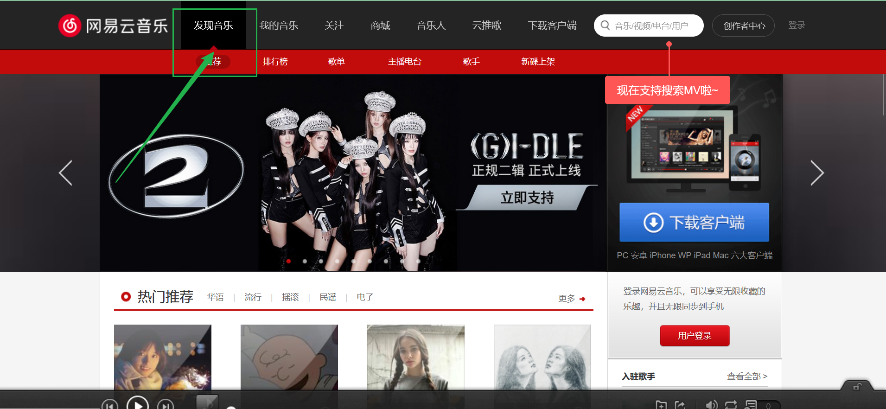

## 探究

- 可利用 css 盒子模型的外边框 border 进行设置

-

```html
<style>
  .box {
    height: 50px;
    width: 50px;
    background-color: red;
    border-top: 50px solid blue;
    border-bottom: 50px solid blue;
    border-left: 50px solid yellow;
    border-right: 50px solid yellow;
  }
</style>

<body>
  <div class="box"></div>
</body>
```

- 效果如下

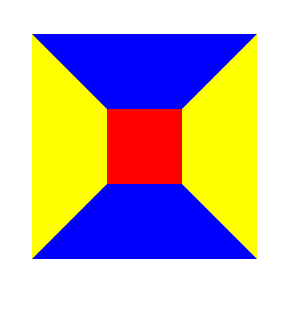

> 如果将`height`和`width`都设置为`0px`，将得到下面效果

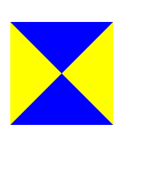

> 可以看到，三角形的轮廓已经基本实现，这时再设置其他三个边框为透明`transparent`即可得到一个指定的三角形

## 结论

- css 文件

```css
.box {
  height: 0px;
  width: 0px;
  /*
  border-top: 50px solid transparent;
  border-bottom: 50px solid transparent;
  border-left: 50px solid transparent;
  或
  */
  border: 50px solid transparent;
  border-right: 50px solid yellow;
}
```

- html 文件

```html
<body>
  <div class="box"></div>
</body>
```

# 百度新闻热榜

- 效果图

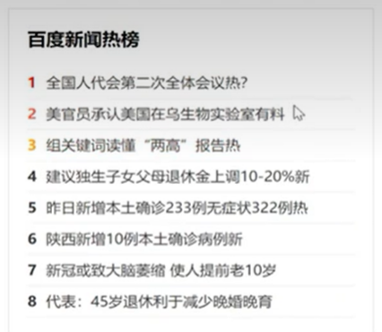

- css 文件

```css
/* 调整默认样式 */
body,
ul {
  margin: 0px;
  padding: 0px;
}
li {
  list-style: none;
}
a {
  text-decoration: none;
}
/* 内部逻辑 */
.container {
  width: 390px;
  /* height:400px; */
  border: 1px solid #ddd;
  margin: 50px auto 0px;
  padding: 15px;
}
.container h3 {
  /* border:1px solid green; */
  font-size: 20px;
  margin: 10px;
}
.container ul li {
  border-bottom: 1px dotted black;
  height: 35px;
  line-height: 35px;
  font-size: 16px;
}
.container ul li a {
  color: #222;
}
.container ul li a:hover {
  color: red;
}
.container ul li a span {
  margin-right: 10px;
  font-weight: bold;
}
/* 处理序号 */
.first-item {
  color: red;
}
.second-item {
  color: rgb(175, 143, 27);
}
.third-item {
  color: rgb(35, 120, 28);
}
```

- html 文件

```html
<body>
    <div class="container">
        <h3>百度新闻热搜</h3>
        <ul>
            <li><a href=""><span class="first-item"> 1</span>曝光学生遭打骂的老师疑被学校威胁<a></li>
            <li><a href=""><span class="second-item"> 2</span>韩国孕妇可随时鉴定胎儿性别<a></li>
            <li><a href=""><span class="third-item"> 3</span>谱写人民政协事业发展新篇章<a></li>
            <li><a href=""><span > 4</span>唯一天价救命药将退市<a></li>
            <li><a href=""><span > 5</span>挖呀挖黄老师已向警方提供证据<a></li>
            <li><a href=""><span > 6</span>昆明大爹把小松鼠喂得随叫随到<a></li>
            <li><a href=""><span > 7</span>新疆户口高考加80分？<a></li>
            <li><a href=""><span > 8</span>央广网评女教师殴打学生<a></li>
        </ul>
    </div>
<body>
```

# 常见电商商品展示

## 效果图

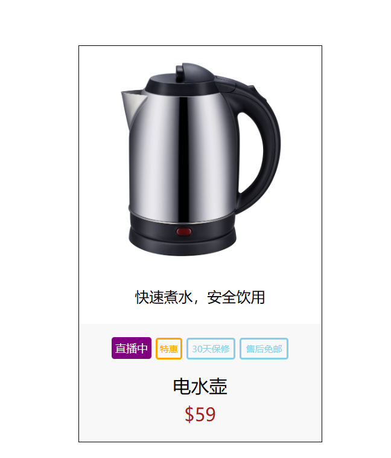

## 总结

- css 文件

```scss
body,
h3 {
  margin: 0px;
}
.container {
  width: 268px;
  /* height:500px; */
  /* background-color: red; */
  margin: 50px auto 0px;
  border: 1px solid black;
  text-align: center;

  .product-describe {
    color: 845f3f;
    font-size: 16px;
  }
  .product-info {
    height: 100px;
    background-color: #f8f8f8;
    margin-top: 20px;
    padding: 15px;
    .product-mark {
      & > div {
        display: inline-block;
      }
      // 将div显示在一行，设置div为行内块元素
      //   display: flex;
      //   justify-content: space-between;
    }
    h3 {
      font-size: 20px;
      font-weight: 400;
      margin-top: 15px;
    }
    p {
      color: #a92112;
      font-size: 20px;
      margin-top: 5px;
    }
  }
}
/* 用于定义标签样式 */
.mark-info-1 {
  border: 2px solid purple;
  color: #fff;
  background-color: purple;
  border-radius: 3px;
  height: 20px;
  line-height: 20px;
  font-size: 12px;
  width: 40px;
}
.mark-info-2 {
  border: 2px solid orange;
  color: orange;
  border-radius: 3px;
  height: 20px;
  line-height: 20px;
  font-size: 10px;
  width: 25px;
}
.mark-info-3 {
  border: 2px solid skyblue;
  color: skyblue;
  border-radius: 3px;
  height: 20px;
  line-height: 20px;
  font-size: 10px;
  width: 50px;
}
```

> 上面代码中使用了 scss 语法，需要在和 html 文件中进行引入 scss.js

```html
<script src="https://cdn.bootcdn.net/ajax/libs/sass.js/0.11.1/sass.min.js"></script>
```

- html 文件

```js
<body>
    <div class="container">
        
        <p class="product-discribe">快速煮水，安全饮用</p>
        <div class="product-info">
            <div class="product-mark">
                <div class="mark-info-1">直播中</div>
                <div class="mark-info-2">特惠</div>
                <div class="mark-info-3">30天保修</div>
                <div class="mark-info-3">售后免邮</div>
            </div>
            <h3>电水壶</h3>
            <p>$59</p>
        </div>
    </div>
<body>
```

# 小米商城悬浮导航

## 最终效果

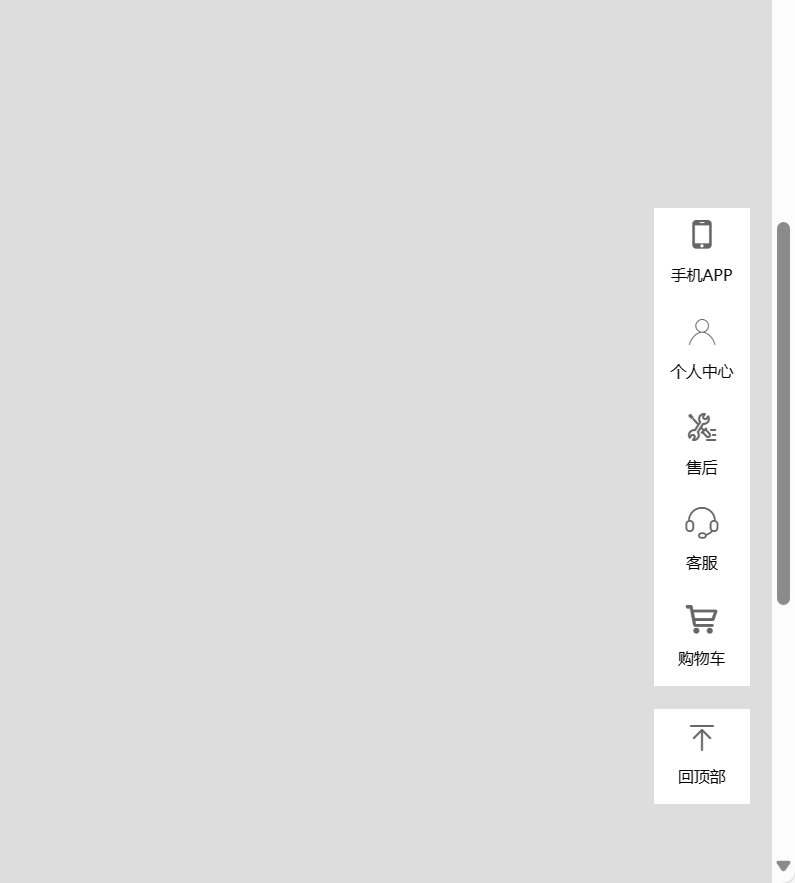

## 阿里云矢量图标

- 本案例使用到了阿里云矢量图标 iconfont
  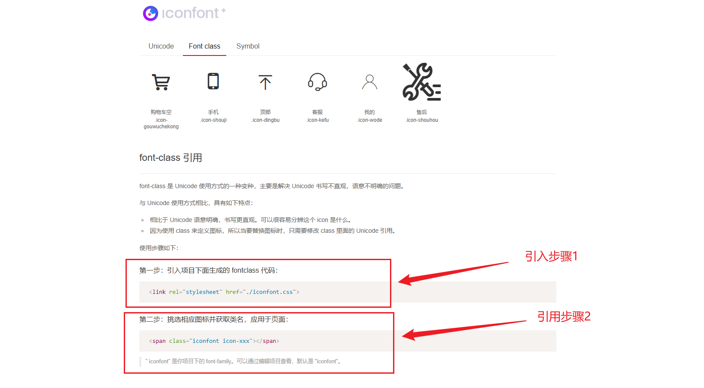

## 总结

- css 文件

```scss
/* 默认样式更改 */
ul {
  margin: 0;
  padding: 0;
  list-style: none;
}
p {
  margin: 0;
}
a {
  text-decoration: none;
  color: #000;
}
/* 父容器 */
body {
  height: 2000px;
  background-color: #ddd;
}
/* 业务逻辑 */
.container {
  width: 85px;
  height: 500px;

  /* 定位 */
  position: fixed;
  right: 20px;
  bottom: 100px;
  ul {
    li {
      width: 85px;
      height: 85px;
      /* border: 1px solid red; */
      background-color: #fff;
      span {
        width: 85px;
        height: 50px;
        /* background-color: green; */
        display: block;
        font-size: 28px;
        color: #666;
        text-align: center;
        line-height: 50px;
      }
      p {
        font-size: 14px;
        text-align: center;
      }
    }
    & li:last-child {
      margin-top: 20px;
    }
    & li:hover > * {
      color: hotpink;
    }
    /* 此处.QRCode并非所有li被hover之后都会触发 */
    & li:hover .QRCode {
      display: block;
    }
    .QRCode {
      width: 100px;
      height: 100px;
      background-color: #fff;
      position: absolute;
      top: 0px;
      left: -150px;
      padding: 15px;
      display: none;
    }
  }
}
```

- html 文件

```html
<body>
  <div class="container">
    <ul>
      <li>
        <span class="iconfont icon-shouji"></span>
        <p>手机APP</p>
        <div class="QRCode">
          
        </div>
      </li>

      <li>
        <span class="iconfont icon-wode"></span>
        <p>个人中心</p>
      </li>
      <li>
        <span class="iconfont icon-shouhou"></span>
        <p>售后</p>
      </li>
      <li>
        <span class="iconfont icon-kefu"></span>
        <p>客服</p>
      </li>
      <li>
        <span class="iconfont icon-gouwuchekong"></span>
        <p>购物车</p>
      </li>
      <li>
        <span class="iconfont icon-dingbu"></span>
        <p>回顶部</p>
      </li>
    </ul>
  </div>
</body>
```

# 小米商城导航栏

## 最终效果

## 总结

- css 文件

```css
/* 改变默认样式 */
body {
  margin: 0px;
  background-image: linear-gradient(to right, #fdb787, #c6ffdd);
}
ul {
  margin: 0px;
  padding: 0px;
}
li {
  list-style: none;
}
a {
  text-decoration: none;
}
/* 样式 */
.container {
  width: 300px;
  /* height:500px; */
  background: rgba(255, 255, 255, 0.6);
  margin: 50px auto 0px;
  ul {
    /* border:1px solid red; */
    padding: 20px 0px;
    li {
      /* border:1px solid blue; */
      height: 42px;
      line-height: 42px;
      a {
        display: block;
        /* padding-left:20px; */
        text-indent: 2em;
        color: #000;
        background-image: url("./pic/rightRow.png");
        background-repeat: no-repeat;
        background-position: right center;
        background-size: 20px;
      }
      a:hover {
        background-color: #ff6700;
        color: #fff;
      }
    }
  }
}
```

- html 文件

```html
<body>
  <div class="container">
    <ul>
      <li><a href="">手机</a></li>
      <li><a href="">电视</a></li>
      <li><a href="">家电</a></li>
      <li><a href="">笔记本 平板</a></li>
      <li><a href="">出行 穿戴</a></li>
      <li><a href="">耳机 音箱</a></li>
      <li><a href="">健康 儿童</a></li>
      <li><a href="">生活 箱包</a></li>
      <li><a href="">只能路由器</a></li>
    </ul>
  </div>
  <body></body>
</body>
```

# 模板

# float 栅格布局

## 效果图

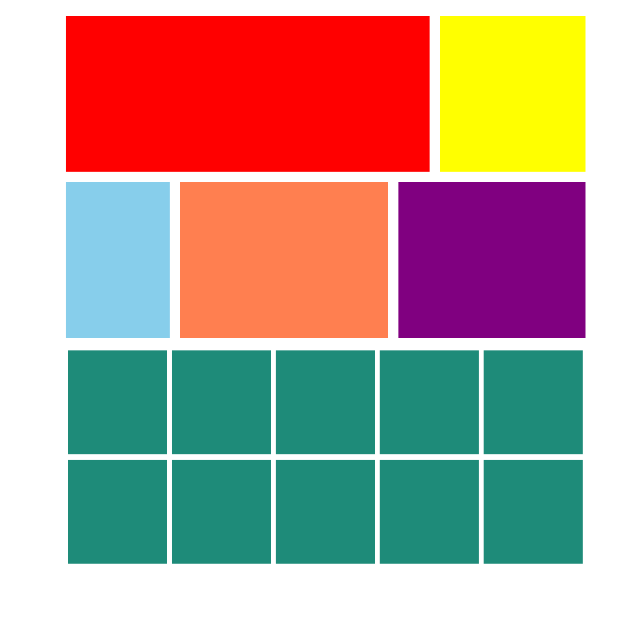

## 总结

- css 文件

```scss

```

- html 文件

```html

```

# 搜狗

## 效果图

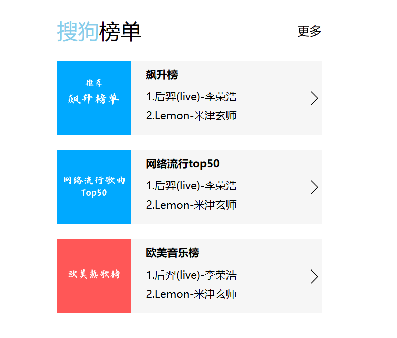

## 总结

- css 文件

```scss
// 清除默认样式
body,
h3,
h4,
p {
  margin: 0;
}
a {
  text-decoration: none;
  color: #000;
}
// 业务逻辑
.container {
  width: 350px;
  /* height: 500px; */
  /* border: 1px solid #9d9a9a; */
  margin: 50px auto 0;
  h3 {
    /* border: 1px solid black; */
    font-weight: normal;
    height: 40px;
    line-height: 40px;

    span {
      font-size: 0px;
      & :first-child {
        color: skyblue;
        font-style: normal;
        font-size: 28px;
      }
      & :nth-child(2) {
        /* color: skyblue; */
        font-style: normal;
        font-size: 28px;
      }
    }
    a {
      font-size: 16px;
      float: right;
    }
  }
  .music-item {
    height: 98px;
    background-color: #f6f6f6;
    margin-top: 20px;
    .item-img {
      width: 98px;
      height: 98px;
      background-color: purple;
      float: left;
    }
    .item-text {
      height: 98px;
      width: 232px;
      background-color: skyblue;
      float: right;
      background: url("./pic/材料/rightRow.png") no-repeat right center;
      background-size: 20px;
      h4 {
        font-size: 14px;
        padding: 8px 0;
      }
      p {
        font-size: 14px;
        color: #000;
        line-height: 25px;
      }
    }
  }
}
```

- html 文件

```html
<body>
  <div class="container">
    <h3>
      <span>
        <i>搜狗</i>
        <i>榜单</i>
      </span>
      <a href="">更多</a>
    </h3>
    <div class="music-item">
      <div class="item-img">
        <a href="" alt="">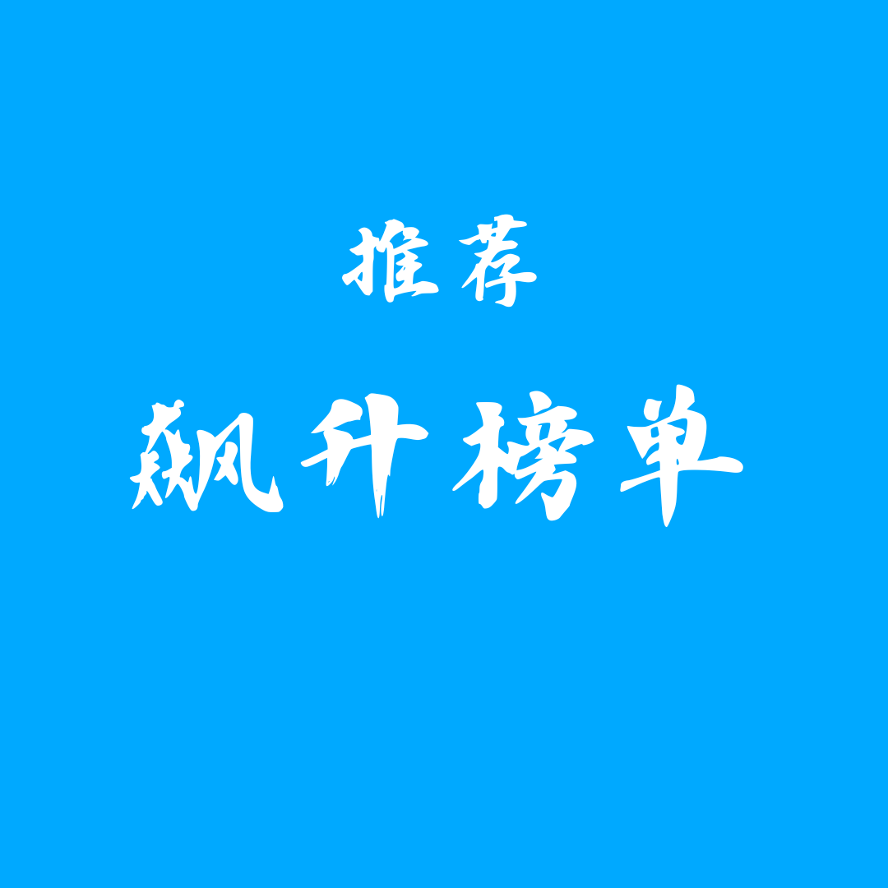</a>
      </div>
      <div class="item-text">
        <h4>飙升榜</h4>
        <p>1.后羿(live)-李荣浩</p>
        <p>2.Lemon-米津玄师</p>
      </div>
    </div>
    <div class="music-item">
      <div class="item-img">
        <a href="" alt=""></a>
      </div>
      <div class="item-text">
        <h4>网络流行top50</h4>
        <p>1.后羿(live)-李荣浩</p>
        <p>2.Lemon-米津玄师</p>
      </div>
    </div>
    <div class="music-item">
      <div class="item-img">
        <a href="" alt="">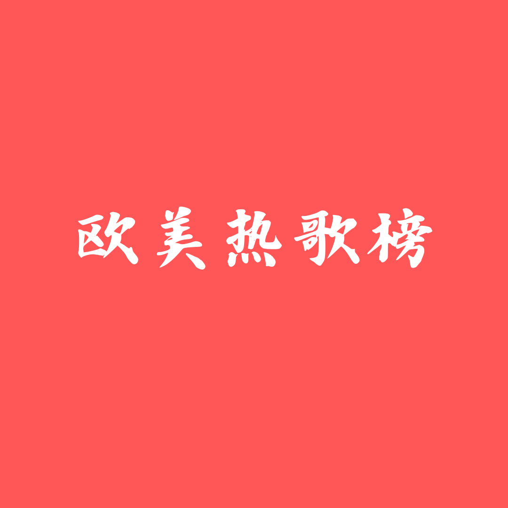</a>
      </div>
      <div class="item-text">
        <h4>欧美音乐榜</h4>
        <p>1.后羿(live)-李荣浩</p>
        <p>2.Lemon-米津玄师</p>
      </div>
    </div>
  </div>
</body>
```

# float 栅格布局

## 效果图


## 总结

- css 文件

```scss
/* 改变默认样式 */
body,
ul {
  margin: 0;
  padding: 0;
}
ul {
  list-style: none;
}
/* 清除浮动 */
.clearfix::after {
  content: "";
  display: block;
  clear: both;
}
.container {
  width: 1000px;
  height: 1500px;
  /* border: 1px solid red; */
  margin: 30px auto 0px;
  .column2 {
    /* border: 2px solid black; */
    .column2-1 {
      width: 700px;
      height: 300px;
      background-color: red;
      float: left;
    }
    .column2-2 {
      width: 280px;
      height: 300px;
      background-color: yellow;
      float: right;
    }
  }
  .column3 {
    /* border: 2px solid blue; */
    margin-top: 20px;
    & > * {
      float: left;
    }
    .column3-1 {
      width: 200px;
      height: 300px;
      background-color: skyblue;
    }
    .column3-2 {
      width: 400px;
      height: 300px;
      background-color: coral;
      margin: 0px 20px;
    }
    .column3-3 {
      width: 360px;
      height: 300px;
      background-color: purple;
    }
  }
  .column-n {
    /* border: 2px solid red; */
    margin-top: 20px;
    ul {
      /* border: 1px solid red; */
      li {
        background-color: rgb(30, 139, 121);
        width: 190px;
        height: 200px;
        float: left;
        margin: 5px;
      }
    }
  }
}
```

- html 文件

```html
<body>
  <div class="container">
    <div class="column2 clearfix">
      <div class="column2-1"></div>
      <div class="column2-2"></div>
    </div>
    <div class="column3 clearfix">
      <div class="column3-1"></div>
      <div class="column3-2"></div>
      <div class="column3-3"></div>
    </div>
    <div class="column-n">
      <ul class="clearfix">
        <li></li>
        <li></li>
        <li></li>
        <li></li>
        <li></li>
        <li></li>
        <li></li>
        <li></li>
        <li></li>
        <li></li>
      </ul>
    </div>
  </div>
</body>
```
