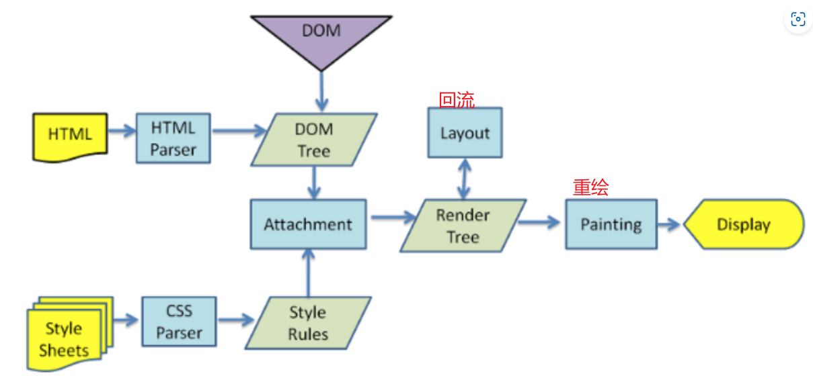

# 块级元素与行内元素区别

## 块级元素

- 单独占一行，不与任何元素共用一行，从上到下排列
- 默认宽度：撑满父元素
- 默认高度：由内容撑开
- 宽高可设置

## 行内元素

- 不独占一行
- 一行中不能容纳下的行内元素，会在下一行继续从左到右排列
- 默认宽度：由内容撑开。
- 默认高度：由内容撑开。
- 无法设置宽高。

# 伪类与伪元素区别

- 伪类使用单冒号，而伪元素使用双冒号。如 :hover 是伪类，::before 是伪元素
- 伪元素会在文档流生成一个新的元素，并且可以使用 content 属性设置内容

# 块级元素 div 水平居中

- 定位+margin
- 定位+transfrom
- flex 布局
- grid 布局
- table 布局

## 实现

```html
<div class="parent">
  <div class="child"></div>
</div>
```

- 定位+margin

> 使用`margin:0  auto`需要注意：
>
> - 元素需要同时设置 width 以表明其具体宽度
> - 元素不能设置 float 浮动
> - 元素不能设置绝对或固定定位

```css
.parent {
  width: 100px;
  height: 100px;
  border: 1px solid black;
}
.child {
  width: 50%;
  height: 50%;
  margin: 0 auto;
  border: 1px solid red;
}
```

- 父元素弹性布局 flex

```css
div.parent {
  display: flex;
  justify-content: center;
  align-items: center;
}
/*或*/
div.parent {
  display: flex;
}
div.child {
  margin: auto;
}
```

- 使用相对定位与绝对定位

```css
div.parent {
  position: relative;
}
div.child {
  position: absolute;
  top: 50%;
  left: 50%;
  transform: translate(-50%, -50%);
}
```

- 使用栅格布局 grid

```css
div.parent {
  display: grid;
}
div.child {
  justify-self: center;
  align-self: center;
}
```

# css 盒子模型

- 什么是盒模型：HTML 页面中所有元素都可以看做盒子
- 盒模型组成：内容、内边距、外边距、边框
- 盒模型类型：
  > - 标准盒模型：width 和 height 设置盒子内容区大小，整体向外扩张（**width 和 height 设置的是内容区（content）大小**）
  > - 怪异盒模型(IE 盒模型)：内容区将会被压缩(**width 和 height 设置的是盒子（content+padding+border+margin）的总大小**)
- 如何设置盒模型：通过 box-sizing 属性进行设置
  > content-box：标准盒模型（默认值）
  > border-box：怪异盒模型

# css 选择器优先级

- 为什么：写 css 样式时，如果同一个元素被添加了多个样式，此时哪种样式的权重最高就显示谁
- 有哪些：标签（元素）、类/伪类/属性、全局（通配）选择器、行内样式、id、important
- 优先级 !important > 行内样式 > id > 类 > 标签（元素） > 全局

> 按照权重算

| 选择器                               | 权重 |
| ------------------------------------ | ---- |
| ID 选择器                            | 1000 |
| 类（class）、伪类、属性（attribute） | 100  |
| 元素、伪元素                         | 10   |

- 但即使 10 个类选择器也顶不掉一个 ID 选择器，因为选择器优先级的计算方式是

# css 隐藏元素的方式

display：none，移除文档流
opacity：0，仍然在文档流中，元素仅仅不可见，作用于该元素上的事件有效
visibility：hidden，仍然在文档流中，但作用于其上的事件无效
position：absolute，对元素进行位移
font-size：0

# px 和 rem 的区别

- 分别是什么

  > - px：像素，显示器呈现的画面内容，
  > - rem:相对单位，相对于 html 根节点的 font-size 值，直接设置

- 技巧：
  设置根元素 html 的`font-size：62.5%;`(10/16)时，1rem=10px,2rem=20px,1.6rem=16px;

# 重绘与重排（回流）

- 什么是：
  回流：布局引擎根据渲染树得到节点的几何信息（位置、大小等）
  重绘：根据渲染树以及回流得到的几何信息得到 DOM 节点的绝对像素
- 何时发生：
  > - 回流：（1）DOM 元素 尺寸（盒子模型各组成部分的宽高）、位置、内容。（2）DOM 元素的添加、删除.（3）页面的初始渲染。（4）浏览器窗口发生变化
  > - 重绘：DOM 样式变化（如 color、background-color 等颜色的修改、文本方向的修改）未影响集合属性
  > - 回流一定会导致重绘

## 如何减少重绘回流

- 改变元素的样式通过 class 类名的方式
- 避免使用 css 的 js 表达式

> 多次修改一个元素的布局时，使用单个样式修改

```js
// bad
const element = document.getElementById("xxx");
//每次循环都修改元素的样式
for (let i = 0; i < 10; i++) {
  element.style.top = element.offsetTop + 10 + "px";
  element.style.left = element.offsetLeft + 10 + "px";
}

//good

let offLeft = el.offsetLeft,
  offTop = el.offsetTop;
for (let i = 0; i < 10; i++) {
  offLeft += 10;
  offTop += 10;
}
// 一次性将计算结果提交给浏览器进行重绘
el.style.left = offLeft + "px";
el.style.top = offTop + "px";
```

> 同时修改一个元素的多种样式，使用类名合并样式

```html
<!-- bad -->
<script>
  const container = document.getElementById("container");
  container.style.width = "100px";
  container.style.height = "200px";
  container.style.border = "10px solid red";
  container.style.color = "red";
</script>
<!-- good -->
<style>
  .basic_style {
    width: 100px;
    height: 200px;
    border: 10px solid red;
    color: red;
  }
</style>
<script>
  const container = document.getElementById("container");
  container.classList.add("basic_style");
</script>
```

> 浏览器渲染机制与重绘回流
> 

# css 清除由于换行导致的间距

- 设置父元素字体大小为 0，给子元素设置适当的字体大小。

```css
.box {
  font-size: 0;
}

.box span {
  font-size: 16px;
  background-color: red;
}
```
