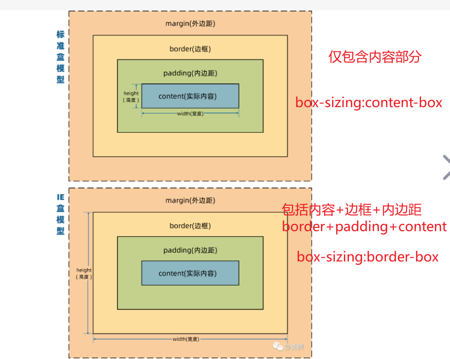
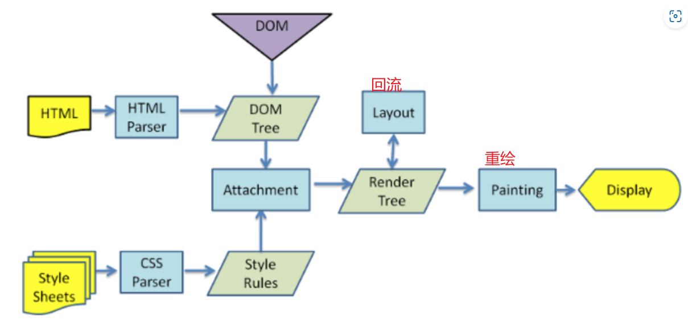
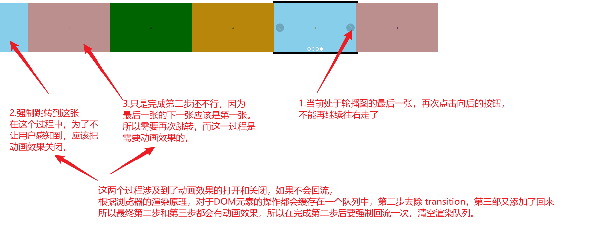

# 块级元素与行内元素区别

## 块级元素

- 单独占一行，不与任何元素共用一行，从上到下排列
- 默认宽度：撑满父元素
- 默认高度：由内容撑开
- 宽高可设置

## 行内元素

- 不独占一行
- 一行中不能容纳下的行内元素，会在下一行继续从左到右排列
- 默认宽度：由内容撑开。
- 默认高度：由内容撑开。
- 无法设置宽高。

# 伪类与伪元素区别

- 伪类使用单冒号，而伪元素使用双冒号。如 :hover 是伪类，::before 是伪元素
- 伪元素会在文档流生成一个新的元素，并且可以使用 content 属性设置内容

# 块级元素 div 水平居中

- 定位+margin
- 定位+transfrom
- flex 布局
- grid 布局
- table 布局

## 实现

```html
<div class="parent">
  <div class="child"></div>
</div>
```

- 定位+margin

> 使用`margin:0  auto`需要注意：
>
> - 元素需要同时设置 width 以表明其具体宽度
> - 元素不能设置 float 浮动
> - 元素不能设置绝对或固定定位

```css
.parent {
  width: 100px;
  height: 100px;
  border: 1px solid black;
}
.child {
  width: 50%;
  height: 50%;
  margin: 0 auto;
  border: 1px solid red;
}
```

- 父元素弹性布局 flex

```css
div.parent {
  display: flex;
  justify-content: center;
  align-items: center;
}
/*或*/
div.parent {
  display: flex;
}
div.child {
  margin: auto;
}
```

- 使用相对定位与绝对定位

```css
div.parent {
  position: relative;
}
div.child {
  position: absolute;
  top: 50%;
  left: 50%;
  transform: translate(-50%, -50%);
}
```

- 使用栅格布局 grid

```css
div.parent {
  display: grid;
}
div.child {
  justify-self: center;
  align-self: center;
}
```

# css 盒子模型

**什么是盒模型**：HTML 页面中所有元素都可以看做盒子
**盒模型组成**：内容、内边距、外边距、边框
**如何设置盒模型**：通过 box-sizing 属性进行设置
**盒模型类型：**

- 标准盒模型（content-box,默认值）：

  > - 整体向外扩张（**width 和 height 设置的是内容区（content）大小**）
  > - 设置一个元素宽高为 100px，该元素内容区就一定是 100px；任何边框和边距都会额外体现到最终的元素的大小上

- 怪异盒模型(border-box)：
  > - 内容区将会被压缩(**width 和 height 设置的是盒子（content+padding+border）的总大小**)
  > - 设置一个元素宽高为 100px，不设置 margin 时，该元素的大小就一定是 100px，任何边框和边距都会压缩 content 区域



**有什么用**

在标准盒模型中，为元素设置 `内边距和边框`可能会使元素的尺寸超出预期（此处的预期指的是给元素指定宽`width`和高`height`）,而使用怪异盒模型，可以通过元素宽高（`width`和`height`）直接控制元素的尺寸

# css 选择器优先级

- 为什么：写 css 样式时，如果同一个元素被添加了多个样式，此时哪种样式的权重最高就显示谁
- 有哪些：标签（元素）、类/伪类/属性、全局（通配）选择器、行内样式、id、important
- 优先级 !important > 行内样式 > id > 类 > 标签（元素） > 全局

> 按照权重算

| 选择器                               | 权重 |
| ------------------------------------ | ---- |
| ID 选择器                            | 1000 |
| 类（class）、伪类、属性（attribute） | 100  |
| 元素、伪元素                         | 10   |

- 但即使 10 个类选择器也顶不掉一个 ID 选择器，因为选择器优先级的计算方式是

# css 隐藏元素的方式

display：none，移除文档流
opacity：0，仍然在文档流中，元素仅仅不可见，作用于该元素上的事件有效
visibility：hidden，仍然在文档流中，但作用于其上的事件无效
position：absolute，对元素进行位移
font-size：0

# px 和 rem 的区别

- 分别是什么

  > - px：像素，显示器呈现的画面内容，
  > - rem:相对单位，相对于 html 根节点的 font-size 值，直接设置

- 技巧：
  设置根元素 html 的`font-size：62.5%;`(10/16)时，1rem=10px,2rem=20px,1.6rem=16px;

# 重绘与重排（回流）

**浏览器渲染过程**

- 分别解析 HTML 和 CSS，生成 DOM 树和 CSSDOM 树
- 将两者合并生成`渲染树Render Tree`
- 根据`渲染树`进行**回流**，得到节点`几何信息（位置、大小等）`
- 根据`渲染树和回流`得到的`几何信息`进行**重绘**，得到`DOM节点`的`绝对像素`
- 将`像素信息`发送给 GPU，完成页面展示



> 从上图我们可以看出，回流一定导致重绘

**何时发生回流**

1. 浏览器首次渲染
2. 浏览器窗口大小改变
3. 元素尺寸、位置、内容发生变化
4. 元素内字体发生变化
5. 添加删除可见的 DOM 元素
6. 激活 CSS 伪类（如 `:hover`）
7. 访问 DOM 的几何属性或调用 DOM 元素的某些方法（**常用于强制回流**）

**何时发生重绘**

DOM 元素的样式改变（如 color、background-color 等）未影响其在文档流中的位置时，浏览器将这些新的样式赋予给元素并重新绘制它，这一过程称为重绘

**性能比较**

- 回流的代价较高
- 现代浏览器对频繁的回流和重绘进行优化：维护一个队列，把所有引起回流和重绘的操作放入队列中，当队列中任务数量或者时间间隔达到阈值，浏览器清空该队列，统一进行回流重绘，将多次回流和重绘变成一次。

**一个强制回流的案例**



## 如何减少重绘回流

- 改变元素的样式通过 class 类名的方式
- 避免使用 css 的 js 表达式

> 多次修改一个元素的布局时，使用单个样式修改

```js
// bad
const element = document.getElementById("xxx");
//每次循环都修改元素的样式
for (let i = 0; i < 10; i++) {
  element.style.top = element.offsetTop + 10 + "px";
  element.style.left = element.offsetLeft + 10 + "px";
}

//good

let offLeft = el.offsetLeft,
  offTop = el.offsetTop;
for (let i = 0; i < 10; i++) {
  offLeft += 10;
  offTop += 10;
}
// 一次性将计算结果提交给浏览器进行重绘
el.style.left = offLeft + "px";
el.style.top = offTop + "px";
```

> 同时修改一个元素的多种样式，使用类名合并样式

```html
<!-- bad -->
<script>
  const container = document.getElementById("container");
  container.style.width = "100px";
  container.style.height = "200px";
  container.style.border = "10px solid red";
  container.style.color = "red";
</script>
<!-- good -->
<style>
  .basic_style {
    width: 100px;
    height: 200px;
    border: 10px solid red;
    color: red;
  }
</style>
<script>
  const container = document.getElementById("container");
  container.classList.add("basic_style");
</script>
```

# css 清除由于换行导致的间距

- 设置父元素字体大小为 0，给子元素设置适当的字体大小。

```css
.box {
  font-size: 0;
}

.box span {
  font-size: 16px;
  background-color: red;
}
```

## h3c3 有哪些新特性

- h5 新特性
  > - 语义化标签
  > - 新增音频视频
  > - 画布 canvas
  > - 数据存储 localStoage\sessionStorage
  > - 表单控件 email url search...
  > - 拖拽释放 API
- c3
  > - 选择器：属性、伪类、伪元素
  > - 媒体查询
  > - 文字阴影
  > - 边框
  > - 盒子模型 box-sizing
  > - 渐变
  > - 过渡 transform
  > - 自定义动画 keyframe
  > - 背景属性
  > - 2D、3D

# margin 重叠以及解决

对于块级元素，其父元素的第一个子元素的 margin-top 或者最后一个子元素的 margin-bottom 会被其父元素剥夺

# 哪些可以继承

# BFC

理解为元素的一个“特异功能”，该功能默认情况下处于关闭状态，当元素满足某些条件时，就称元素激活了该"特异功能"，也称该元素 创建了 BFC，

**开启 BFC 之后有哪些好处**

- 其子元素不会产生 margin 塌陷问题
- 自己不会被其他浮动元素覆盖
- 就算其子元素是浮动的，自己也不会高度塌陷

**如何开启 BFC**

- 根元素
- 浮动元素
- 绝对定位、固定定位的元素
- 行内块元素
- 所有表格单元格 table\thead\tbody\
- overflow 值不是 visiable 的块元素
- 伸缩项目
- 多列容器
- column-span 为 all 的元素
- display:flow-root 的元素

# rem 如何做适配

rem 相对于根元素 html 的 font-size 计算大小通常用于做移动端适配

```
html{font-size:10px;}div{width:1.2rem(实际宽度1.2x10=12px)}
```

# 移动端兼容性问题
