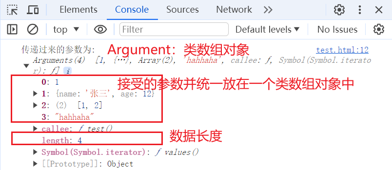
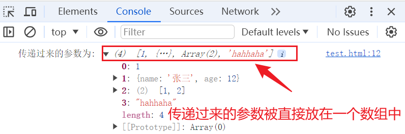

# 如何控制 100 个并发请求

## 使用数组

- 将 100 个请求分为若干个大小相等的请求列表 requestList 中，每次使用`promise.all()` 请求一个 requestList 中所有的请求

## 维护一个请求池

- 每次有请求完成后,入队一个新的 fetch，一直保持 10 个

```js
const arr = [];
for (let i = 0; i < 100; i++) {
  arr.push(
    () =>
      new Promise((resolve) => {
        setTimeout(() => {
          console.log("done", i);
          resolve();
        }, 100 * i);
      })
  );
}

const parallelRun = () => {
  const runingTask = new Map();
  const inqueue = (totalTask, max) => {
    while (runingTask.size < max && totalTask.length) {
      const newTask = totalTask.shift();
      const tempName = totalTask.length;
      runingTask.set(tempName, newTask);
      newTask().finally(() => {
        runingTask.delete(tempName);
        inqueue(totalTask, max);
      });
    }
  };
  return inqueue;
};

parallelRun()(arr, 6);
```

# 涉及异步操作的封装

## 为什么 promise 这么重要

很多第三方库(如`jsonwebtoken.sign()/verify(),`)提供的业务代码都仅仅支持回调函数的写法，这说明这些业务代码都是能够异步执行的，而回调函数容易造成回调地狱问题。
封装为 `promise` 对象之后，业务代码就能使用`async/await`和`then()`方法调用，下面演示一个例子

_`mysql2`_

- 未封装前

```js
connection.query(sql, (err, result, fields) => {
  // 业务操作
});
```

- 封装之后

```js
function sqlExec(sql) {
  return new Promise((resolve, reject) => {
    connection.query(sql, (err, result, fields) => {
      if (err) {
        reject(err);
      } else {
        resolve(result);
      }
    });
  });
}
// 调用方式一：then()
sqlExec(sql)
  .then((result) => {
    // 业务代码
  })
  .catch((err) => {
    console.log(err);
  });
// 调用方式二：在其他函数中使用async/await
async function test(sql) {
  const res = await sqlExec(sql);
  console.log(res);
}
```

> 另一个感悟：
> 通过上面的代码我们看到`then()`函数调用可以用在任何地方
> 而`async/await`在异步函数中调用更加方便

> 关于`promise.reject()` 和`await`
> 我们常常使用 `await` 函数接收一个 异步 promise 结果,而我们一定能保证 await 接受的是`resolve(data)`返回的数据。因为当你使用 Promise 并在 reject 函数中返回一个错误时，如果你使用 await 来等待这个 Promise 的结果，并且 Promise 被拒绝了（即调用了 reject 函数），那么 await 表达式会抛出一个错误，这个错误将会导致代码不会向下执行，所以只要不报错，`await` 一定得到正确的结果

**jsonwebtoken**

```js
// 使用Promise封装jwt.verify
function verifyToken(token, secret) {
  return new Promise((resolve, reject) => {
    jwt.verify(token, secret, (err, decoded) => {
      if (err) {
        reject(err);
      } else {
        resolve(decoded);
      }
    });
  });
}

// 使用封装后的函数
verifyToken(token, secret)
  .then((decoded) => {
    console.log("JWT验证成功（Promise风格）:", decoded);
  })
  .catch((err) => {
    console.error("JWT验证失败（Promise风格）:", err);
  });
```

# 关于函数传参

在 es6 之前，函数内部都有一个 `arguments` 作为隐藏的属性，表示了向函数内部传递参数

```js
function test() {
  console.log("传递过来的参数为:", arguments);
}
test(1, { name: "张三", age: 12 }, [1, 2], "hahhaha");
```



- es6 之后，可以使用解构的方式传参

```js
function test(...args) {
  console.log("传递过来的参数为:", args);
}
test(1, { name: "张三", age: 12 }, [1, 2], "hahhaha");
```


