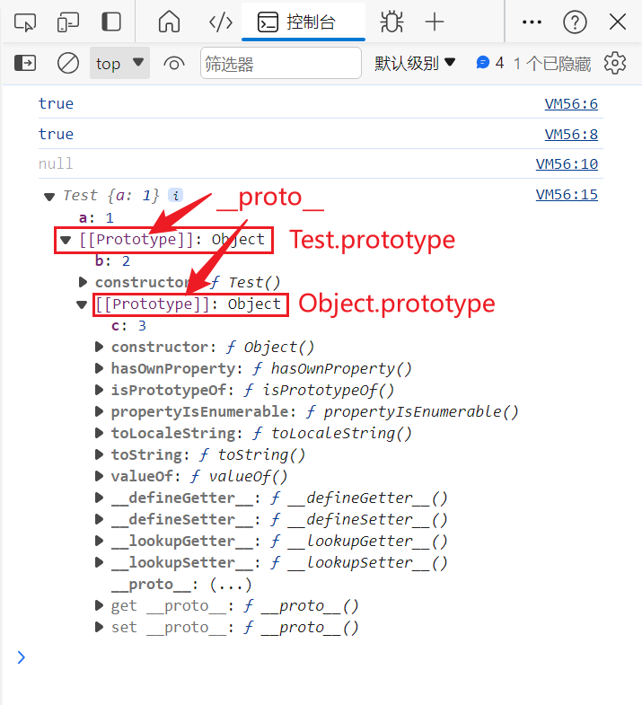

# 将两个数组合并

```js
let a1 = ["A1", "A2", "B1", "B2", "C1", "C2", "D1", "D2"];
// 用于标识需要进行插入的数字
let a2 = ["A", "B", "C", "D"].map((item) => {
  return item + 3;
});
//先进行遍历，由于js的sort函数可以对字母进行排序，经过sort()函数之后，A、B、C、D字母都聚在了一起
let a3 = [...a1, ...a2].sort().map((item) => {
  //如果包含标识符3，就去掉标识符
  if (item.includes("3")) {
    return item.split("")[0];
  }
  return item;
});
```

# 手写代码

## 数组扁平化

> var arr = [ [1, 2, 2], [3, 4, 5, 5], [6, 7, 8, 9, [11, 12, [12, 13, [14] ] ] ], 10]
> 将数组扁平化，去除其中重复数据，得到一个升序且不重复的数组

```js
//方法一：
Array.from(new Set(arr.flat(Infinity))).sort((a, b) => a - b);

//方法二
arr
  .toString()
  .split(",")
  .sort((a, b) => {
    return a - b;
  })
  .map(Number);

//方法三：重新定义flat和unique方法
Array.prototype.flat = function () {
  return [].concat(
    ...this.map((item) => (Array.isArray(item) ? item.flat() : [item]))
  );
};
Array.prototype.unique = function () {
  return [...new Set(this)];
};
console.log(
  arr
    .flat()
    .unique()
    .sort((a, b) => a - b)
); // [ 1, 2, 3, 4, 5, 6, 7, 8, 9, 10, 11, 12, 13, 14 ]
```

## 判断输入是否为网址

```js
function isUrl(url) {
  try {
    new URL(url);
    return true;
  } catch (error) {
    return false;
  }
}
```

## 对象转数组

- 原始对象：{1:222, 2:123, 5:888}
- 目的数组：[222, 123, null, null, 888, null, null, null, null, null, null, null]

```js
let obj = { 1: 222, 2: 123, 5: 888 };
const result = Array.from({ length: 12 }).map(
  (_, index) => obj[index + 1] || null
);
// 或者直接  Array.from({ length: 12 },(_, index) => obj[index + 1] || null)
console.log(result);
```

## 数组模拟队列、栈

- 模拟栈结构,后进先出
  > pop()末尾删除，push()末尾添加

```js

```

- 模拟队列结构，先进先出
  > pop()末尾删除，unshift()头部添加
  > 或
  > push()末尾添加，shift()头部删除

```js

```

## 求 1-10000 之间的对称数（121,1331）

- 方案一：使用数组的 filter 函数

```js
[...Array(10000).keys()].filter((item) => {
  //length>1的目的是不返回0-9
  return (
    item.toString().length > 0 &&
    item === Number(item.toString().split("").reverse().join(""))
  );
});
```

- 方案二:普通遍历方案，会出现 0-9

```js
let res = [];
for (let i = 0; i <= 10000; i++) {
  let origin = "" + i;
  let reverse = i.toString().split("").reverse().join("");
  if (origin === reverse) {
    res.push(i);
  }
}

// for (let i=0;i<=10000;i++){
//   let reverse=Number(i.toString().split('').reverse().join(''))
//   if(i===reverse){
//     res.push(i)
//   }
// }
```

## 关于隐式类型转换

### js 基本数据类型

- 字符串、数字、布尔值
- null、undefined
- symbol
- bigInt

### 其他对象 to 字符串(toString 原则)

- null >> 0
- undefined >> NAN
- 布尔 >> 转换为 0 或 1
- 字符串 >> 纯数字形式，则转为对应的数字，空字符转为 0, 否则一律按转换失败处理，转为 NaN
- 数组 >> 首先会被转为原始类型，也就是 ToPrimitive，然后在根据转换后的原始类型按照上面的规则处理
- 普通对象 >> 相当于直接使用 Object.prototype.toString()，返回"[object Object]

### 其他对象 to 数字(toNumber 原则)

- null >> 'null'
- undefined >> undefined
- 布尔 >> "true"或"false"
- 字符串 >> 如果是纯数字形式，则转为对应的数字，空字符转为 0, 否则一律按转换失败处理，转为 NaN
- 数字 >> 转换为数字对应的字符串
- 数组 >> 将所有元素按照","连接起来，相当于调用数组的 Array.prototype.join()方法，如[1, 2, 3]转为"1,2,3"，空数组[]转为空字符串，数组中的 null 或 undefined，会被当做空字符串处理

### 其他对象 to 布尔值(toBoolean 原则)\*\*

- js 中除了**false、null、undefined、空字符、0 和 NaN**转换为字符串时为假，其余都为真

### 对象类型类型（如：对象、数组） to 原始类型\*\*

- 对象类型需要被转为原始类型时，它会先查找对象的 valueOf 方法，如果 valueOf 方法返回原始类型的值
- 如果 valueOf 不存在或者 valueOf 方法返回的不是原始类型的值，就会尝试调用对象的 toString 方法,遵循对象的 ToString 规则
- 如果 valueOf 和 toString 都没有返回原始类型的值，则会抛出异常

```js
Number([]); // 0     空数组 >>  空字符串  >> 0
Number(["10"]); //10   ['10']  >>  '10' >> 10

const obj1 = {
  valueOf() {
    return 100;
  },
  toString() {
    return 101;
  },
};
// 先查找对象的valueOf方法
Number(obj1); // 100

const obj2 = {
  toString() {
    return 102;
  },
};
// 没找到对象的valueOf方法，查找对象的toString方法
Number(obj2); // 102

const obj3 = {
  toString() {
    return {};
  },
};
//没找到对象的valueOf方法，toString方法返回的不是原始类型值
Number(obj3); // TypeError
```

## 不同数据类型运算以及

### 转字符串

任何数据与**字符串**加减都会得到字符串

```js
true + ""; // "true"
new Object() + ""; // "[object Object]"
3 + ""; // "3"
[1, 3, 4] + ""; // '1,3,4'
```

### 转 Number

```js
+{} = NaN
+'20' = 20
-'20' = -20
+[] = 0;
+[1] = 1;
+[1, 2] = NaN
+true=1
```

## 宽松相等(==)和严格相等(===)

- 区别：宽松相等（==）会在比较中进行隐式转换

### bool 类型与其他类型的相等比较

- 原则：只要有 bool 类型参与比较，该 bool 类型就会首先转换为数字类型,
- 遵循 toNumber 原则：true>1,false>0

```js

```

### number 类型和 string 类型的相等比较

- 原则：string 类型 会首先转换为 number 类型，
- 遵循 toString 原则：纯数字形式(如'10','0')的字符串>> 数字、空字符串>>0、其余转化为 NAN

```js
0 == ""; //  ''  > 0
1 == "1"; // '1' > 1
1e21 == "1e21"; // '1e21'  > 1e21
Infinity == "Infinity"; // 'Infinity'  >   Infinity
true == "1"; // true > 1 , '1' > 1
false == "0"; // false > 0 , '0' > 0
false == ""; // false > 0 , '0' > 0
```

### object 类型与原始类型的相等比较

- object 类型遵循**toPrimitive 原则** 转换为 原始类型
- 数组对象的 valueOf()方法返回数组自身，toString()方法遵循**toString 原则**

```js
'[object Object]' == {} // {} > {}.valueOf()={},{}.toString()= '[object Object]'
'1,2,3' == [1, 2, 3] // [1,2,3] > '1,2,3'
[2] ==  2   // [2].valueOf()=[2],[2].toString()='2' > 2

[null] == 0 // true
[undefined] == 0 // true
[] == 0 // true
```

### 面试题

- 为 a 赋值使 a 满足下面的逻辑表达式

```js
let a = xxx;

a == 1 && a == 2 && a == 3;
```

- 解题思路
- 宽松相等（==）两侧有对象 a 参与，那么对象 a 就会遵循**toPrimitive 原则**先进行隐式类型转换
- 对象 a 进行隐式类型转换时会先后调用它的**valueOf()方法和 toString()方法**,
- 适当改写这两个方法即可达到目的

```js
let a = {
  num: 1,
  valueOf() {
    return this.num++;
  },
  toString() {
    return this.num++;
  },
};
let bool = a == 1 && a == 2 && a == 3;
console.log(bool); // true
```

## 关于 es6 的解构赋值语法

### 剩余参数语法

在 es6 以前，使用 arguments 存储传递给函数的参数，它是一个类数组对象。

```js
function add(a, b, c, d) {
  console.log(arguments); //自行打印观察结果
  console.log(Object.prototype.toString.call(arguments)); // [object Arguments]
}

add(1, 2, 3, 4);
```

- 可以调用 call()方法将 arguments 对象转化为数组对象

es6 中的剩余参数语法允许你将一个不定数量的参数表示为一个数组。

```js
function add(...args) {
  console.log(args);
}
add(1, 2, 3, 4);
// [1,2,3,4]
```

> 注意：剩余参数只能作为函数的最后一个参数

```js
function getItems(fruitList, ...args, favoriteFruit) {
  return [...fruitList, ...args, favoriteFruit]
}

getItems(["banana", "apple"], "pear", "orange")
```

> 上面代码的执行结果将会报错：SyntaxError

## call 的妙用

- **call 方法的 this 指向**

`Function.prototype.call(thisArg, arg1, arg2,...)`永远指向 thisArg

```js
let cat = {
  name: "",
  sayName() {
    console.log(this.name);
  },
};
// 此处的this指向dog
cat.sayName.call(dog);
```

- 例子二

```js
let obj = {};
// 此处的this指向obj
Object.prototype.hasOwnProperty.call(obj, "toString");
```

### 最精确地数据类型判断方法

- `Object.prototype.toString.call()`

```js
Object.prototype.toString.call("An"); // "[object String]"
Object.prototype.toString.call(1); // "[object Number]"
Object.prototype.toString.call(Symbol(1)); // "[object Symbol]"
Object.prototype.toString.call(null); // "[object Null]"
Object.prototype.toString.call(undefined); // "[object Undefined]"
Object.prototype.toString.call(function () {}); // "[object Function]"
Object.prototype.toString.call({}); // "[object Object]"
```

- 或者简写为

```js
toString.call(() => {}); // [object Function]
toString.call({}); // [object Object]
toString.call([]); // [object Array]
toString.call(""); // [object String]
toString.call(22); // [object Number]
toString.call(undefined); // [object undefined]
toString.call(null); // [object null]
toString.call(new Date()); // [object Date]
toString.call(Math); // [object Math]
toString.call(window); // [object Window]
```

### 转换数据类型

- 使用 Array.prototype.slice.call(arguments)将 arguments 类数组对象转换为数组
  > 解读
  >
  > - js 中的数组对象 Array 的 slice(start,end)方法，返回一个数组切片副本，start 和 end 参数都是可选的，当不传递参数时，将会返回一个原数组的复制版本
  > -

```js
function add(a, b, c, d) {
  let a1 = Array.prototype.slice.call(arguments);
  console.log(Object.prototype.toString.call(a1)); //[Object Array]
  console.log(a1); // [1,2,3,4]
  // 等价于
  // console.log([...arguments]); // [1,2,3,4]
}

add(1, 2, 3, 4);
```

### 调用原生方法

- 解决对象继承的方法被同名函数覆盖掉的问题

```js
var obj = {};
obj.property1 = 22;
obj.hasOwnProperty("property1"); // true
obj.hasOwnProperty("toString"); // false

// 覆盖掉继承的 hasOwnProperty 方法
obj.hasOwnProperty = function (...args) {
  return true;
};

obj.hasOwnProperty("toString"); // true

//调用原生方法
Object.prototype.hasOwnProperty.call(obj, "toString"); // false
```

> 解读
>
> - Object.prototype.hasOwnProperty()函数返回一个布尔值，表示调用该方法的对象自有属性（而不是继承来的属性）中是否具有指定的属性。
> - 此处使用 call 改变了 this 指向，使得 hasOwnProperty 方法中的 this 指向了 obj 对象，由于 obj 的 toString 属性来自继承，所以最终会返回 false

## this 指向

### 全局环境与全局函数：指向 window

- 全局环境下 this 为 window
- 全局函数中的 this 也是 window（全局函数其实是 window(全局对象)的方法）

```js
console.log(this); //window

function fun() {
  console.log(this);
}
fun(); //相当于window.fun()      //window
```

### 对象方法中:指向调用该方法的对象

- 对象方法中的 this 指向调用这个方法的对象

```js
let cat = {
  name: "小猫",
  sayName() {
    console.log(this.name);
  },
};
let dog = {
  name: "小狗",
};
cat.sayName.bind(dog)(); // 小狗
cat.sayName.call(dog); // 小狗
cat.sayName.apply(dog); // 小狗
cat.sayName(); // 小猫
```

### DOM 事件

- DOM 事件中的 this 指向该 dom 对象

```html
<button onclick="console.log(this)">此处this指向button自身</button>
```

### 定时器

- 在定时器或者 setInterval 中，`this`指向全局对象
- 原因：定时器或者 setInterval 是全局函数，其中的函数就是由 window 调用的

```js
setTimeout(function () {
  console.log("匿名函数的this指向", this); //window
}, 100);
setTimeout(() => {
  console.log("箭头函数的this指向", this); //window
}, 100);
```

### 构造函数

- 构造函数中的 this 指向关键字`new`新创建出来的对象
- 拓展：**new 关键字做了什么**：创建一个对象，并将构造函数中的 this 指向创建出来的对象

```js
function F() {
  this.name = "小明"; // 此处this指向新创建出来的对象f
}
let f = new F();
console.log(f); // f {name:'小明'}
```

### 箭头函数

- 箭头函数没有 this
- 口诀 1：普通函数==谁调用指向谁==，箭头函数==在哪里定义指向谁==
- 口诀 2：箭头函数外指向谁，其 this 就指向谁

```js
let cat = {
  sayName() {
    setTimeout(function () {
      console.log(this); //window
    }, 100);

    setTimeout(() => {
      console.log(this); //cat
    }, 100);
  },
};
```

```js
btn.addEventListener(
  "click",
  function () {
    console.log("匿名函数的指向问题：", this); // <button></button>
  },
  false
);
btn.addEventListener(
  "click",
  () => {
    console.log("箭头函数的指向问题：", this); //window
  },
  false
);
```

### 原型链中

下面的代码中
向 Number 的原型对象上添加一个 add 方法，打印 this，发现 this 指向该原型对象

```js
Number.prototype.add = (function () {
  console.log(this);
  // return this.valueOf()
})(5).add(); //将会返回Number (5)
```

## 改变 this 指向

### Function.prototype.call()

- 语法：func.call(thisArg, arg1, arg2,...)
- 作用：指定函数内部 this 指向（函数执行作用域），然后在该作用域中调用该函数
- 参数：**thisArg**指定函数 func 的执行作用域，该参数为空、null、undefined 时，默认传入全局对象。**其他参数 arg1...argN**指定函数 func 执行时所需要的参数

```js
let obj = {};
function func() {
  //全局函数，此处this指向为window
  return this;
}
func() === window; //true
func.call(obj) === obj; //true
```

> 上面代码中，func.call(obj)改变了全局函数中的 this 指向为对象 obj，并在对象 obj 的作用域中运行函数 func

- call()的参数 thisArg 默认值

```js
var name = "全局对象window";
var obj = { name: "对象obj" };

function printName() {
  console.log(this.name);
}

//默认传入全局对象
printName.call(); // 全局对象window
printName.call(null); // 全局对象window
printName.call(undefined); // 全局对象window
printName.call(window); // 全局对象window
//传入指定对象
printName.call(obj); // 对象obj
```

- call()的其他参数

```js
function add(a, b) {
  return a + b;
}

add.call(this, 1, 2); // 3
```

### Function.prototype.apply()

- 语法：func.apply(thisArg, argsArray)
- 作用：==同 call 方法==
- 参数：**thisArg**==同 call 方法==，**其他参数 argsArray**指定函数 func 执行时所需要的参数(**需以数组形式**)

#### 应用 1:返回数组中最大元素

```js
var a = [10, 2, 4, 15, 9];
Math.max.apply(null, a); //15
```

#### 应用 2:将数组中空元素变为 undefined

```js
var a = ["a", , "b"];
Array.apply(null, a);
console.log(a); //["a",undefined,"b"]
```

> arr.forEach()循环在遇到空元素会直接跳过，而遇到 undefined 时则会正常处理

#### 应用 3:绑定回调函数的对象

- 由于`call()`与`apply()`不仅绑定函数执行时所在的对象，还会立即执行函数，因此不得不把绑定语句写在一个函数体内

```js
var obj = {};
obj.func = function () {
  console.log(this === obj);
};
//
var func = function () {
  obj.func.apply(obj);
  //或 obj.func.call(obj)
};

// jQuery 的写法
$("#button").on("click", func);
```

### Function.prototype.bind()

- 语法：func.bind(thisArg, arg1, arg2,....)
- 作用：创建一个新函数，当调用该新函数时，它会调用原始函数并将其 this 关键字设置为给定的值

> 场景引入

```js
var d = new Date();
d.getTime(); // 1481869925657

var printTime = d.getTime;
printTime(); //Uncaught TypeError: this is not a Date object

var printTime_2 = d.getTime.bind(d);
printTime_2(); // 1481869925657
```

> 上面代码中，我们将 d.getTime()方法赋给变量 printTime，然后调用 print()就报错了，这是因为 getTime()方法内部的 this，绑定 Date 对象的实例，赋给变量 printTime 后，内部的 this 已经==不指向 Date 对象的实例==了，而 bind()方法将 getTime()方法内部的 this 绑定到 d 对象

- bind 将 this 绑定到其他对象

```js
var counter = {
  count: 0,
  say: function () {
    return this.count;
  },
};

var obj = {
  count: 100,
};
var func = counter.say.bind(obj);
func(); //100
```

> 上面代码中，bind()方法将 say()方法内部的 this，绑定到 obj 对象，结果调用 func 方法时返回的就是`obj.count`

- bind()函数传参

```js
//原始函数
var print = function (x, y) {
  console.log(
    `我有两个朋友${this.friend1}、${this.friend2}，第一个${x}岁,第二个${y}岁`
  );
};

var obj = {
  friend1: "张三",
  friend2: "李四",
};
//新函数
var newPrint = print.bind(obj, 15);
newPrint(20); //我有两个朋友张三、李四，第一个15岁,第二个20岁
```

> 上面代码中，bind()中向原始函数传递的参数为 15，新函数向原始函数传递的参数为 20，显然==bind 传递的参数会排在前面==

#### 注意

- bind()每次返回一个新的函数，绑定事件时需要注意

```js
//下面click事件绑定了有一个匿名函数，会导致无法取消绑定
element.addEventListener("click", o.m.bind(o));
element.removeEventListener("click", o.m.bind(o));

//正确写法
var listener = o.m.bind(o);
element.addEventListener("click", listener);
element.removeEventListener("click", listener);
```

- 与 call 结合使用

```js
[1, 2, 3].slice(0, 1); // [1]
// 等同于
Array.prototype.slice.call([1, 2, 3], 0, 1);
// 等价于
var slice = Function.prototype.call.bind(Array.prototype.slice);
slice([1, 2, 3], 0, 1);
```

## this 指向问题

- 普通函数中的 this 指向 window

```js
function test() {
  this.a = 1;
  console.log(this);
}
test(); //此处相当于window.test(),也就是由window对象进行调用，故该函数中的this指向window
```

- 普通对象的函数属性中的 this 指向该对象本身

```js
var obj={
  a:2;
  test:function(){
    console.log(this)
  }
}
obj.test()    //obj
```

- 构造函数中的 this 指向 new 出来的实例

```js
function Test(name) {
  this.name = name;
}
var test = new Test("张三");
console.log(test.name, this); //张三,Test{name:'张三'}
```

```js
//下面的构造函数利用Object.definproperty实现了一个自存档对象
function Archiver() {
  let temperature = null;
  const archive = [];

  Object.defineProperty(this, "temperature", {
    get() {
      console.log("get!");
      return temperature;
    },
    set(value) {
      temperature = value;
      archive.push({ val: temperature });
    },
  });

  this.getArchive = () => archive;
}

const arc = new Archiver();
arc.temperature; // 'get!'
arc.temperature = 11;
arc.temperature = 13;
arc.getArchive(); // [{ val: 11 }, { val: 13 }]
```

- 原型上的方法，内部 this 指向仍然是构造函数实例化出来的对象

```js
Test.prototype.say = function () {
  console.log(this.name); //张三
  console.log(this); //Test{name:'张三'}
};
```

- DOM 元素上绑定的处理函数，内部的 this 指向为 DOM 元素本身

```js
//<button id="mybtn">点我</button>
var Btn = document.getElementById("mybtn");
Btn.onclick = function () {
  console.log(this); //<button id="mybtn">点我</button>
};
```

```js
//定时器中的setTimeout中的this指向window
setTimeout(function () {
  console.log(this);
}, 2000); //window{...}
```

# 性能

## 数组相关

### 读取数组中第一个数据与第 10 个数据哪个快

- 一样快
- 所有的数组其实是对象，其“索引”看起来是数字，其实会被转换成字符串，作为属性名（对象的 key）来使用。所以无论是取第 1 个还是取第 10 万个元素，都是用 key 精确查找哈希表的过程，其消耗时间大致相同

## 判断是否为数组的几种方法

### Object.prototype.toString.call()

**关于 Object.prototype.toString()**
每一个继承 Object 的对象都有`toString`方法，该方法没有被重写时，会返回`object Type`(其中 type 为对象的 js 类型)，但是除了 Object 对象能够返回`[object Object]`外，很多内置对象（如数组 Array、日期 Date 等）都重写了 toString() 方法以返回特定的字符串格式。

```js
let a = {};
let b = [1, 2];
a.toString(); //"[object Object]"
a.toString(); //"1,2"
```

- 使用 call 或者 apply 方法来改变 toString 方法的执行上下文
- 该方法能够判断所有 js 数据类型

```js
let arr = [1, 2, 3];
Object.prototype.toString.call(arr);
//相当于arr调用了未被重写过的toString()方法，也就是arr.toString(),
//此处的toString()!==Array.prototype.toString()        toString()===Object.prototype.toString()
```

### instanceof

**关于原型链**

- prototype:构造函数的一个属性
- \__proto_\_:实例对象的一个属性
- 每个 JavaScript 对象都有一个内部链接，指向它的原型对象。这个原型对象也是一个普通对象，也有自己的原型，层层递进，直到一个对象的原型为 null。这个 null 就是原型链的终点。

- 每个构造函数都有一个 prototype 属性，这个属性是一个指针，指向一个对象，该对象的用途是包含可以由特定类型的所有实例共享的属性和方法。当创建了一个新的对象实例后，这个实例的**proto**属性（在非规范中，但大多数浏览器支持）会指向构造函数的 prototype 对象。

- 当一个对象试图访问一个属性时，如果这个对象内部不存在这个属性，那么 JavaScript 会在这个对象的原型（也就是**proto**指向的对象）上寻找这个属性，然后是原型的原型，依此类推，直到找到这个属性或者到达原型链的终点 null

```js
function Test() {
  this.a = 1;
}
let test = new Test();
console.log(Test.prototype === test.__proto__); //true

console.log(Object.prototype === Test.prototype.__proto__); //true

console.log(Object.prototype.__proto__); //null

Test.prototype.b = 2;
Object.prototype.c = 3;

console.log(test);

/**
 * 以对象为基准，以__proto__为连接的直到object.prototype的链条就称原型链
 * test{
 *  a:1,
 *  __proto__: Test.prototype={
 *    b:2,
 *    __proto__:Object.prototype={
 *      c:3
 *    }
 *  }
 * }
 *
 *
 *
 *
 */
```



- instanceof 的内部机制是
- instanceof 只能用来判断对象类型，原始类型不可以。`所有对象类型 instanceof Object` 都是 true。

```js
[] instanceof Array; // true
[] instanceof Object; // true
```

### Array.isArray()

- 只能判断对象是否为数组

# 关于事件循环

## 一道明星题

[【掘金-王仕军】](https://juejin.cn/post/6844903470466629640)

```js
for (var i = 0; i < 5; i++) {
  setTimeout(function () {
    console.log(i);
  }, 1000);
}
console.log(i);
```

> 上面代码的执行结果是：`5,5,5,5,5,5`,原因就不说了

### 需求一:代码的输出结果变为：5 -> 0,1,2,3,4

- 方案一：使用立即执行函数解决闭包造成的问题

```js
for (var i = 0; i < 5; i++) {
  (function (j) {
    // j = i
    setTimeout(function () {
      console.log(j);
    }, 1000);
  })(i);
}

console.log(i);
```

- 方案二：使用函数进行传参

```js
var output = function (i) {
  setTimeout(function () {
    console.log(i);
  }, 1000);
};

for (var i = 0; i < 5; i++) {
  output(i); // 这里传过去的 i 值被复制了
}

console.log(i);
```

### 需求二：代码的输出结果变为： 0,1,2,3,4,5

- 方案一：暴力方案

```js
for (var i = 0; i < 5; i++) {
  (function (j) {
    setTimeout(function () {
      console.log(new Date(), j);
    }, 1000 * j);
  })(i);
}

setTimeout(function () {
  console.log(new Date(), i);
}, 1000 * i);
```

- 方案二：ES6 + Promise

```js
const tasks = []; // 这里存放异步操作的 Promise

const output = (i) =>
  new Promise((resolve) => {
    setTimeout(() => {
      console.log(new Date(), i);
      resolve();
    }, 1000 * i);
  });

// 生成全部的异步操作
for (var i = 0; i < 5; i++) {
  tasks.push(output(i));
}

// 异步操作完成之后，输出最后的 i
Promise.all(tasks).then(() => {
  setTimeout(() => {
    console.log(new Date(), i);
  }, 1000);
});
```

- 方案三：封装 sleep 函数

```js
const sleep = (delay) =>
  new Promise((resolve) => {
    setTimeout(resolve, delay);
  });

(async () => {
  // 声明即执行的 async 函数表达式
  for (var i = 0; i < 5; i++) {
    await sleep(1000);
    console.log(i);
  }

  await sleep(1000);
  console.log(i);
})();
```

# js 原生语法相关

## 例题一

```js
let c = { greeting: "Hey!" };
let d;

d = c;
console.log(d.greeting); // 'Hey!'
```

> 注意：
>
> - 上面代码中，变量 c 是一个对象，令`d=c`，那么两者将会引用同一个对象，而内存中，仅有一个对象存在、

## 复杂的箭头函数

```js
const add = (x) => (y) => (z) => {
  console.log(x, y, z);
  return x + y + z;
};

// 相当于
function add(x) {
  return function (y) {
    return function (z) {
      console.log(x, y, z);
      return x + y + z;
    };
  };
}
```
