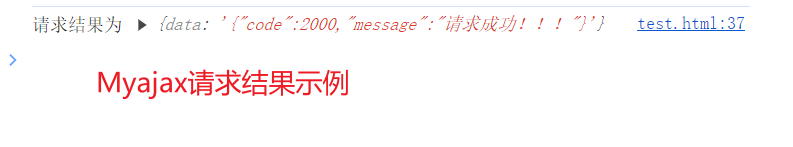

# 防抖和节流

## 防抖

- 用户触发操作过于频繁，只需要最后一次事件的操作

```js
let input = document.querySelector("input"); //此处的场景是拿着用户的输入结果与后端服务器进行ajax交互，如果每输入一次就发送一个ajax请求将会对性能的消耗非常大
input.onchange = function () {
  console.log(this.value);
};

//全局写法
let input = document.querySelector("input");
let t = null;
// 下面函数保证了只有最后一个settimeout被保留
input.onchange = function () {
  //当onchange事件被触发时，执行该函数
  //每次执行时都判断前面是否还有timeout，有则清除
  if (t != null) {
    clearTimeout(t);
  }
  //每次执行都将t重新赋值一个timeout
  t = setTimeout(() => {
    console.log(this.value); //业务代码
  }, 500);
};
```

```html
<!--
此处的一个报错：Cannot set properties of null (setting 'oninput')
原因：<script>标签写在了<header>中，导致JavaScript代码在DOM元素加载之前执行
解决办法：通过将代码放在 window.onload 事件处理函数中，或者HTML的 body 标签最后面
-->
<input />
<script>
  let inp = document.querySelector("input");
  inp.oninput = debounce(function () {
    //该函数即为settimeout中的参数Fn
    console.log(this); //使用call后，this指向DOM元素
  });
  //闭包写法
  // 上面代码存在的问题：1、引入了全局变量和全局函数 2、防抖代码和业务代码混在了一起，不利于维护
  //定义防抖函数
  function debounce(fn, delay) {
    let t = null;
    //事件函数this指向input DOM元素
    return function () {
      if (t != null) {
        clearTimeout(t);
      }
      //每次执行都将t重新赋值一个timeout
      t = setTimeout(() => {
        fn.call(this); //call改变了调用fn函数的对象，不使用call，由window对象调用，使用call则由DOM元素调用该函数，this指向也就是DOM元素
      }, delay);
    };
  }
</script>
```

## 节流

- 控制比较耗费性能的代码的执行次数

```js
// 下面代码的逻辑是，flag为true时，执行业务代码，由于setTimeout，每隔一秒只能执行一次
let flag = true;
window.onscroll = function () {
  if (flag) {
    setTimeout(() => {
      console.log("hello world");
      flag = true;
    }, 1000);
  }
  flag = false;
};

//封装

window.onscroll = throttle(function () {
  console.log("hello world");
}, 1000);
function throttle(fn, delay) {
  let flag = true;
  return function () {
    if (flag) {
      setTimeout(() => {
        fn();
        flag = true;
      }, delay);
    }
    flag = false;
  };
}
```

# this 指向相关

## 手写实现 call apply bind

### Function.prototype.call()

- 语法：func.call(thisArg, arg1, arg2,...)
- 作用：指定函数内部 this 指向（函数执行作用域），然后在该作用域中调用该函数

- 实现方案一（不推荐）

```js
function foo(name, age) {
  console.log(this, name, age);
}

Function.prototype.myCall = function (thisArg, ...args) {
  // 判断 thisArg是不是一个对象  如果不是 需要包装成对象
  thisArg =
    thisArg === null || thisArg === undefined ? window : Object(thisArg);

  // 给这个 thisArg  对象 添加一个 属性  fn   然后执行这个fn
  //  这个时候的 fn的this 指向就是  当前函数
  Object.defineProperty(thisArg, fn, {
    configurable: true,
    enumerable: false,
    value: this,
    //thisArg.fn = this = foo
  });

  thisArg.fn(...otherArgs); //执行

  delete thisArg.fn; //删除
};
```

#### 实现方案二

> 参考：[【掘金-麻不烧】](https://juejin.cn/post/7128233572380442660)

- 搭个架子

```js
Function.prototype.myCall = function (target, ...args) {};
```

> - 进阶

```js
Function.prototype.myCall = function (target, ...args) {
  target = target || window;
  // 给target对象绑定一个对象
  const symbolKey = Symbol();
  target[symbolKey] = this;
  // 返回函数执行结果
  const res = target[symbolKey](...args);
  // 删除以释放内存
  delete target[symbolKey];
  // 返回函数的指向结果
  return res;
};
```

### Function.prototype.apply()

- 语法：func.apply(thisArg, argsArray)
- 作用：==同 call 方法==

#### 实现方式一（不推荐）

```js
function foo(name, age) {
  console.log(this, name, age);
}

Function.prototype.myCall = function (thisArg, ...thisArgs) {
  // 判断 thisArg是不是一个对象  如果不是 需要包装成对象
  thisArg =
    thisArg === null || thisArg === undefined ? window : Object(thisArg);

  // 给这个 thisArg  对象 添加一个 属性  fn   然后执行这个fn
  //  这个时候的 fn的this 指向就是  当前函数
  Object.defineProperty(thisArg, fn, {
    configurable: true,
    enumerable: false,
    value: this,
    //thisArg.fn = this = foo
  });

  thisArg.fn(...otherArgs); //执行

  delete thisArg.fn; //删除
};
```

#### 实现方案二

> 参考：[【掘金-麻不烧】](https://juejin.cn/post/7128233572380442660)

```js
Function.prototype.myApply = function (target, args) {
  // 区别就是这里第二个参数直接就是个数组
  target = target || window;
  // 为target对象赋值一个属性，属性值为函数对象
  const symbolKey = Symbol();
  // 由于call()函数被一个函数对象所调用，所以此处的this指向是该函数对象
  target[symbolKey] = this;
  // 在call()函数内部直接调用该函数并得到返回结果
  const res = target[symbolKey](...args);
  // 执行完借用的函数后，删除以释放内存空间
  delete target[symbolKey];
  // 返回函数执行结果
  return res;
};
```

### Function.prototype.bind()

- 语法：func.bind(thisArg, arg1, arg2,....)
- 作用：创建一个新函数，当调用该新函数时，它会调用原始函数并将其 this 关键字设置为给定的值

- 先搭个架子
  > - 绑定一个对象，返回一个函数

```js
Function.prototype.myBind=function(target,...outerArgs){
  target=target||{};
  return function(){}
```

- 进阶
  > - 给 target 对象绑定一个方法，由于 bind 本身是一个函数，一般都是由另外一个函数对象（要改变`this`指向的函数）调用，所以 bind 函数内部的 this 指向就是想要改变 `this`指向那个函数
  > - 另外，返回的函数要能够接受参数

> 参考：[【掘金-麻不烧】](https://juejin.cn/post/7128233572380442660)

```js
Function.prototype.myBind = function (target, ...outerArgs) {
  // 定义target对象
  target = target || {};
  // 为target对象赋值一个属性，属性值为函数对象
  const symbolKey = Symbol();
  target[symbolKey] = this;
  // 返回一个函数，用于接收剩余参数
  return function (...innerArgs) {
    // 在返回的函数中进行调用
    target[symbolKey](...outerArgs, ...innerArgs);
    // 执行完毕，删除借用的函数，释放内存空间
    delete target[symbolKey];
  };
};
```

# Promise 相关

## 实现一个 Promise.finally

```js
Promise.prototype.finally = function (callback) {
  let P = this.constructor;
  return this.then(
    (value) => {
      callback();
      return value;
    },
    (error) => {
      callback();
      throw error;
    }
  );
};
```

> 上面代码，为什么需要 Promise.resolve(callback()).then(() => value)，而不能直接执行 callback, return value？
> 因为 callback 如果是个异步操作，返回 promise 呢.希望等 callback 执行完再接着执行

## 实现一个 sleep 函数

- 见《js 面试题之手写代码》

## 手写 ajax

- 在不刷新页面的情况下，请求特定的 URL 以获取数据

### XMLHttpRequest 对象

| 属性         | 描述                        |     |
| ------------ | --------------------------- | --- |
| readyState   | 本次请求状态                |     |
| status       | 本次请求的 HTTP 状态码      |     |
| responseBody | 服务器返回内容的正文        |     |
| responseText | 以字符串形式返回响应信息    |     |
| responseXML  | 以 XML 数据形式返回响应信息 |     |

> readyState 状态
> 0：尚未初始化（没有调用 open()方法）
> 1：没有调用 send()方法，
> 2：send()方法已经调用，未得到服务器返回，
> 3：接收了部分服务器数据，
> 4：接收了全部服务器数据，本次请求完全结束

### XMLHttpRequest 对象的基本使用

**使用步骤**

1. 实例化 xmlhttprequest 对象
2. 设置请求头
3. 通过 open()方法打开服务器 url 地址
4. 注册 onreadystatechange 事件处理函数
5. 调用 send()方法发送请求

```js
let xhr = new XMLHttpRequest();
xhr.open("get", url);
xhr.onreadystatechange = function () {
  if (xhr.readyState === 4 && xhr.status == 200) {
    //业务代码
  }
};
xhr.send();

//open()方法
//open(method,url,async)    规定请求的类型，URL，请求是否应该进行异步处理。
```

### ajax 的基础封装

```js
// 初步封装：采用回调函数
let res = myajax("get", url, function (result) {
  alert(result);
});
function myajax(method, url, next) {
  let xhr = new XMLHttpRequest();
  xhr.open(method, url);
  xhr.send();
  xhr.onreadystatechange = function () {
    if (xhr.readyState === 4 && xhr.status == 200) {
      //业务代码
      //return xhr.responseText 不能使用return返回异步请求内容
      next(xhr.responseText);
    }
  };
}
```

### 基于 promise 的封装

- 封装方式一：

```js
let res = myajax("get", url).then((res) => {
  console.log(res);
});

function myajax(method, url) {
  return new Promise((resolve) => {
    let xhr = new XMLHttpRequest();
    xhr.open(method, url);
    xhr.setRequestHeader("Accept", "application/json");
    xhr.onreadystatechange = function () {
      if (xhr.readyState === 4 && xhr.status == 200) {
        //业务代码
        //return xhr.responseText 不能使用return返回异步请求内容
        resolve(xhr.responseText);
      }
    };
    xhr.send();
  });
}
```

- 封装方式二：
  > 来源于 《阮一峰 es6 入门》

```js
const getJSON = function (url) {
  const promise = new Promise(function (resolve, reject) {
    const handler = function () {
      if (this.readyState !== 4) {
        return;
      }
      if (this.status === 200) {
        resolve(this.response);
      } else {
        reject(new Error(this.statusText));
      }
    };
    const client = new XMLHttpRequest();
    client.open("GET", url);
    client.onreadystatechange = handler;
    client.responseType = "json";
    client.setRequestHeader("Accept", "application/json");
    client.send();
  });

  return promise;
};

getJSON("/posts.json").then(
  function (json) {
    console.log("Contents: " + json);
  },
  function (error) {
    console.error("出错了", error);
  }
);
```

- 封装方式三：
  > 来源于：掘金 《https://juejin.cn/post/6844904046436843527》

```js
myajax({ url = "", method = "post", data, headers = {}, requestList }) {
  return new Promise((resolve, reject) => {
    let xhr = new XMLHttpRequest();
    xhr.open(method, url);
    Object.keys(headers).forEach((key) => {
      xhr.setRequestHeader(key, headers[key]);
    });
    xhr.send(data);
    xhr.onload = (e) => {
      resolve({
        data: e.target.response,
      });
    };
  });
},
```

```js
// 调用
// 后端返回示例
//res.json({
// code: 2000,
// message: "请求成功！！！",
// })
myajax({
  url: "http://localhost:8000/hello",
  method: "get",
}).then((res) => {
  console.log("请求返回结果为：", res);
  // 使用jSON.parse解码
  console.log("请求返回结果为：", JSON.parse(res.data));
});
```



# 其他手写题

## 对 js 原型的认识

### 实现 (5).add(3).minus(2) 功能

```js
Number.prototype.add = function (n) {
  return this.valueOf() + n;
};
Number.prototype.minus = function (n) {
  return this.valueOf() - n;
};
```

### 手写一个 new

```js
function _new(fn, ...arg) {
  const obj = Object.create(fn.prototype);
  const ret = fn.apply(obj, arg);
  return ret instanceof Object ? ret : obj;
}
```

# js 类型互转

## 对象 Obj 转化成一个二维数组

```js
const obj = {
  a: [1, 2, 3],
  b: [4, 5, 6],
  c: [7, 8, 9],
};

const objToArr = Object.values(obj).reduce((acc, currentValue) => {
  acc.push(currentValue);
  return acc;
}, []);
```
