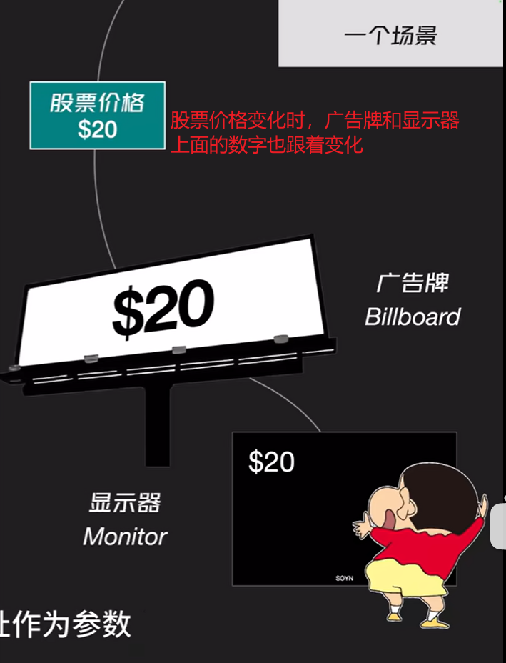

# 要完成的面试题

```
跨域问题
事件循环
原型与原型链
实现发布订阅
http请求头与请求体
session、cookie、token
```

## 跨域问题及解决方案

- CORS
  在后端设置几个响应头
  如 `Access-Control-Allow-Origin: *`

- 反向代理
  在 nginx/traefik/haproxy 等反向代理服务器中设置为同一域名
- JSONP
  详解见 JSONP 的原理是什么，如何实现

## 事件循环

### 浏览器中

**宏任务(macro-task)**

- script （整体代码）
- setTimeout
- setInterval
- setImmediate
- UI render

**微任务(micro-task)**

- Promise.then
- MutaionObserver

> 代码执行顺序
> 整个 js 文件作为一个宏任务开始执行，执行期间，遇到宏任务将其放在宏任务队列当中，遇到微任务将其放在微任务队列当中，整个 js 文件执行完毕，代表本轮 宏任务结束。
> 每一个宏任务结束后都要先执行本宏任务产生的微任务，也就是执行微任务队列中的任务，如果微任务在执行过程中产生宏任务，就将其放在宏任务队列中，如果产生了微任务，继续将其添加至微任务队列。
> 当微任务队列为空时，执行下一轮宏任务，如此循环

**别人的总结**

执行宏任务，然后执行该宏任务产生的微任务，若微任务在执行过程中产生了新的微任务，则继续执行微任务，微任务执行完毕后，再回到宏任务中进行下一轮循环

### promise.then/catch/finally

### 事件循环经典题目

- promise/setTimeout/async/await

```js
console.log("script start"); //1

async function async1() {
  await async2(); // 跳转2
  console.log("async1 end"); //微1  > 4
}
async function async2() {
  console.log("async2 end"); // 跳转2 > 2
}
async1(); // 跳转2

setTimeout(function () {
  console.log("setTimeout");
}, 0); // 宏1 > 7

new Promise((resolve) => {
  console.log("Promise"); //3
  resolve();
})
  .then(function () {
    console.log("promise1"); //微2  > 5
  })
  .then(function () {
    console.log("promise2"); // 微3  >6
  });
```

- 题目二（**明星题**）：很诡异的一道题，但原理很简单

```js
for (var i = 0; i < 5; i++) {
  setTimeout(function () {
    console.log(i);
  }, 1000);
}
console.log(i);

// 输出：5 5 5 5 5 5
```

> 代码解释：为什么上面代码执行后打印了六次 5？？？
>
> - 当 setTimeout 被调用时，它并不会立即执行其回调函数，而是将这个回调函数放入宏任务队列，等待当前执行栈清空且事件循环到达下一个事件循环迭代时，才会被调用。
> - 很明显，setTimeout 设置了延时为 1 秒，而在这 1 秒之内，**变量 i**已经完成多次赋值，并且最终的值为 5，所以得到了“诡异的结果”

### 同步异步及代码执行顺序

> js 事件循环
> libuv 引擎中的事件循环分为 6 个阶段，它们会按照顺序反复运行。每当进入某一个阶段的时候，都会从对应的回调队列中取出函数去执行。当队列为空或者执行的回调函数数量到达系统设定的阈值，就会进入下一阶段。下面 是 Eventloop 事件循环的流程：
> 
> 整个流程分为六个阶段，当这六个阶段执行完一次之后，才可以算得上执行了一次 Eventloop 的循环过程。下面来看下这六个阶段都做了哪些事：
> timers 阶段：执行 timer（setTimeout、setInterval）的回调，由 poll 阶段控制；
> I/O callbacks 阶段：主要执行系统级别的回调函数，比如 TCP 连接失败的回调；
> idle, prepare 阶段：仅 Node.js 内部使用，可以忽略；
> poll 阶段： 轮询等待新的链接和请求等事件，执行 I/O 回调等；
> check 阶段：执行 setImmediate() 的回调；
> close callbacks 阶段：执行关闭请求的回调函数，比如 socket.on('close', ...)

```js
//setImmediate(func,...args)
//要执行的函数，传入函数的参数
function func(...data) {
  console.log(data);
}
setImmediate(func, 111, 222);
```

### 一些基础的题目

```js
for (let i = 0; i < 1000; i++) {
  console.log(1);
}
setTimeout(() => {
  console.log(2);
}, 0);
setTimeout(() => {
  console.log(3);
}, 0);
setTimeout(() => {
  console.log(4);
}, 0);
console.log(5);
//上面代码的输出顺序为：11111....1115234
```

```js
//promise对象和async
let p = new Promise(() => {
  console.log(1);
});
p.then(() => {
  console.log(2);
});
//上面代码输出结果：1   原因：调用resolve时执行then
let p = new Promise((resolve) => {
  console.log(1);
  resolve("hello world");
});
p.then((data) => {
  console.log(data);
});
//上面代码输出结果：1 hello world

axios.get(url).then((res) => {
  console.log(res);
});
//原理：将获取到的数据通过resolve传递出来，然后才能通过then获取到数据
```

```js
//await后面加promise对象就可以直接得到resolve的值
let p1 = new Promise((resolve) => {
  resolve(1);
});
let p2 = new Promise((resolve) => {
  resolve(2);
});
async function fun() {
  let data1 = await p1;
  let data2 = await p2; //相当于执行p2.then()中的回调函数
  console.log(data1, data2); //在await后执行的代码，也即在then()后执行。故可以看做是then()中执行的代码
}
//代码输出结果：1,2
```

### async

- async 函数返回一个 Promise 对象
- 下面三种函数的写法是等价的

```js
function f() {
  return Promise.resolve("test");
}
function f() {
  return new Promsie((resolve) => {
    resolve("test");
  });
}
async function f() {
  return "test";
}
```

### await 原理

- await 后面跟随一个 `Promise` 对象，返回该对象的结果
- 如果后跟不是一个 `Promise` 对象，则直接返回对应的值
- 可以理解为：await 这一行代码后面的部分相当于 `promise.then`中的内容,整体作为一个微任务

```js
async function f() {
  // 等同于
  // return 123
  return await 123;
}
f().then((res) => console.log(res)); // 123
```

从字面意思上看 await 就是等待，await 等待的是一个表达式，这个表达式的返回值可以是一个 promise 对象也可以是其他值。
await 是一个让出线程的标志。await 后面的表达式会先执行一遍，将 await 后面的代码加入到 microtask 中，然后就会跳出整个 async 函数来执行后面的代码。

```js
async function async1() {
  console.log("async1 start");
  await async2();
  console.log("async1 end");
}
//相当于
async function async1() {
  console.log("async1 start");
  Promise.resolve(async2()).then(() => {
    console.log("async1 end");
  });
}
```

- await 在等待什么？等待的是 promise 的状态改变，也就是等待 resolve 和 reject 函数，如果 await 后面跟的是 promise 对象，但是该 promise 对象没有 resolve 值，那该行代码会一直处于 await 状态， await 后面的代码也不会执行

```js
async function async1() {
  console.log("async1 start");
  await new Promise((resolve) => {
    // 该promise 对象没有resolve值出去
    console.log("promise1");
  });
  console.log("async1 success"); // 不会执行
  return "async1 end";
}
console.log("srcipt start");
async1().then((res) => console.log(res));
console.log("srcipt end");
```

- 上面提到，await 一个 Promise 对象时，就相当于在等 Promise 内部的代码执行到 resolve 或者 reject 函数，使用 await 就不用再用 then 或 catch 接收结果，直接将 await 的结果赋值给一个变量即可

### 题目 1

```js
console.log(1); //同步1
async function async1() {
  await async2();
  console.log(2); //相当于promise.then    微任务5
}
async function async2() {
  console.log(3); //同步2
}
async1(); //函数>>>同步2
setTimeout(function () {
  console.log(4); //宏任务8
}, 0);
new Promise((resolve) => {
  console.log(5); //同步3
  resolve();
})
  .then(function () {
    console.log(6); //微任务6
  })
  .then(function () {
    console.log(7); //微任务7
  });
console.log(8); //同步4
//上面代码执行顺序：1
```

### 题目 2

```js
setImmediate(() => {
  console.log(1); //宏任务7
});
console.log(2); //同步1
setTimeout(() => {
  console.log(3);
}, 0); //宏任务6
setTimeout(() => {
  console.log(4);
}, 100);
console.log(5); //同步2
new Promise((resolve) => {
  console.log(6); //同步3
  resolve();
}).then(() => {
  console.log(7); //微任务5
});
process.nextTick(() => {
  console.log(8); //nextTick4
});
//上述代码执行顺序：2、5、6、8、7、3、1、4
```

### 题目 3

```js
//请写出输出内容
async function async1() {
  console.log("async1 start");
  await async2();
  console.log("async1 end");
}
async function async2() {
  console.log("async2");
}

console.log("script start");

setTimeout(function () {
  console.log("setTimeout");
}, 0);

async1();

new Promise(function (resolve) {
  console.log("promise1");
  resolve();
}).then(function () {
  console.log("promise2");
});
console.log("script end");

/*
script start
async1 start
async2
promise1
script end
async1 end
promise2
setTimeout
*/
```

# this 指向问题

**this 的绑定方式**

1. 默认绑定。非严格模式 this 指向全局对象、严格模式 this 绑定到 undefined
2. 隐式绑定。如 obj.foo() foo 内的 this 指向 obj
3. 显式绑定。通过`call`或者`apply`的方式直接指定 this 的绑定对象
4. new 绑定
5. 箭头函数绑定（this 的指向由外层作用域决定）

## 题目

### 默认绑定

**前置知识**

> 使用 var 创建变量的时候(不在函数里)，会把创建的变量绑定到全局对象 window 上，而 let、const 则不会
> 在非严格模式（non-strict mode）下，当函数不是作为对象的方法被调用时，this 通常会指向全局对象
> 在严格模式（'use strict';）下，如果函数不是作为对象的方法被调用，或者没有使用 new、call、apply、bind 等方法来显式地设置 this，那么 this 将会是 undefined

- 题目一

```js
function foo() {
  console.log(this);
}
// 此处相当于 window.foo()，也就是window调用了foo函数
foo(); // window
```

- 题目二

```js
function foo() {
  function inner() {
    console.log(this);
  }
  inner();
}
// 在foo()中调用inner()时，没有被任何对象调用，
// 那么在非严格模式下，this将默认指向window
foo(); // window
```

### 隐式绑定

**隐式绑定的 this 错乱问题:隐式丢失**
如果你把一个函数当成参数传递到另一个函数的时候，也会发生隐式丢失的问题，且与包裹着它的函数的 this 指向无关。在非严格模式下，会把该函数的 this 绑定到 window 上（**原因如下：**），严格模式下绑定到 undefined。

- 原因一：如果回调函数本身未声明过，直接作为回调定义，那么实际上它是定义在全局作用域中（尽管它是作为参数传递的，但没有在任何函数内部定义）
- 原因二：对于一个普通函数，其作为参数传递时，并没有进行调用，仅仅是将该函数本身传递给了另一个函数，至于传递过去什么时候调用，由谁调用（大概率由 window 直接调用），都是不确定的。
- 原因三：...

> this 永远执指向最后调用它的对象

- 题目一

```js
var obj = {
  foo: function () {
    console.log(this);
  },
};
// 此处相当于 window.obj.foo(),obj为最后的调用者
obj.foo(); // obj {...}
```

- 隐式丢失问题实例

```js
var obj = {
  foo() {
    console.log(this);
  },
  foo2:()=>{
    console.log(this)   /
  }
};

function doFoo(fn) {
  fn();
}
// 此处相当于 window.doFoo(obj.foo)，也就是doFoo内部指向了window,
doFoo(obj.foo); // window
doFoo(obj.foo2); // window
```

> 解释：
>
> - `obj.foo()`函数只是作为参数传递了过去，最终还是要被 window 对象调用
> - `obj.foo2()`函数，尽管其定义在了对象内部，但是由于对象本身构成不了 作用域，该箭头函数内部的`this`指向仍然是`window`对象

下面我们尝试使用一个对象来调用 doFoo 函数，用以探索被当成参数传递的函数的外部函数的 this 执行是否会影响其 this 指向

```js
var obj = {
  foo() {
    console.log(this); // window
  },
};

var obj2 = {
  doFoo(fn) {
    console.log(this); // {  doFoo: f }
    fn();
  },
};

obj2.doFoo(obj.foo);
// {  doFoo: f }
// window
```

> 常见场景：在`setTimeout`函数的函数，就是因为隐式丢失的问题，导致，被传入的函数中的 this 总是指向 window

### 显式绑定

> 使用 call、apply、bind 等函数强项改变函数的 this 指向
>
> - `call(thisArg, arg1, arg2, ..., argN)`
> - `apply(thisArg, argsArr)`
> - `bind(thisArg, arg1, arg2, ..., argN)`

- 题目一

```js
function foo() {
  console.log(this.a);
  return function () {
    console.log(this.a);
  };
}
var obj = { a: 1 };
var a = 2;
foo(); // 2
foo.bind(obj)(); // 1
foo().bind(obj)(); //2 1
```

> 执行 foo()时，实际上仅仅执行了`console.log()`，因为 return 出来的函数没有变量接受，更不会调用，
> 同理，给 foo 绑定 bind 函数，也就是`foo.bind`将会返回一个新的函数，后面加一个括号代表调用这个新的函数，与上面`foo()`的解释一样,`bind`只是改变了函数内部的 this 指向，所以也只会执行`console.log`，而 return 出来的函数没有变量接收，更不会调用
> 对于`foo().bind(obj)()`,函数`foo()`先执行了一次，然后将返回的函数交给了 bind，两者形成一个新的函数，再执行一遍，所以输出两次

- 题目二

```js
function foo() {
  console.log(this.a);
  return function () {
    console.log(this.a);
  };
}
var obj = { a: 1 };
var a = 2;

foo(); // 2
foo.call(obj); // 1
foo().call(obj); //2 1
```

> `foo()`的解释同上
> 给函数绑定`call`,改变函数内部`this`指向的同时，立即执行该函数，所以也只会执行 `cossole.log()`

- 题目

```js
var obj1 = {
  name: "obj1",
};
var obj2 = {
  name: "obj2",
  foo1: function () {
    console.log(this.name);
  },
  foo2: function () {
    function inner() {
      console.log(this.name);
    }
    inner();
  },
  foo3: function () {
    function inner() {
      console.log(this.name);
    }
    inner.call(obj1);
  },
};
var name = "window";
obj2.foo1(); //obj2
obj2.foo2(); // window
obj2.foo3(); // obj1
```

- 题目

```js
var name = "window";
var obj = {
  name: "张三",
};
function foo1(age) {
  console.log(`名字：${this.name},年龄：${age}`);
}
var foo2 = function () {
  return foo1.call(obj, ...arguments);
};
foo2(3); // 名字：张三,年龄：3
```

### 箭头函数

> 箭头函数中的 this 由外层作用域来决定（箭头函数中没有 this 绑定，必须通过查找**作用域链**来决定其值，如果箭头函数被非箭头函数包含，则 this 绑定的是最近一层非箭头函数的 this，否则，this 为 undefined。），且指向函数定义时的`this`而非执行时。
> 非箭头函数的函数的 this 指向，通常是最后调用它的对象，箭头函数不遵循这一规律
> 箭头函数的`this`指向由其外层作用域决定，也可以说箭头函数会从**外部函数作用域**或**全局作用域（如果在顶层调用）**中捕获 this 的值
> 作用域只有全局作用域 window 和局部函数作用域

#### 箭头函数的特殊性

箭头函数内部的 this 指向在定义时就已经确定了，它取决于定义箭头函数时的上下文对象（词法作用域）。具体来说，箭头函数不会创建自己的 this 上下文，而是会捕获其所在上下文（即包围它的函数或全局作用域）中的 this 值。

由于这个特性，call()、apply() 和 bind() 方法都不能用来修改箭头函数内部的 this 指向。这些方法通常用于改变函数调用时的 this 上下文，但对于箭头函数来说，这是不必要的也是无效的，因为箭头函数已经通过词法作用域绑定了自己的 this

- 示例：call()、apply() 和 bind() 方法都不能用来修改箭头函数内部的 this 指向

```js
var name = "张三";
const bb = () => {
  console.log(this.name);
};
const obj = {
  name: "李四",
};
bb.call(obj); // 张三
bb.apply(obj); // 张三
bb.bind(obj)(); // 张三
```

#### 特殊的例题

- 例题一：

```js
var name = "小张";
// 使用箭头函数
setTimeout(() => {
  let name = "小李子";
  console.log(this.name); // 小张
}, 200);
// 普通函数
setTimeout(function () {
  let name = "小哈哈";
  console.log(this.name); // 小张
}, 200);
```

- 代码执行结果的解释

  > - 第一个 setTimeout 中定义的箭头函数中的 this 指向在定义时已经确定，指向外部的 setTimeout，后者由`window`调用，故`this`指向`window`
  > - 第二个 setTimeout 中定义的普通函数，其外部 setTimeout 被`window`调用后，其本身再由`window`调用，故`this`指向`window`

- 例题二：

```js
var name = "lucy";
var obj = {
  name: "martin",
  say: function () {
    console.log(this.name);
  },
};
obj.say(); //martin，this指向obj对象
setTimeout(obj.say, 0); //lucy，this指向window对象
```

> 代码执行结果解释
>
> - 普通函数中，this 的指向取决于函数是如何被调用的
> - 第一次调用,`obj.say()`直接在 obj 对象上调用，因此 `this`指向了调用该方法的对象本身，即`obj`对象
> - 第二次，在 setTimeout，作为第一个参数，实际上传递的是 `obj.say` 属性的值，也即函数本身，而不是函数的调用，而该函数最终在定时器结束时，由全局对象`window`进行调用，因此，`this`指向`window`

- 解决方案

```js
// 箭头函数
// 原理还是将该函数由对象本身调用
setTimeout(() => {
  obj.say();
}, 0);

// 方案二：使用bind
setTimeout(obj.say.bind(obj), 0);

// 方案三：使用闭包
setTimeout(function () {
  obj.say();
}, 0);
```

- 例题三：

```js
var crop = {};
crop.list = [];

// 订阅函数
crop.on = function (fn) {
  this.list.push(fn);
};

// 发布函数
crop.emit = function (...args) {
  this.list.forEach((cb) => {
    console.log("this指向问题：", this, args); // crop对象本身
    cb.apply(this, args);
  });
};

// 绑定一个订阅事件
crop.on((...args) => {
  console.log("on函数中的this指向", this); // window
  // 订阅函数的功能
  console.log("这是第一个订阅函数,接收到的参数为：", args);
});
// 绑定第二个订阅事件
crop.on(function (...args) {
  console.log("on函数中的this指向", this); // crop对象本身
  //订阅函数的功能
  console.log("这是第二个订阅函数,接收到的参数为：", args);
});
// 发布一个事件
crop.emit("前端", 10000);
```

> 注意
>
> - 上面代码中，定义了一个对象，`on`方法规定传递一个`函数Fn`作为形参，且`函数Fn`可以接受多个参数
> - 由于没有订阅事件的类型，`emit`方法的功能是：遍历`list`中存储的**每一个订阅函数**，并依次执行，其中`emit`函数可以接受多个参数，并透传给**每个要执行的订阅函数**
> - 使用`on`方法，绑定了两个订阅函数。其中第一个是箭头函数，其 this 指向**在定义时已经确定**：定义在全局作用域中（尽管它是作为 crop.on 的参数传递的，但没有在任何函数内部定义），因此其内部 this 始终指向为全局（**apply()方法无法改变其 this 指向**）。第二个是普通函数，定义在全局作用域中（尽管它是作为 crop.on 的参数传递的，但没有在任何函数内部定义），因此内部 this 刚开始时指向为全局，后边通过`apply()`方法修改后指向`crop对象`

#### 真实例题

- 题目一：

```js
var obj = {
  name: "obj",
  foo1: () => {
    console.log(this.name);
  },
  foo2: function () {
    console.log(this.name);
    return () => {
      console.log(this.name);
    };
  },
};
var name = "window";
obj.foo1(); // window
obj.foo2()(); // obj  obj
```

> `obj.foo1()`是一个箭头函数，该箭头函数内部的 this 尝试沿着**作用域链**，逐层向上捕获`this`,向上找一层`obj`（对象本身没有作用域）,再向上找到`window`全局作用域对象，所以，this 指向为 window
> `obj.foo2()`不是箭头函数，它遵循 this 指向的一般规律，即 this 总是指向最后调用它的那个对象,即`obj`.`obj.foo2()()`是一个箭头函数，该箭头函数内部的 this 自动捕获其外部作用域（等于其外部的函数的 this 指向），即`obj`本身，故打印了两次`obj`
> 换一种方式理解：`obj.foo2()()`函数返回了一个箭头函数，该箭头函数中的`this`指向在定义时已经确定好，由于其包含在一个普通函数内部，所以 其`this`指向为普通函数的`this`指向，二后者的`this`指向又由调用对象决定，显然`obj.foo2()`函数最近的调用对象为`obj`对象本身，所以打印了两次`obj`

- 题目二

```js
var name = "window";
var obj2 = {
  name: "obj2",
  foo: function () {
    console.log(this.name);
    return () => {
      console.log(this.name);
    };
  },
};
var obj3 = {
  name: "obj3",
  foo: () => {
    console.log(this.name);
    return function () {
      console.log(this.name);
    };
  },
};
var obj4 = {
  name: "obj4",
  foo: () => {
    console.log(this.name);
    return () => {
      console.log(this.name);
    };
  },
};

obj2.foo()(); // 'obj2' 'obj2'
obj3.foo()(); // 'window' 'window'
obj4.foo()(); // 'window' 'window'
```

> `obj2.foo()`不是箭头函数，它遵循 this 指向的一般规律，即 this 总是指向最后调用它的那个对象，即`obj2`，然后它返回了一个箭头函数，`obj2.foo()()`调用该箭头函数时，该箭头函数捕获了外部函数（即 foo 函数）的`this` 值，所以其内部的 this 指向是 obj2
> `obj3.foo()`是箭头函数，其 this 指向由外层作用域决定（同题目一），因此为 window，内层普通函数由调用者决定，调用它的是 window，因此也为 window
> `obj4.foo()`两层都是箭头函数，第一个箭头函数的 this 由外层作用域决定，因此为 window，第二个箭头函数的 this 也由外层作用域决定，它的外层作用域是第一个箭头函数，而第一个箭头函数的 this 是 window，因此内层的 this 也是 window

# js 设计模式

## 单例模式

单例模式（Singleton Pattern）是一种创建型设计模式，它确保一个类只有一个实例，并提供一个全局访问点来访问这个唯一实例。

- 示例
  > - 下面将通过一个具体的场景来说明单例模式的优点
  > - 假设我们有一个 AuthManager 类，它负责管理用户的登录状态，包括存储用户的令牌（token）、检查用户是否已登录以及执行登录和注销操作。
  > - 此时，使用单例模式可以确保在整个应用程序中只有一个 AuthManager 实例，这样我们就可以在整个应用程序中共享和管理用户的登录状态，而无需担心在不同地方创建多个实例导致的状态不一致问题
  > - 具体来说，下面代码中，提供了一个静态的 getInstance 方法来获取单例实例。这样，无论我们在应用程序的哪个部分需要访问或管理用户的登录状态，我们都可以使用 AuthManager.getInstance()来获取同一个 AuthManager 实例，并确保状态的一致性

```js
class AuthManager {
    // 私有静态变量来保存单例实例
    private static instance = null;

    // 私有构造函数，防止从外部使用 new 关键字创建实例
    private constructor() {
        this.token = null; // 存储用户令牌的属性
        // ... 其他属性和方法
    }

    // 静态方法用于获取单例实例
    static get getInstance() {
        if (!AuthManager.instance) {
            AuthManager.instance = new AuthManager();
        }
        return AuthManager.instance;
    }

    setToken(token) {
        this.token = token;
    }

    isLoggedIn() {
        return this.token !== null;
    }

    logout() {
        this.token = null;
    }
}

// 使用示例
// 获取AuthManager的实例
const authManager = AuthManager.getInstance;

// 设置用户令牌（登录）
authManager.setToken('user-token-123');

// 检查用户是否已登录
console.log(authManager.isLoggedIn()); // 输出: true

// 注销用户
authManager.logout();

// 再次检查用户是否已登录
console.log(authManager.isLoggedIn()); // 输出: false

// 尝试使用new关键字创建新的AuthManager实例（失败，因为构造函数是私有的）
// const anotherAuthManager = new AuthManager(); // 这会抛出错误

```

## 观察者模式

**问题引入**
先看一个场景


为了达到上面的场景，可以这么写

```js
// 显示器
class Monitor {
  print(price) {
    console.log("Monitor", price);
  }
}
// 广告牌
class Billboard {
  display(price) {
    console.log("Billboard", price);
  }
}
// 股票
class Stock {
  constructor() {
    this.price = 20;
    this.monitor = new Monitor();
    this.billboard = new Billboard();
  }
  // 价格波动
  setPrice(newPrice) {
    this.price = newPrice;
    this.monitor.print(newPrice);
    this.billboard.display(newPrice);
  }
}

function main() {
  let stock = new Stock();
  stock.setPrice(40);
}
main();
```

- 上面代码存在的问题是，不同类之间的紧耦合，当两个观察者发生改变时，Stock 类也要跟着改变，这使得 stock 类的稳定性依赖于两个观察者类。而且当有第三个观察者加入时，Stock 也要跟着改变。

- 下面使用观察者模式进行设计

```js
class Observer {
  constructor(stock) {
    this.stock = stock;
  }
  update(newPrice) {}
}

class Monitor extends Observer {
  constructor(stock) {
    super(stock);
    this.stock.attach(this);
  }
  // 覆写父类的update()函数完成更新
  update(newPrice) {
    this.print(newPrice);
  }
  print(price) {
    console.log("Monitor", price);
  }
}

class Billboard extends Observer {
  constructor(stock) {
    super(stock);
    this.stock.attach(this);
  }
  // 覆写父类的update()函数完成更新
  update(newPrice) {
    this.display(newPrice);
  }
  display(price) {
    console.log("Billboard", price);
  }
}

class Stock {
  constructor() {
    this.observerSet = new Set();
  }
  attach(observer) {
    this.observerSet.add(observer);
  }
  ditach(observer) {
    this.observerSet.delete(observer);
  }
  notify(newPrice) {
    for (let observer of this.observerSet) {
      observer.update(newPrice);
    }
  }
  setPrice(newPrice) {
    this.price = newPrice;
    this.notify(newPrice);
  }
}

function main() {
  let stock = new Stock();
  let monitor = new Monitor(stock);
  let billboard = new Billboard(stock);
  stock.setPrice(40);
}
main();
```

- 上面代码中，Stock 类在构造时不再依赖任何观察者对象，因此这个类可以保持稳定，而观察者对象也可以自由选择观察目标

## 发布订阅模式

### 实现一个发布订阅

```js
class EventEmitter {
  constructor() {
    this.events = {};
  }

  // 订阅事件
  on(eventName, callback) {
    if (!this.events[eventName]) {
      this.events[eventName] = [];
    }
    this.events[eventName].push(callback);
  }

  // 取消订阅事件
  off(eventName, callback) {
    if (this.events[eventName]) {
      const index = this.events[eventName].indexOf(callback);
      if (index > -1) {
        this.events[eventName].splice(index, 1);
      }
    }
  }

  // 触发事件
  emit(eventName, ...args) {
    if (this.events[eventName]) {
      this.events[eventName].forEach((callback) => {
        callback(...args);
      });
    }
  }
}

// 使用示例
const eventEmitter = new EventEmitter();

// 订阅事件A
eventEmitter.on("eventA", (message) => {
  console.log(`Event A: ${message}`);
});

// 订阅事件A的另一个回调函数
eventEmitter.on("eventA", (message) => {
  console.log(`Another Event A callback: ${message}`);
});

// 订阅事件B
eventEmitter.on("eventB", (data) => {
  console.log(`Event B: ${data}`);
});

// 触发事件A
eventEmitter.emit("eventA", "Hello, Event A!");
// 输出: Event A: Hello, Event A!
// 输出: Another Event A callback: Hello, Event A!

// 触发事件B
eventEmitter.emit("eventB", "Hello, Event B!");
// 输出: Event B: Hello, Event B!

// 取消订阅事件A的一个回调函数
// 注意：为了简化示例，这里假设我们知道要取消的回调函数的引用
const callbackToRemove = (message) => {
  console.log(`Another Event A callback: ${message}`);
};
eventEmitter.off("eventA", callbackToRemove);

// 再次触发事件A，检查回调函数是否已被移除
eventEmitter.emit("eventA", "Hello again, Event A!");
// 输出: Event A: Hello again, Event A!
// 注意: 另一个回调函数没有再次被调用
```
