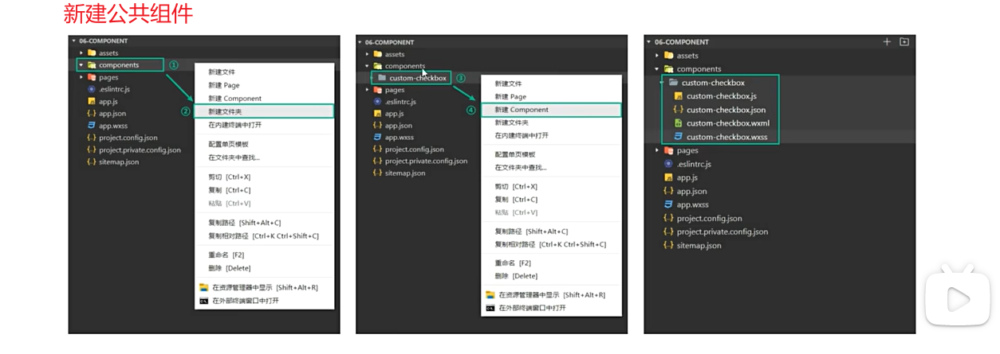

# 张三

## image 组件

- src：图片资源地址
- mode:裁剪与缩放模式
- show-menu-by-longpress：长按展示功能菜单，可将其转发给好友、收藏、保存
- lazy-load:图片懒加载，滑动到一定距离后展示图片

## text 组件

- user-select:长按显示选中文本
- space:显示连续空格

## navigator 组件

- url：跳转链接
- open-type:跳转方式

## scroll-view 组件

- 可滚动视图区域，用户通过手指滑动或点击滚动条展示想要的内容
- scroll-x

## 设置背景图片

- 设置`background-image`属性即可
- 不能设置 url()内的图片地址为本地图片，要么使用网络图片、要么将图片转换为 base64

```css
/*不能成功显示*/
background-image:url("../../assets/1.png")

/*本地图片替换为网络图片*/
background-image:url("1.png")

/*图片转base64*/
background-image:url(data:image/png;base64,ivOrw0KGoAA......)


```

# 自定义组件化

- 将页面中的功能模块抽取为自定义组件
- 分类：公共组件、页面组件
  > - 公共组件：放在根目录的 components 文件夹中
  > - 页面组件：放在对应页面的目录下，一个组件一个文件夹

## 组件的定义、注册、使用

### 公共组件

- 页面内功能模块抽离为自定义组件在不同页面使用

- 目录结构

```
|- 根目录
  |- components
    |- custom-checkbox      自定义全局组件
      |- custom-checkbox.wxml       (定义组件内容)
      |- custom-checkbox.js
      |- custom-checkbox.wxss
      |- custom-checkbox.json
  |- pages
    |- index
      |- index.wxml   （使用全局组件）
      |- index.wxss
      |- index.js
      |- index.json
  |- app.json       （注册全局组件）
```

- 创建公共组件
  

- `app.json` 注册组件

```json
{
  "entryPagePath": "pages/index/index",
  "pages": [],
  //...
  "usingComponents": {
    //key：自定义组件名
    //value：自定义组件路径
    "custom-checkbox": "./components/custom-checkbox/custom-checkbox"
  }
}
```

- `custom-checkbox.wxml`定义组件内容

```
<view>我是一个全局组件</view>
```

- `index.wxml`使用全局组件：将自定义组件名作为标签即可

```html
<custom-ckeckbox />
```

### 页面组件

- 页面组件：复杂页面拆分为多个低耦合模块
- 目录结构

```
|- 根目录
  |- components
  |- pages
    |- index
      |- custom-swiper    自定义页面组件
        |- custom-swiper.wxml     (页面组件内容)
        |- custom-swiper.wxss
        |- custom-swiper.js
        |- custom-swiper.json
      |- index.wxml         (使用页面组件)
      |- index.wxss
      |- index.js
      |- index.json      ( 注册页面组件)
```

- index.json 注册页面组件

```json
{
  "usingComponents": {
    //key：自定义组件名
    //value：自定义组件路径
    "custom-checkbox": "./custom-swiper/custom-swiper"
  }
}
```

- `custom-swiper.wxml`定义页面组件内容

```
<view>我是一个页面组件</view>
```

- `index.wxml`使用页面组件：将自定义组件名作为标签即可

```html
<custom-swiper />
```

## 组件的数据及方法

- 定义在组件.js 文件中

```
|- 根目录
  |- components
    |- custom-checkbox      自定义全局组件
      |- custom-checkbox.wxml       (定义组件内容)
      |- custom-checkbox.js
      |- custom-checkbox.wxss
      |- custom-checkbox.json
  |- pages
    |- index
      |- index.wxml   （使用全局组件）
      |- index.wxss
      |- index.js
      |- index.json
  |- app.json       （注册全局组件）
```

- `custom-checkbox.js`中定义组件的数据和方法

```js
Component({
  //组件初始数据
  data:{
    isChecked:false;
  },
  //组件方法列表
  methods:{
    updateChecked(){
      this.setData({
        isChecked:!this.data.isChecked
      })
    }
  }
})
```

- `custom-checkbox.wxml`中使用组件的数据和方法

```
<view class="container">
  <view class="box">
    <checkbox checked="{{isChecked}}" bindtap="updateChecked"></checkbox>
  </view>
</view>
```

- `custom-checkbox.wxss`中定义组件样式

```css
.container {
  display: inline-block;
}
```

- `index.wxss`中调整样式

```css
page {
  padding: 50rpx;
  box-sizing: border-box;
}
```

## 组件属性 properties

```
|- 根目录
  |- components
    |- custom-checkbox      自定义全局组件
      |- custom-checkbox.wxml       (定义组件内容)
      |- custom-checkbox.js
      |- custom-checkbox.wxss
      |- custom-checkbox.json
  |- pages
    |- index
      |- index.wxml   （使用全局组件）
      |- index.wxss
      |- index.js
      |- index.json
  |- app.json       （注册全局组件）
```

- 用于接受组件使用者传递给组件内部的数据
- custom-checkbox.js

```js
Component({
  properties:{
    //简写
    label:String
    //全写
    label:{
      //js基本数据类型
      type:String，
      value:'',
    },
    position:{
      type:String,
      value:"right"
    }
  }
})
```

- custom-checkbox.wxml 定义组件内容，并使用插件语法使用 index.html 传递过来的数据

```xml
<view class="container">
  <view>
    <!-- 其他内容... -->
    <view class="{{position==='right' ? 'right' : 'left'}}">
      <text>{{label}}</text>
    </view>
  </view>

</view>
```

- index.html 使用组件并向组件传递数据

```xml
<custom-checkbox label="我已阅读用户协议" position="right">
<custom-checkbox label="匿名提交" position="left">
```

## wxml 的 slot-插槽

> 插槽解决了什么问题？
> 你定义了一个组件并在 index.wxml 页面使用了它，代码如下

```xml
<custom01></custom01>
```

> 这时你想要在这个组件标签中间插入一段文本，直接插入你会发现这段文本不会显示

```xml
<custom01>这是插入的文件</custom01>
```

> 于是你需要先在 custom01 组件的 wxml 文件中使用`<slot/>`标签来作为占位符，为这段文本占位

```xml
<view>
  <slot />
</view>
```

> 重新编译发现文本得以显示

- 项目目录结构

```
|- 根目录
  |- components
    |- custom01      自定义全局组件
      |- custom01.wxml       (定义组件内容)
      |- custom01.js
      |- custom01.wxss
      |- custom01.json
  |- pages
    |- index
      |- index.wxml   （使用全局组件）
      |- index.wxss
      |- index.js
      |- index.json
  |- app.json       （注册全局组件）
```

### 默认插槽的使用

- 默认情况下，自定义组件的子节点内容不会进行展示
- index.wxml

```xml
<custom01>
  在index.wxml页面使用全局组件custom01，这段文本就是该组件的子节点
</custom01>
```

- 要想展示，需要在**组件的 wxml 文件**中配置`<slot />`标签
- custom01.wxml

```xml
<view>
  <slot />
</view>
```

> `<slot />`标签用于接受承载子节点内容，实质上是一个占位符，子节点内容会将 slot 进行替换

### 具名插槽的使用

- 一个组件的 wxml 只能有一个默认插槽 slot，使用多个 slot 需要在**组件的 js 文件**中进行声明
- custom01.js

```js
Component({
  options:{
    //启用多个slot
    multipleSlots:true;
  }
})
```

- 书写`<slot name="">`标签时携带 name 配置项可以为插槽命名
- custom01.wxml

```xml
<view>
  <slot name="slot-top">
  <view><slot/></view>
  <slot name="slot-bottom">
</view>
```

- index.wxml 使用全局组件

```xml
<custom01>
  <text slot="slot-top">显示在顶部的文本<text>
  其余文本
  <text slot="slot-bottom">显示在底部的文本<text>
</custom01>
```

## 组件样式

- 组件的 wxss 样式默认只对当前组件生效

- 自定义**组件的 wxss 文件**不能使用 ID、属性、标签名选择器
- custom01.wxss

```css
/*下面的选择器不被允许*/
text: {
  color: red;
}
#content {
  color: red;
}
[id="content"] {
  color: red;
}
/*推荐的选择器：类选择器*/
.content {
  color: green;
}
```

# 事件处理系统

- 小程序事件绑定与网页事件几乎一致
- 小程序绑定事件使用 bind 方法（网页中使用 on 方法)
- 小程序触摸事件 tap(网页中点击事件为 click)

```js
//方式一：bind:事件名="handler"
<button bind:tap="handler"></button>
//方式一：bind事件名="handler"
<button bindtap="handler"></button>
```

## 冒泡事件与非冒泡事件

> 冒泡事件：一个组件的事件被触发之后，该事件会向父节点传递
> 非冒泡事件：一个组件的事件被触发之后，该事件不会向父节点传递

- 使用 bind 绑定的事件为冒泡事件，可以使用 catch 替换 bind 将该事件转换为非冒泡事件

```js
<button catch:tap="handler"></button>
```

## 事件传参

### data-\*

- 触发事件时将一些数据作为参数传递给事件处理函数的过程
- 通过`data-*`的方式

- `event.target`事件触发者
  `event.currentTarget`事件绑定者：哪个组件触发了当前事件的处理函数
- 使用 data-方法传递参数，多个单词由字符-连接
- 参数传递时，大写字符将自动转化为小写字符

```js
// 多个单词由字符-连接
<button data-parent-id="1" data-parent-name="tom"></button>
```

### mark

- `mark:自定义属性`传递给事件处理函数

```html
<button mark:id="100" bind:tap="handler"></button>
```

```js
Page({
  handler(event) {
    console.log(event.mark.id);
  },
});
```

## 绑定数据

- 小程序页面使用的数据均需要在 Page()的 data 对象中进行声明定义
- 数据声明好后，在 WXML 文件中使用插值语法`{{}}`将变量包裹起来，从而实现数据绑定
- 在`{{}}`内部只能写表达式不能写语句，也不能调用 js 方法

```xml
<!--要展示的数据在wxml中使用双大括号将变量进行包裹-->
<view>{{name}}</view>
<view>{{obj.age}}</view>
<!--动态绑定属性值时，属性值也需要使用双大括号-->
<view id="{{id}}">绑定属性值</view>
<checkbox checked="{{isChecked}}"></checkbox>

<!--算术运算-->
<view>{{id+1}}</view>
<!--三元运算-->
<view>{{id===1?"等于":"不等于"}}</view>
<!--逻辑判断-->
<view>{{id===1}}</view>

<!--双大括号只能写表达式不能写语句或js方法-->
<view>{{if(id===10){}}}</view>
<view>{{obj.age.toUpperCase()}}</view>
```

```js
Page({
  data: {
    id: 10,
    name: "张三",
    isChecked: true,
    obj: {
      age: 20,
    },
  },
});
```

### 更改 d 单个数据

- 修改数据可使用赋值的方式进行修改，但页面的数据不会更新
- 调用 setData()方法进行修改，可以驱动视图更新

```html
<button bind:tap="handler"></button>
```

```js
Page({
  data: {
    num: 10,
  },
  updateNum() {
    /*使用赋值的方法进行更新，页面数据不会更新*/
    // this.data.num+1;
    this.setData({
      num: this.data.num + 1,
    });
  },
});
```

> 注意：this.setData({

      num:this.data.num++
    })这种修改data数据的方式不会生效

> 在微信小程序中，this.setData 方法用于更新页面数据。然而，this.data.num++ 这种直接修改数据的方式在 this.setData 中并不会生效，因为 this.data 应该被视为一个只读的属性。当你尝试直接修改 this.data 的值时，实际上并不会改变其真正的值。

> 正确的做法：
> let num = this.data.num; num++;

### 新增、修改多个属性

```js
Page({
  data:{
    test:'测试属性',
    userInfo:''
  },
  updateInfo(){
    //新增单个/多个属性
    // this.setData({
    //   'userInfo.name':'tom',
    //   'userInfo.age':10
    // })

    //修改单个/多个属性
    // this.setData({
    //   'userInfo.name':'Jerry',
    //   'userInfo.age':30
    // })

    //如果修改的数据很多，每次都写数据路径太麻烦了，
    //方法一：使用es6解构  进行修改，
    // const userInfo={
    //   ...this.data.userInfo,
    //   name:'Jerry',   //后定义的属性将会覆盖原有属性
    //   age:18,
    // }
    //方法二：使用ES6 Object.assign()合并
    // const userInfo=Object.assign(this.data.userInfo,{name:'Jerry'},{age:20})
    // this.setData({
    //   userInfo
    // })


    // 删除单个属性
    // delete this.data.userInfo.age
    // this.setData({
    //   userInfo:this.data.userInfo
    // })
    // 删除多个属性，使用es6解构
    const {test,...rest}=this.data.userInfo,
    this.setData({
      userInfo:rest
    })
  }
})
```

### 修改数组元素

```js
Page({
  data: {
    list: [1, 2, 3],
  },
  updateData() {
    //新增数组元素,直接向数组中push不能更新页面数据
    //方法一：
    // this.data.list.push(4)
    // this.setData({
    //   list:this.data.list
    // })
    //方法二：
    // const newList=this.data.list.concat(4)
    // this.setData({
    //   list:newList
    // })
    //方法三：
    // const newList=[...this.data.list,4]

    //修改数组元素
    // 列表一：list:[{id:1,name:'tom'},{id:2,name:"张三"}]
    // this.setData({
    //   "list[0].name":"Jerry"
    // })
    // 列表二：list:[1,2,3]
    // this.setData({
    //   'list[1]':6
    // })

    // 删除数组元素
    //方式一：
    // this.data.list.splice(1,1)
    // this.setData({
    //   list:this.data.list
    // })
    //方式二：
    const newList = this.data.list.filter((item) => item !== 2);
    this.setData({
      list: newList,
    });
  },
});
```

### 双向数据绑定

- 只能是一个单一字段的绑定，`<input model:value="值为{{value}}" />`,多余了“值为”二字，页面数据修改不会影响原数据
- 不支持数组和对象，`<input model:value="{{obj.name}}">`

```js
Page({
  data: {
    value: 2,
    isChecked: false,
    obj: {
      name: "张三",
    },
  },
});
```

```xml
<!-- 单向绑定：数据能够影响页面 -->
<input value="{{value}}" />
<!-- 双向绑定：数据能影响页面，页面也能影响数据 -->
<input type="text" model:value="{{value}}" />

<checkbox model:checked="{{isChecked}}">是否同意协议</checkbox>
```

## 条件渲染

- 用于控制页面结构的展示和隐藏
- 方式一：wx:if/wx:elif/wx:else：通过新增和移除结构的方式来实现
- 方式二：hidden 属性：通过 css 的 display 属性实现

```js
Page({
  data: {
    num: 1,
    isVisible: true,
  },
  handler() {
    this.setData({
      num: this.data.num + 1,
    });
  },
});
```

```xml
<!-- 通过wx:if判断 -->
<view wx:if="{{num===1}}">num 等于{{num}}</view>
<view wx:elif="{{num===2}}">num 等于{{num}}</view>
<view wx:else="{{num===3}}">num 等于{{num}}</view>

<button bind:tap="handler">点击更新num</button>
<!-- 通过hidden属性判断 -->
<view hidden="{{!isVisible}}">isVisible为true则显示结构</view>
```

> 注意：wx:else 只能与 wx:if 结合使用
> wx:if/wx:elif/wx:else 组件的使用不能被打断，必须连贯

# 各种生命周期函数

## 小程序运行机制

**冷启动**：首次打开、销毁后再次打开
**热启动**：小程序已经打开，在一段时间内再次打开
**前台**
**后台**
**挂起**：进入后台 5 秒，小程序的 js 线程被终止
**销毁**:小程序很久没用、系统资源紧张

## 生命周期

- 小程序从启动到销毁的整个过程
- 由应用生命周期，页面生命周期，组件生命周期三个部分组成
- 生命周期伴随着一些函数，称为生命周期函数

### 应用生命周期

- 应用生命周期函数定义在`app.js`的`App()`方法中
- 由`onLaunch、onShow、onHide`三个函数组成

```js
App({
  /**
   * 当小程序初始化完成时，会触发 onLaunch（全局只触发一次）
   */
  onLaunch: function () {},
  /**
   * 当小程序启动，或从后台进入前台显示，会触发 onShow
   */
  onShow: function (options) {},
  /**
   * 当小程序从前台进入后台，会触发 onHide
   */
  onHide: function () {},
  /**
   * 当小程序发生脚本错误，或者 api 调用失败时，会触发 onError 并带上错误信息
   */
  onError: function (msg) {},
});
```

### 页面生命周期

- 小程序页面从加载、运行、销毁的整个过程
- tabBar 页面之间的切换页面不会销毁
- 点击左上角返回上一个页面时，会销毁当前页面

```js
Page({
  /**
   * 页面的初始数据
   */
  data: {},
  /**
   * 生命周期函数--监听页面加载（仅执行一次）
   */
  onLoad(options) {
    console.log("页面创建的时候执行");
  },
  /**
   * 生命周期函数--监听页面初次渲染完成，（仅执行一次）
   */
  onReady() {
    console.log("页面初次渲染完成");
  },
  /**
   * 生命周期函数--监听页面显示，后台进入前台时也会触发
   */
  onShow() {
    console.log("页面在前台展示时显示");
  },
  /**
   * 生命周期函数--监听页面隐藏，小程序进入后台时也会触发
   */
  onHide() {},
  /**
   * 生命周期函数--监听页面卸载
   */
  onUnload() {},
  /**
   * 页面相关事件处理函数--监听用户下拉动作
   */
  onPullDownRefresh() {},
  /**
   * 页面上拉触底事件的处理函数
   */
  onReachBottom() {},
  /**
   * 用户点击右上角分享
   */
  onShareAppMessage() {},
});
```

## 小程序 API

- 小程序的 API 几乎都挂载在 wx 对象下
- 异步 API 支持回调函数和 Promise 两种调用方式

### 网络请求 wx.request

- 需要在微信公众平台配置域名，若未配置将会报错
- 可设置不校验合法域名

```js
wx.request({
  url: "https://gmall-prod.atguigu.cn/mall-api/index/findBanner",
  method: "GET",
  data: {},
  header: {},
  success: (res) => {
    console.log(res);
  },
  fail: (err) => {
    console.log(err);
  },
  complete: () => {
    console.log();
  },
});
```

## 界面交互

### loading 加载框

```js
Page({
  data:{

  },
  getData(){
    wx.showLoading({
      title:'数据加载中',
      mask:true
    }),
    wx.request({
      url:'https://gmall-prod.atguigu.cn/mall-api/index/findBanner',
      method:"GET",
      data:{},
      header:{},
      success(res)=>{
        console.log(res)
      },
      fail:(err)=>{
        console.log(err)
      },
      complete:()=>{
        wx.hiddenLoading()
      }
    })
  }
})
```

### 模态对话框

```js
delHandler(){
  const {confirm}=wx.showModal({
    title:'提示',
    content:'是否删除该商品'
  })
  if(confirm){
    wx.showToast({
      title:'删除成功',
      icon:'none',
      duration:2000
    })
  }else{
    wx.showToast({
      title:'删除成功',
      icon:'error',
      duration:2000
    })
  }
}
```

```js
//
wx.setStorageSync("num",1)
wx.setStorageSync('obj',{name:'tom'mage:10})
//删除本地存储
wx.removeStorageSync('num')
//

wx.setStorage({
  key:'num',
  data:1
})
async setData(){
  const obj=await wx.getStorage({
    key:'obj'
  })
}
```

# npm 包的使用

打开终端》》npm init -y 初始化 package.json 文件》》npm i @vant/weapp 下载包》》点击【工具>构建 npm】生成 miniprogram_npm 文件存放构建后的 npm 包

> 使用 npm 包之前应确定该 npm 包是否支持微信小程序

## 自定义构建 npm

实际开发中项目功能越来越多，文件目录越来越复杂，对项目目录结构进行优化，如将源码放在 miniprogram 目录下

```
|- 根目录
  |- miniprogram
    |- miniprogram_npm
      |- @vant
        |- weapp
    |- assets
      |- images
    |- pages
      |- index
      |- cate
    |- app.js
    |- app.json
    |- app.wxss
  |- .eslintrc.js
  |- project.config.json
  |- project.private.config.json
```

- 在 project.config.json 中指定 node_modules 的位置

```json
{
  //指定小程序源码目录
  "miniprogramRoot": "./miniprogram/",
  "setting": {
    //开启自定义npm构建方式
    "packNpmManually": true,
    //指定构建前后的npm包位置
    "packNpmRelationList": [
      {
        "packageJsonPath": "./package.json",
        "miniprogramNpmDistDir": "./miniprogram"
      }
    ]
    //...
  }
  //...
}
```

## vant Weapp 组件库使用

- 一个前端小组件库

> 删除 app.json 文件中的配置项`style:v2`，微信客户端 7.0 开始 ui 界面改版，该配置项的意思是使用最新版的小程序 ui 样式，而其强加了很多样式且这些样式难以覆盖，若想用 vant-weapp 覆盖小程序组件，就必须去除该配置项以避免出现样式混杂的问题

```json
//app.json
{
  "style": "v2"
}
```

- 使用步骤
  - 在**组件的 json 文件**或 app.json 中进行注册
  - 在**组件的 wxml 文件**直接使用

在 vant-image 组件中使用插槽

- app.json 注册组件

```json
{
  "usingComponents": {
    "vant-image": "@vant/weapp/image/index",
    "vant-loading": "@vant/weapp/loading/index"
  }
}
```

- index.wxml 使用组件

```xml
<vant-image
  use-loading-slot
  use-error-slot
  >
  <van-loading slot="loading" type="spinner" size="20" vertical>
  <text slot="error">加载失败</text>
</vant-image>
```

### vant-weapp 样式的修改

# 小程序分包

## 普通分包

将小程序不同功能代码分别打包为不同子包，构建时按需加载

```
|- root
  |- modules    放置分包
    |- goodMoudle     配置一个分包
      |- pages
        |- detail
        |- list
  |- assets
  |- pages

```

- 在`app.json`中配置字段：`subPackage`即可

```json
{
  "pages": [
    "pages/index/index",
    "pages/cate/cate",
    "pages/cart/cart",
    "pages/my/my"
  ],
  "window": {
    //...
  },
  "tabBar": {
    //...
  },
  "usingComponents": {},
  //用于控制分包
  "subPackges": [
    {
      "root": "modules/goodModule",
      "name": "goodMoudle",
      "pages": ["pages/list/list", "pages/detail/detail"]
    }
  ]
}
```

## 独立分包

- 独立于主包和其他分包
- 从独立分包中的界面进入小程序不需要下载主包
- 通常用于放置一些相对独立的功能

- 在`app.json`中进行配置（在`subPackage`字段内配置`independent`字段）

```json
{
  "pages": [],
  //...
  "subPackges": [
    {
      "root": "modules/markModule",
      "name": "markModule",
      "pages": ["pages/market/market"],
      "independent": true
    }
  ]
}
```

- 独立分包不能依赖主包和其他分包中的资源，全局样式文件`app/wxss`对独立分包无效
- 独立分包中不能定义 APP

## 分包预下载

- 访问小程序某个页面时，预先下载其他分包中的代码和资源
- 在`app.json`中配置`preloadRule`字段

```json
{
  "pages": [],
  //...
  "subPackges": [],
  "preloadRule": {
    //主包预下载分包
    //该配置项的意义为：进入页面pages/index/index后预下载分包goodModule
    "pages/index/index": {
      "network": "all",
      "packages": ["goodModule"]
    },
    //独立分包预下载主包
    "modules/marketModule/pages/market/market": {
      "network": "all",
      "packages": ["__APP__"]
    }
  }
}
```

# 开放能力

## 获取用户头像

- button 组件 open-type 的值设置为 chooseAvatar
- 通过 bindchooseavatar 事件回调函数获取到头像的临时路径

```
|- 根目录
  |- pages
    |- index
      |- index.html
      |- index.js
      |- index.wxss
      |- index.json
```

- index.wxss

```css
.btn {
  background-color: transparent;
}
.btn::after {
  border: none;
}
.avatar {
  width: 200rpx;
  height: 200rpx;
  border-radius: 50%;
}
```

- index.html

```html
<view>
  <button class="btn">
    <image class="avatar" src="{{avatarUrl}}" mode="" open-type="chooseAvatar" bindchooseavatar="chooseavatar">
  </button>
</view>
```

- index.js

```js
Page({
  data: {
    avatarUrl: "../assets/1.png",
  },
  chooseavatar(event) {
    const { avatarUrl } = event.detail;
    this.setData({
      avatarUrl,
    });
  },
});
```

## 获取用户昵称

- index.wxss

```css
input {
  border: 1px solid #179c16;
  margin: 20rpx;
  height: 60rpx;
  border-radius: 20rpx;
  padding-left: 20rpx;
}
```

- index.html

```html
<view>
  <!-- 使用form组件包裹input以及button组件 -->
  <form bindsubmit="onSubmit">
    <!-- input输入框组件的type属性设置为 nickname-->
    <!-- 添加name属性，form组件会自动收集带有name属性的表单元素的值 -->
    <input type="nickname" name="nickname" placeholder="请输入昵称" />
    <!-- 设置form-type="submit" 就会将按钮变为提交按钮 -->
    <!-- 点击提交按钮触发表单的bindsubmit事件 -->
    <button type="primary" plain form-type="submit">点击获取昵称</button>
  </form>
</view>
```

- index.js

```js
Page({
  data: {
    avatarUrl: "../assets/1.png",
  },
  chooseavatar(event) {},
  onSubmit(event) {
    const { nickname } = event.detail.value;
  },
});
```

## 转发功能

- `index.js`文件声明`onShareAppMessage`事件监听函数，并自定义转发内容，定义了该事件处理函数，右上角才会出现“转发按钮”

```js
Page({
  onShareAppMessage() {
    return {
      title: "测试内容",
      path: "/pages/cate/cate",
      imageUrl: "../assets/1/png",
    };
  },
});
```

- index.html，给 button 组件设置属性`open-type="share"`，用户点击按钮后触发`onShareAppMessage`函数

```html
<button open-type="share">点击转发</button>
```

## 分享到朋友圈

```js
Page({
  //监听页面按钮的转发 以及 右上角按钮
  onshareAppMessage() {},
  //监听右上角分享到朋友圈按钮
  onShareTimeLine() {
    return {
      title: "分享到朋友圈",
      query: "id=1",
      imageUrl: "../assets/1.png",
    };
  },
});
```

# 组件通信方法

- 获取全局 APP 对象

```
|- 根目录
  |- pages
    |- index
    |- profile
      |- peofile.html
      |- profile.js
      |- profile.wxss
      |- profile.json
  |- app.js
  |- app.json
  |- app.wxss
```

- app.js

```js
App({
  //全局共享数据
  globalData: {
    token: "",
  },
  //全局共享方法
  setToken(token) {
    this.globalData.token = token;
  },
});
```

- profile.wxml

```html
<button type="primary" plain bindtap="login">登录</button>
```

- profile.js

```js
const appInstance = getApp();
Page({
  login() {
    appInstance.setToken("sshianshuaos");
    // console.log()
  },
});
```

## 页面间通信 eventChannel

- 原理：通过 wx.navigateTo 打开一个页面，这两个页面之间将会建立一条数据通道 eventchannel
- 场景：通过 index.wxml 跳转到 list.wxml 页面

- index.wxml

```html
<button type="warn" bindtap="handler">点击跳转</button>
```

- index.js

```js
Page({
  handler() {
    wx.navigateTo({
      url: "/pages/list/list",
      events: {
        // key:被打开页面通过eventChannel发射的事件
        // value:回调
        // 为事件添加监听器，获取被打开页面传递给当前页面的数据
        currentEvent: (res) => {
          console.log(res);
        },
      },
      success(res) {
        //通过success回调的形参，获取eventChannel对象
        //eventChannel对象提供了emit方法，可用于发射事件同时携带参数
        res.eventChannel.emit("myevent", { name: "张三" });
      },
    });
  },
});
```

- list.js

```js
Page({
  onLoad() {
    // 获取eventChannel对象
    const EventChannel = this.getOpenerEventChannel();
    // 通过eventChannel提供的on方法监听页面发射的自定义事件
    EventChannel.on("myevent", (res) => {
      console.log(res);
    });
    // 通过EventChannel的emit方法也可向上一级页面传递数据
    EventChannel.on("curentEvent", { age: 100 });
  },
});
```

## 组件通信-事件总线

# 通用模块封装

- 一些通用函数，我们使用时只关心其功能，如果每次使用都调用完整的 API，会使得代码很冗余

## 消息提示模块封装

- 创建一个 toast 方法对 wx.showToast()进行封装
- toast()接受一个对象作为参数，对象中包含 title、icon、duration、mask 等参数，
- 封装的方法挂载到 `wx` 全局对象身上

```js
//utils/extendApi.js
function toast({
  title = "数据加载中",
  icon = "none",
  mask = true,
  duration = 3000,
} = {}) {
  wx.showToast({
    title,
    icon,
    mask,
    duration,
  });
}
wx.toast = toast;
export { toast };
```

```js
//app.js
import { toast } from "utils/extendApi.js";
App({
  onLaunch() {
    toast({ title: "数据加载失败", mask: true });
  },
});
```

## 模态提示框

```js
//  utils/extendApi.js
function modal(options = {}) {
  const promise = new Promise((resolve) => {
    const defaultOptions = {
      title: "提示",
      content: "是否确定执行该操作",
      confirmColor: "#efefef",
    };
    const finalOptions = Object.assign({}, defaultOptions, options);
    wx.showModal({
      ...finalOptions,
      complete({ confirm, cancel }) {
        confirm && resolve(true);
        cancel && resolve(false);
      },
    });
  });
  return promise;
}
export { modal };
```

```js
// app.js
import { modal } from "utils/extendApi.js";
App({
  async onLaunch() {
    const res = await modal({
      content: "重新登录",
      showCancel: false,
    });
    console.log(res);
  },
});
```

## 封装本地存储 API

s

```js
//utils/storage.js
function setStorage(key, value) {
  try {
    wx.setStorageSync(key, value);
  } catch (e) {
    console.error(`存储发生错误${e}`);
  }
}
function getStorage(key) {
  try {
    const value = wx.getStorageSync(key);
    if (value) {
      return value;
    }
  } catch (e) {
    console.error(`获取指定 ${key} 数据发生错误:`, e);
  }
}
function removeStorage(key) {
  try {
    wx.removeStorageSync(key);
  } catch (err) {
    console.error(`移除指定 ${key} 数据发生错误:`, e);
  }
}
function clearStorage() {
  try {
    wx.clearStorageSync();
  } catch (e) {
    console.error("清空本地存储时发生错误:", e);
  }
}
export { setStorage, getStorage, removeStorage, clearStorage };
```

# 网络请求封装

```js
wx.request({
  success() {
    wx.request({
      success() {},
    });
  },
  fail() {},
  complete() {},
});
```

- wx.request()方法采用回调函数接收返回的值，容易导致回调地狱问题
  封装的网络请求模块包含功能：

1. 使用 request 实例方法发送请求
2. 包含 get、delete、put、post 等实例方法可以快捷的发送网络请求
3. 包含 请求拦截器、响应拦截器
4. 包含 uploadFile 将本地资源上传到服务器 API
5. 包含 all 并发请求方法
6. 同时优化了并发请求时 loading 显示效果

```js
// utils/wx-request
class WxRequest {
  constructor() {}

  request(options) {
    return new Promise((resolve, reject) => {
      wx.request({
        ...options,
        success: (res) => {
          resolve(res);
        },
        fail: (error) => {
          reject(error);
        },
      });
    });
  }
}

const instance = new WxRequest();
export default instance;
```

```js
// app.js
import instance from "utils/wx-request";
Page({
  async handler() {
    const res = await instance.request({
      url: "https://gmall-prod.atguigu.cn/mall-api/index/findBanner",
      method: "GET",
    });
  },
});
```

## 请求参数的封装

```js
//Utils/wx-request
class WxRequest{
  defaults={
    baseUrl:"",
    url:"",
    data:null,
    method:"GET",
    header:{
      'Content-type':'application/json'
    },
    timeout:60*1000
  },
  constructor(params={}){
    console.log(params)
    this.defaults=Object.assign({},this.defaults,params)
  }
  request(options){
    options.url=this.defaults.baseUrl+options.url,
    options={...this.defaults,...options}
    return new Promise((resolve,reject)=>{
      wx.request({
        //...
      })
    })
  }
}
const instance=new WxRequest({
  baseUrl:"https://gmall-prod.atguigu.cn/mall-api",
  timeout:5000
})
export default instance
```

## 快捷请求方法的封装

- 问题：如果每次都使用 request()方法发送请求，当项目的接口地址变多之后，不够简洁

- 解决方案：封装四个快捷方法`get/delete/post/put`简化 request()的调用

```js
// Utils/wx-request
class WxRequest {
  //coding...

  get(url, data = {}, config = {}) {
    return this.request(Object.assign({ url, data, method: "GET" }, config));
  }
  post(url, data = {}, config = {}) {
    return this.request(Object.assign({ url, data, method: "POST" }, config));
  }
  put(url, data = {}, config = {}) {
    return this.request(Object.assign({ url, data, method: "PUT" }, config));
  }

  delete(url, data = {}, config = {}) {
    return this.request(Object.assign({ url, data, method: "DELETE" }, config));
  }
}

const instance = new WxRequest({
  baseURL: "https://gmall-prod.atguigu.cn/mall-api",
  timeout: 15000,
});
export default instance;
```

```js
//test.js
import instance from "utils/wx-request";
Page({
  async handler() {
    const res = await instance.get("/index/findBanner");
    console.log(res);
  },
});
```

## 拦截器

- 请求拦截器：发送请求之前做点什么（本质：在请求之前调用的函数，用于对请求参数进行新增或修改）

  > 请求拦截应用场景：在发送请求时，购物车列表、收货地址、更新头像等接口，都需要进行权限验证，因此我们需要在请求拦截器中判断本地是否存在访问令牌 `token` ，如果存在就需要在请求头中添加 `token` 字段

- 响应拦截器：拿到响应数据做点什么（本质：在得到响应之后调用的函数）

> 响应拦截器应用场景：在使用 wx.request 发送网络请求时。只要成功接收到服务器返回，无论`statusCode`是多少，都会进入 `success` 回调。因此开发者根据业务逻辑对返回值进行判断。
> 响应拦截器中我们要判断请求成功、请求失败，然后进行不同的业务逻辑处理
>
> 1. 请求成功后，将响应成功的数据传递给响应拦截器，同时在传递的数据中新增 `isSuccess: true` 字段，表示请求成功
> 2. 请求失败后，将响应失败的数据传递给响应拦截器，同时在传递的数据中新增 `isSuccess: false` 字段，表示请求失败

实现思路

1. WxRequest 类内部定义 interceptors 实例属性，属性中应包含 request 和 response 方法
2. 实例的请求响应拦截器会 **覆盖** 类默认的请求响应拦截器
3. 发送请求之前调用请求拦截器
4. 服务器响应之后，无关 statusCode 是否为 200，都调用响应拦截器

```js
//  Utils/request.js
class WxRequest{
  //code....
  interceptors={
    request:(config)=>config,
    response:(response)=>response
  }
  request(options){
    return new Promise((resolve,reject)=>{
      wx.request({
        ...options,
        success:(res)=>{
          if(this.interceptors.response){
            res=this.interceptors.response({response:res,isSuccess:true})
            resolve(res)
          }
        },
        fail:(err)=>{
          if(this.interceptors.response){
            err=this.interceptors.response({response:err,isSuccess:true})
            reject(err)
          }
        }
      })
    })
  }
}
const instance=new WxRequest({
  baseUrl:'https://gmall-prod.atguigu.cn/mall-api',
  timeout:5000
})
// 设置请求拦截器
instance.setRequestInterceptor((config) => {
  if(wx.getStorageSync('token')){
    config.header['token']=wx.getStorageSync('token')
  }
  return config
})
//设置响应拦截器
instance.setResponseInterceptor((response) => {
  const { response: res, isSuccess } = response
  if (!isSuccess) {
     wx.toast('网络异常，请稍后重试~')
     return res
  }
  switch(res.data.code){
    //业务状态码200，接口请求成功
    case 200:
      return res.data
    //业务状态码208，没有token或者token过期失效
    case 208:
      const modalStatus=await wx.modal({
        title:'提示',
        content:'登录授权过期'
      })
      if(modalStatus){
        wx.clearStorageSync()
        wx.navigateTo({
          url:'/pages/login/login'
        })
      }
      return
    //业务状态码为其他，请求或响应出现了异常
    default:
      wx.showToast({
        title:'接口调用失败',
        icon:'none'
      })
      return Promise.reject(response)
  }
  return response.data
})

export default instance
```

## 前端并发请求

- 在前端页面同时向后端发起多个请求的情况，当一个页面需要请求多个接口获取数据时，为了提高页面的加载速度和用户体验，可以同时发起多个请求，这些请求之间就是并发的关系

- 方式一：使用 `async` 和 `await` 同步发送数据
- 缺点：请求只能一个一个地发送， 这就会造成请求阻塞，影响渲染速度

```js

```

- 方式二：使用 Promise.all()方法同时发送多个异步请求

```js
async getData(){
  const [res1,res2]=await Promise.all([
    instance.get('/mall-api/index/findBanner'),
    instance.get('/mall-api/index/findCategory1')
  ])
  console.log(res1,res2)
}
```

- 将 Promise.all（）封装在在 WxRequest 实例中 `all` 方法

```js
// utils/request.js
class WxRequest {
  all(...promise) {
    return Promise.all(promise);
  }
}
```

```js
// /pages/test/test.js
import instance from "utils/http";
Page({
  async getData() {
    const [res1, res2] = await instance.all([
      instance.get("mall-api/index/findBanner"),
      instance.get("mall-api/index/findCategory1"),
    ]);
  },
});
```

## loading 效果

- 请求发送前, 通过`wx.showLoading`展示 loading 效果
- 获得响应数据后，调用 wx.hideLoading 隐藏 loading

实现步骤

- 在 WxRequest 类的默认请求配置项中，设置 isLoading 默认值为 true，显示 loading

```js
class WxRequest {
  defaults = {
    //...
+    isLoading: true // 是否显示 loading 提示框
  }
}
```

- 实例化时，配置 isLoading 配置为 false，隐藏 loading

```js
const instance = new WxRequest({
  baseURL: "https://gmall-prod.atguigu.cn/mall-api",
  isLoading: false, // 隐藏 loading
});
```

- 发送网络请求时，传入请求配置 isLoading 为 false，隐藏 loading
  > 在封装的网络请求中，wx.showLoading 默认显示 loading 效果，但实际开发中，有些接口不需要显示 loading、或者开发者希望能够自己控制 loading 样式或交互，这就需要关闭默认 loading

```js
async func() {
  await instance.get('/index/findCategory1', null, { isLoading: true })
}
```

- 内部实现

```js
class WxRequest {
  // 初始化默认的请求属性
  defaults = {
      // 其他配置...
+     isLoading: true // 是否显示 loading 提示框
  }
  constructor(params = {}) {}
  request(options) {
      // coding...
+     // 发送请求之前添加 loding
+     if (options.isLoading) {
+       this.queue.length === 0 && wx.showLoading()
+       // 然后想队列中添加 request 标识，代表需要发送一次新请求
+       this.queue.push('request')
+     }

    // 请求之前，触发请求拦截器
    // 如果存在请求拦截器，则触发请求拦截器
    if (this.interceptors.request) {
      options = this.interceptors.request(options)
    }

    // 使用 Promise 封装异步请求
    return new Promise((resolve, reject) => {
      // 使用 wx.request 发起请求
      wx.request({
        ...options,
        success: (res) => {},
        fail: (err) => {},
        complete: () => {
          // 接口调用完成后隐藏 loding
          // wx.hideLoading()

 +          if (!options.isLoading) return

          // 每次请求结束后，从队列中删除一个请求标识
          this.queue.pop()
          // 如果队列已经清空，在往队列中添加一个标识
          this.queue.length === 0 && this.queue.push('request')
          this.timerId = setTimeout(() => {
            this.queue.pop()
            this.queue.length === 0 && wx.hideLoading()
          }, 100)
        }
      })
    })
  }
}
```

## 文件上传 uploadFile

**原 API**

```js
 wx.uploadFile({  
  url: '', // 必填项，开发者服务器地址  
  filePath: '', // 必填项，要上传文件资源的路径 (本地路径)  
  name: '' // 必填项，文件对应的 key，开发者在服务端可以通过这个 key 获取文件的二进制内容})
```

## 网络请求总数

> |- utils

    |- http.js        实例化WxRequest
    |- request.js     封装网络请求模块WxRequest
    |- storage.js     封装本地存储模块

```js
// utils/http.js
import WxRequest from "./request.js";
import { getStorage } from "./storage";

// 类实例化
const instance = new WxRequest({
  baseUrl: "https//gmall-prod.atguigu.cn/mall-api",
  timeout: 1500,
});
//添加请求拦截器
instance.interceptors.request = (config) => {
  const token = getStorage("token");
  if (token) {
    config.header["token"];
  }
  return config;
};

// 添加响应拦截器
instance.interceptors.response = async (response) => {
  const { isSuccess, data } = response;

  // 如果 isSuccess 为 false，说明执行了 fail 回调函数
  // 这时候就说明网络异常，需要给用户提示网络异常
  if (!isSuccess) {
    wx.showToast({
      title: "网络异常请重试",
      icon: "error",
    });

    return response;
  }

  // 判断服务器响应的业务状态码
  switch (data.code) {
    // 如果后端返回的业务状态码等于 200，说请求成功，服务器成功响应了数据
    case 200:
      // 对服务器响应数据做点什么……
      return data;

    // 如果返回的业务状态码等于 208，说明 没有 token，或者 token 失效
    // 就需要让用户登录或者重新登录
    case 208:
      const res = await modal({
        content: "鉴权失败，请重新登录",
        showCancel: false, // 不显示取消按钮
      });

      if (res) {
        // 清除之前失效的 token ，同时要清除本地存储的全部信息
        clearStorage();

        wx.navigateTo({
          url: "/pages/login/login",
        });
      }

      return Promise.reject(response);

    default:
      toast({
        title: "程序出现异常，请联系客服或稍后重试",
      });

      return Promise.reject(response);
  }
};

export default instance;
```

## 小程序环境变量

- 不同开发环境，调用的接口地址不用，如开发环境需调用开发板接口地址，生产环境需调用正式版接口地址
  |环境|对应值|
  |-|-|
  开发版|develop
  体验版|trial
  正式版|release

- 根据环境不同，给 env 变量设置不同的请求基准路径

```js
// 获取 小程序账号信息
const { miniProgram } = wx.getAccountInfoSync()

// 获取小程序当前开发环境
// develop 开发版, trial 体验版, release 正式版
const { envVersion } = miniProgram

let env = {
  baseURL: 'https://gmall-prod.atguigu.cn'
}

switch (envVersion) {
  case 'develop':
    env.baseURL = 'https://gmall-prod.atguigu.cn'
    break

  case 'trial':
    env.baseURL = 'https://gmall-prod.atguigu.cn'
    break

  case 'release':
    env.baseURL = 'https://gmall-prod.atguigu.cn'
    break

  default
}
export { env }
```

## 接口调用方式

- 实际开发中将所有网络请求方法放在 api 目录下统一管理，按照模块功能来划分成对应的文件，在文件中将接口封装成一个个方法单独导出

```js
// api/index.js
import http from "utils/http";
/**
 * @description 获取首页轮播图数据
 */
const reqSwiperData = () => http.get("/index/findBanner");

export { reqSwiperData };
```

# 框架扩展

- mobx-miniprogram:轻量级状态管理库，用于管理状态，其状态一旦改变，所有关联组件状态都会改变

> 安装使用：需下载两个包

- mobx-miniprogram:创建 store 对象用于存储应用数据
- mobx-miniprogram-bindings:将状态和组件、页面进行绑定

```bash
npm i mobx-miniprogram mobx-miniprogram-bindings
```

## 创建 Store 对象 mobx-miniprogram

- `mobx-miniprogram` 三个核心概念
  > 1.  `observable`：用于创建一个被监测的对象，对象的属性就是应用的状态(state)，这些状态会被转换成响应式数据。
  > 2.  `action`：用于修改状态(state)的方法，需要使用 action 函数显式的声明创建。
  > 3.  `computed`：根据已有状态(state)生成的新值。计算属性是一个方法，在方法前面必须加上 `get` 修饰符

```
|-miniprogram
   |- stores
   |- ...
```

```js
// stores/index.js
import { observable, action } from "mobx-miniprogram";
// 使用 observable 创建一个被监测的对象
export const numStore = observable({
  // 创建应用状态
  numA: 1,
  numB: 2,

  // 使用 action 更新 numA 以及 numB
  update: action(function () {
    this.numA += 1;
    this.numB += 1;
  }),

  // 计算属性，使用 get 修饰符，
  get sum() {
    return this.numA + this.numB;
  },
});
```

## 组件中使用数据

- 在 `Page` 或者`Component`中对共享的数据进行读取、更新操作，需要使用 `mobx-miniprogram-bindings`将 `Store` 和 页面或组件进行绑定关联

- 在组件 Component 中使用状态，需要 从`mobx-miniprogram-bindings` 库中导入 `ComponentWithStore` 方法，并将 `Component` 方法替换成 `ComponentWithStore` 方法，原本组件配置项也需要写到该方法中，新增一个 `storeBindings` 配置项，配置项常用的属性有以下三个：
  > 1.  `store`: 指定要绑定的 `Store` 对象
  > 2.  `fields`: 指定需要绑定的 `data` 字段
  > 3.  `actions`: 指定需要映射的 `actions` 方法

### 利用组件

```
| -miniprogram
  |- stores
+      |- index.js
  |- components
    |- custom01
+      |- custom01.js
      |- custom01.josn
      |- custom01.scss
+      |- custom01.wxml  定义组件结构
  |- pages
    |- test
      |- test.js
      |- test.josn
      |- test.scss
+      |- test.wxml   页面内使用组件
+  |- app.json  全局引入
```

```js
// stores/index.js
import { observable, action } from "mobx-miniprogram";
// 使用 observable 创建一个被监测的对象
export const numStore = observable({
  // 创建应用状态
  numA: 1,
  numB: 2,
  // 使用 action 更新 numA 以及 numB
  update: action(function () {
    this.numA += 1;
    this.numB += 1;
  }),

  // 计算属性，使用 get 修饰符，
  get sum() {
    return this.numA + this.numB;
  },
});
```

- 组件

```js
import { ComponentWithStore } from "mobx-miniprogram-bindings";
import { numStore } from "../../stores/index";
ComponentWithStore({
  data: {
    //...
  },
  storeBindings: {
    //指定store对象
    store: numStore,
    //指定要绑定的data字段
    fields: ["numA", "numB", "sum"],
    //指定需要映射的actions方法
    actions: ["update"],
  },
});
```

- 组件全局注册

```js
// app.json
{
  //...全局注册
  "usingComponents": {
    "custom01":"./components/custom01/custom01",
  }
  //...
}
```

- 页面内使用组件

```js
// pages/test.wxml
<custom01 >
```

### 利用 Behavior 配置项

```
|-miniprogram
  |- stores
+     |- index.js   定义store
  |- pages
    |- test
+      |- behavior.js   引入store并设置behavior
+      |- test.js   引入并配置behavior
      |- test.josn
      |- test.scss
+      |- test.wxml   将组件结构拆分出来
-  |- app.json      无须引入components
```

- 定义 store

```js
// stores/index.js

// ... （内容略）
```

- 引入 store 并设置 behavior

```js
// behavior.js
import { BehaviorWithStore } from "mobx-miniprogram-bindings";
import { numStore } from "../../stores/numstore";

export const indexBehavior = BehaviorWithStore({
  storeBindings: {
    store: numStore,
    fields: ["numA", "numB", "sum"],
    actions: ["update"],
  },
});
```

- 引入并配置 behavior

```js
//Pages/test/test.js
import { indexBehavior } from "./behavior";

Page({
  behaviors: [indexBehavior],
  // ... 其他配置项
});
```

- 将组件结构拆分出来

```html
<view>{{numA}}+{{numB}}={{sum}}</view>
<button type="warn" plain bindtap="update">点击更新响应式数据</button>
```

## fields 与 actions 的写法

- `fields`、`actions` 有两种写法：数组 或者 对象

- `fields` 的数组写法

```js
storeBindings: {
    store: numStore,
    fields: ['numA', 'numB', 'sum'],
    actions: ['update'],
}
```

- `fields` 的对象写法有两种：
  > 1. 映射形式：指定 data 中哪些字段来源于 `store` 以及它们在 `store` 中对应的名字。形式：`{key:value}`
  - 例如 `{ a: 'numA', b: 'numB' }`
    > 2. 函数形式：指定 data 中每个字段的计算方法。形式：`<key:()=>{return value}>`
  - 例如 `{ a: () => store.numA, b: () => anotherStore.numB }`
    > 注意：fields 的对象写法中 <font color="red">key:可自定义，value：store 中的变量名<font>

```js
storeBindings: {
    store: numStore,
    fields: {
      // 使用函数方式获取 Store 中的数据
      a: () => store.numA,
      b: () => store.numB,

      // 使用映射形式获取 Store 中的数据，值为数据在 store 中对应的名字
      total: 'sub'
    },
  }
```

- actions 的数组写法

```js
storeBindings: {
    store: numStore,
    fields: ['numA', 'numB', 'sum'],
    actions: ['update'],
  }
```

- actions 的对象写法只有一种：映射形式

```js
storeBindings: {
    store: numStore,
    fields: {
      //...
    },

    // 使用映射形式获取 Store 中的 action 名字
    actions: {
      // key 自定义，为当前组件中调用的方法
      // 值为 store 中对应的 action 名字
      buttonTap: 'update'
    }
  }
```

## 绑定多个 store 对象

- 一个页面或者组件可能会绑定多个 `Store` ，此时将 `storeBindings` 改造成数组。数组每一项就是一个个要绑定的 `Store`。

- 多个 `Store` 中存在相同的数据，显示会出现异常。通过 `namespace` 属性给当前 `Store` 开启命名空间，在开启命名空间以后，访问数据的时候，需要加上 `namespace ` 的名字即可解决冲突

```js
// behavior.js
import { BehaviorWithStore } from "mobx-miniprogram-bindings";
import { numStore } from "../../stores/numstore";

export const indexBehavior = BehaviorWithStore({
  storeBindings: [
    {
      namespace: "numStore", //开启命名空间
      store: numStore,
      fields: ["numA", "numB", "sum"],
      actions: ["update"],
    },
  ],
});
```

```html
//访问store 对象中的数据，加上对应的命名空间即可
<view>{{ numStore.numA }} + {{ numStore.numB }} = {{numStore.sum}}</view>
```

## 组件扩展 miniprogram-computed

- 小程序框架没有提供计算属性相关的 api，使用计算属性可提高页面性能

### 安装使用

- 安装

```shell
npm install miniprogram-computed
```

- 在组件中使用计算属性功能，需要 `miniprogram-computed` 库中导入 `ComponentWithComputed` 方法并将 `Component` 方法替换成 `ComponentWithComputed` 方法

```js
import { ComponentWithComputed } from 'miniprogram-computed'

ComponentWithComputed({
  data: {
    a: 1,
    b: 1
  },

  computed: {
    total(data) {
      // 注意：
      // computed 函数中不能访问 this ，只有 data 对象可供访问
      // 这个函数的返回值会被设置到 this.data.sum 字段中
      return data.a + data.b
    }
  }

  watch: {
    // 同时对 a 和 b 进行监听
    'a, b': function (a, b) {
      this.setData({
        total: a + b
      })
    }
  },

  methods: {
    updateData() {
      this.setData({
        a: this.data.a + 1,
        b: this.data.b + 1
      })
    }
  }
})
```

watch:{
key:value
key:要监听的数据
value:回调函数,形参为改变之后的数据
a:function(a){
consolr.log(a)
}
'a, b': function (a, b) {
this.setData({
total: a + b
})
}
}

### 同时使用 mobx 和 computed

- 使用了 `ComponentWithComputed` 方法构建组件，Mobx 写法使用旧版 `API`

```js
import { ComponentWithComputed } from "miniprogram-computed";

// 导入 storeBindingsBehavior 方法实现组件和 Store 的关联
import { storeBindingsBehavior } from "mobx-miniprogram-bindings";
// 导入 Store
import { numStore } from "../../stores/numstore";
ComponentWithComputed({
  behaviors: [storeBindingsBehavior],
  data: {
    a: 1,
    b: 1,
    sum: 2,
  },
  watch: {
    //...
  },
  computed: {
    total(data) {
      return data.a + data.b + data.sum;
    },
  },
  storeBindings: {
    //...
  },
});
```

- 如果使用了 `ComponentWithStore` 方法构建组件，计算属性写法使用旧版 `API`

```js
import { ComponentWithStore } from 'mobx-miniprogram-bindings'
import {numsStore} from '../../stores/numStore'
// component.js
const computedBehavior = require('miniprogram-computed').behavior

ComponentWithStore({
  behaviors: [computedBehavior],

  data: {
    a: 1,
    b: 1,
    sum: 2
  },

  watch: {
    //...
  },

  computed: {
    total(data) {
      return data.a + data.b + data.sum // data.c 为自定义 behavior 数据段
    }
  },

  // 实现组件和 Store 的关联
  storeBindings: {
    // ...
})
```
