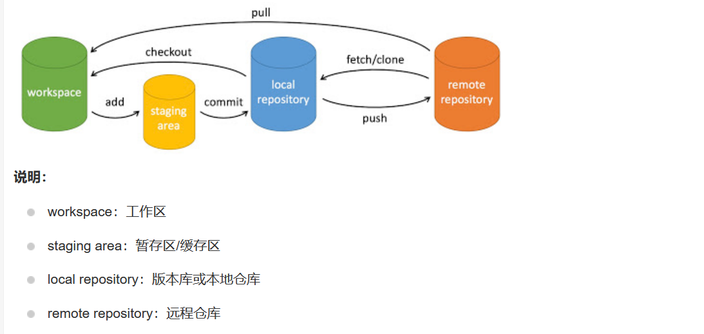

# 必要性与工作原理

软件开发过程，通过文件备份方式管理代码版本，十分不便，使用版本控制工具进行管理


# 版本控制工具 git 与 svn

- git：分布式版本控制工具。备份、记录、回滚、共享、团协
- svn：集中式版本控制工具,所有版本所有项目放在一个服务器中
- gitee、github：基于 git，分布式版本控制+集中式管理版本项目的仓库，不仅可以分布式互相共享版本，分支合并检验

## git 缺点：

- git 使用分布式模型，意味着没有一个中央处理器来保存权威数据，每一个开发人员都拥有代码和所有历史记录的完整副本，当项目较大时，会导致存储库越来越大
- git 操作本地库时执行非常快，但使用远程库时，其限制就明显：存储库的更改基于的版本需要完全一致，才能允许提交，每次提交之前必须从远程仓库获取到所有的更新。其他版本管理工具只需要更新当前修改的文件而不需要全部更新
- 没有一次只更新一个文件或几个文件的能力
- git 默认针对于本地存储库进行工作，无法及时知道远程仓库已经被做了哪些修改，git 只能对文本文件进行合并，二进制文件无法合并只能替换，无法及时了解远程仓库状态，只有将本地仓库和远程仓库合并时才能发现冲突

- 访问控制，对于每一个用户其某个目录某个文件的访问权限
- git 作为一个命令行工具，对初学者和非程序人员不友好

# git 使用

```shell
#初始化
git init
# 克隆远程仓库
git clone url
```

## 创建 git 仓库

- `git init`命令使用一个已经存在的目录作为 git 仓库，在一个指定目录执行该命令后就生成了一个新的 git 仓库，然后就可以使用其他 git 命令来管理跟踪代码变更并与远程仓库交互

### git 版本追溯

在 github 或 gitee 上查看历次提交的记录及对应的版本号，而本地则可以使用如下命令进行版本回溯

```shell
git reset --hard 版本号
```

### git 推送三部曲

```shell
git add .       #将工作区代码都上传到暂存区
git commit -m '一些描述性内容'          # 讲暂存区内容提交到分支
git push origin 分支名      //提交到远程仓库
```

### git 拉取

```shell
git pull origin 分支名
```

## git 分支管理

```shell
git branch      #查看分支
git branch 分支名称         # 创建分支
git checkout 分支名称       #切换分支
git push origin 分支名称:分支名称        #本地分支同步到远程分支
git merge 分支名称          #将分支合并到master
```

- 执行 git init 时，会默认创建一个 master 分支

```shell
$ git branch  # 列出所有分支
  develop
* master    # *表示当前分支，
```


- 使用 branch 创建新分支后，本地的 git 仓库也会分为 master 和若干子分支，使用 checkout 进行分支切换，对应文件夹里的内容也会发生改变
- 实际开发中经常使用至少三个分支，由于要保证 master 分支始终为稳定的版本，除了 develop 和 master 分支外，其他分支的代码要先合并到 develop 分支中，当 develop 分支中的代码没有问题后再合并到 master
  
