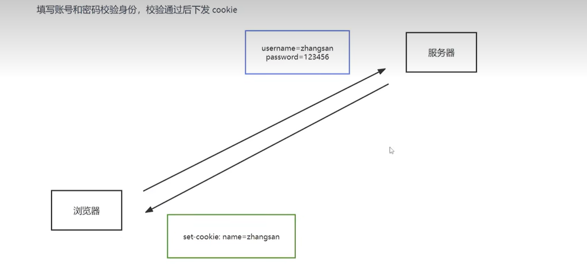

## windows 环境变量


当在系统命令行打开一个文件或调用一个程序时，系统首先在当前目录中寻找，
若没有找到就去用户环境变量 path 的一条条向下寻找，
若还是找不到，就向用户报告找不到

类似于 js 中的作用域链


向环境变量 path 中添加一条目录，重启命令行生效

```
C:\Users\wqf123\Desktop\notebook
```


## nodejs 概述

一个在服务器端（操作系统内、计算机上）的 js 运行环境，Google 的 v8 引擎

传统服务器与数据库交互的问题，线程数量多，对服务器要求高


为了开发高性能服务器，写出 nodejs
由于 nodejs 的单线程特性，无法处理太高的并发量，需要部署多台服务器进行分布式处理，所以后端大多用 java 完成

# 注意

node 环境中不可以使用 DOM 和 BOM 的 API，但可以使用 console 和定时器
node 中的顶级对象为 global，`console.log(global==globalThis)  //true`

```js
//node环境下
console.log(window); //window，报错
console.log(document); //DOM,报错
```


## Buffer

类 Array 对象，用于表示固定长度字节序列（一段固定长度的内存空间，用于处理二进制数据）

- 大小固定且无法调整
- 每个元素大小为 1byte
- 可直接操作计算机内存

创建 Buffer 空间

```js
//创建一个大小为10字节的Buffer空间
let buf = Buffer.alloc(10);

//创建一个大小为10字节的Buffer空间
//allocUnsafe()方法申请缓存空间速度较快，但是由于内存的可复用性，申请到的内存中可能包含原有的旧数据
let buf = Buffer.allocUnsafe(10);

//通过字符串创建 Buffer
//将字符串中的每个字符转化为对应的ASCII码后直接存入Buffer空间中
let buf_3 = Buffer.from("hello");
//通过数组创建 Buffer
//将数组中每个数字转化为二进制后存入Buffer
let buf_4 = Buffer.from([105, 108, 111, 118, 101, 121, 111, 117]);
```

- Buffer >>> 字符串

```js
et buf_4 = Buffer.from([105, 108, 111, 118, 101, 121, 111, 117]);
console.log(buf_4.toString())
```

Buffer 按索引读写

```js
//读取
console.log(buf_3[1]);
//修改
buf_3[1] = 97;
//查看字符串结果
console.log(buf_3.toString());
```

Buffer 溢出：舍弃高位数字

# fs 模块

## 写入

| 方法                        | 描述     |
| --------------------------- | -------- |
| writeFile                   | 异步写入 |
| writeFileSync               | 同步写入 |
| appendFile / appendFileSync | 追加写入 |
| createWriteStream           | 流式写入 |

```js
/*
语法： fs.writeFile(file, data[, options], callback)
参数说明：
file 文件名
data 待写入的数据
options 选项设置 （可选）
callback 写入回调
返回值： undefined
*/
const fs=require('fs');
fs.writeFile('./张三.txt'，'张三吃豆芽',err=>{
    if(err){
        console.log('写入失败')
    }
    console.log('写入成功')
})

/*
语法:   fs.writeFileSync(file, data[, options])
参数:   与 fs.writeFile 大体一致，只是没有 callback 参数
返回值： undefined
*/


/*
语法:
fs.appendFile(file, data[, options], callback)
fs.appendFileSync(file, data[, options])
返回值： 二者都为 undefined
*/
//fs.writeFile('./座右铭.txt','择其善者而从之，其不善者而改之。', {flag:"a"},err => {})
fs.appendFile("./座右铭.txt", "择其善者而从之，其不善者而改之。", (err) => {
  if (err) throw err;
  console.log("追加成功");
});
fs.appendFileSync("./座右铭.txt", "\r\n温故而知新, 可以为师矣");

/*流式写入:适用于大文件写入或频繁写入的场景*/

let ws = fs.createWriteStream('./观书有感.txt');//创建一个流式写入对象
ws.write('半亩方塘一鉴开\r\n');
ws.write('天光云影共徘徊\r\n');
ws.write('问渠那得清如许\r\n');
ws.write('为有源头活水来\r\n');
ws.end()//ws.close()
```

## 读取文件

| 方法             | 说明     |
| ---------------- | -------- |
| readFile         | 异步读取 |
| readFileSync     | 同步读取 |
| createReadStream | 流式读取 |

```js
/*
语法： fs.readFile(path[, options], callback)
参数说明：
path 文件路径
options 选项配置
callback 回调函数
返回值： undefined
*/
const fs = require("fs");
fs.readFile("./座右铭.txt", (err, data) => {
  if (err) throw err;
  console.log(data);
});

/*
语法： fs.readFileSync(path[, options])
参数说明：
path 文件路径
options 选项配置
返回值： string | Buffer
*/
let data = fs.readFileSync("./座右铭.txt");
let data2 = fs.readFileSync("./座右铭.txt", "utf-8");

/*
语法： fs.createReadStream(path[, options])
参数说明：
path 文件路径
options 选项配置（可选）
返回值：Object
*/
let rs = fs.createReadStream("./观书有感.txt"); //创建读取流对象
//每次取出 64k 数据后执行一次 data 回调
rs.on("data", (data) => {
  console.log(data);
  console.log(data.length);
});
//读取完毕后, 执行 end 回调
rs.on("end", () => {
  console.log("读取完成");
});
```

### 文件复制

```js
//两种写入方式占用的内存容量有很大差别
const fs = require("fs");

//同步写入
let data = fs.readFileSync("./笑傲江湖.txt");
fs.writeFileSync("./张三.txt", data);

//流式操作
let rs = fs.createReadStream("./笑傲江湖.txt");
let ws = fs.createWriteStream("张三.txt");
rs.on("data", (chunk) => {
  ws.write(chunk);
});
```

## 文件移动与重命名

```js
/*
语法：
fs.rename(oldPath, newPath, callback)
fs.renameSync(oldPath, newPath)
参数说明：
oldPath 文件当前的路径
newPath 文件新的路径
callback 操作后的回调
*/
fs.rename("./观书有感.txt", "./论语/观书有感.txt", (err) => {});
fs.renameSync("./座右铭.txt", "./论语/我的座右铭.txt");
```

## 文件删除

```js
/*
语法
fs.unlink(path, callback)
fs.unlinkSync(path)
参数说明：
path 文件路径
callback 操作后的回调
*/
const fs = require("fs");
fs.unlink("./test.txt", (err) => {});
fs.unlinkSync("./test2.txt");
```

## 文件夹操作

### 创建

```js
/*
语法：
fs.mkdir(path[, options], callback)
fs.mkdirSync(path[, options])
参数说明：
path 文件夹路径
options 选项配置（ 可选 ）
callback 操作后的回调
*/
fs.mkdir("./page", (err) => {});
//递归异步创建
fs.mkdir("./1/2/3", { recursive: true }, (err) => {});
//递归同步创建文件夹
fs.mkdirSync("./x/y/z", { recursive: true });
```

### 读取

```js
/*
语法：
fs.readdir(path[, options], callback)
fs.readdirSync(path[, options])
参数说明：
path 文件夹路径
options 选项配置（ 可选 ）
callback 操作后的回调
*/
//异步读取
fs.readdir("./论语", (err, data) => {});
//同步读取
let data = fs.readdirSync("./论语");
```

### 删除

```js
/*
语法：
fs.rmdir(path[, options], callback)
fs.rmdirSync(path[, options])
参数说明：
path 文件夹路径
options 选项配置（ 可选 ）
callback 操作后的回调
*/
fs.rmdir("./page", (err) => {});
//异步递归删除文件夹
fs.rmdir("./1", { recursive: true }, (err) => {});
//同步递归删除文件夹
fs.rmdirSync("./x", { recursive: true });
```

## 查看文件状态

```js
/*
语法：
fs.stat(path[, options], callback)
fs.statSync(path[, options])
参数说明：
path 文件夹路径
options 选项配置（ 可选 ）
callback 操作后的回调
*/
fs.stat("./data.txt", (err, data) => {});
//同步获取状态
let data = fs.statSync("./data.txt");

/*文件状态
size 文件体积
birthtime 创建时间
mtime 最后修改时间
isFile 检测是否为文件
isDirectory 检测是否为文件夹
*/
```

## \_\_dirname

\_\_dirname 保存着 当前文件所在目录的绝对路径

# path 模块

path.resolve 拼接规范的绝对路径 常用
path.sep 获取操作系统的路径分隔符
path.parse 解析路径并返回对象
path.basename 获取路径的基础名称
path.dirname 获取路径的目录名
path.extname 获得路径的扩展名

```js
const path = require("path");
//获取路径分隔符
console.log(path.sep); //   \
//拼接绝对路径
console.log(path.resolve(__dirname, "test")); //  E:\others\front_end\vue3_learn\my_notebook\notebook_final\服务端\test
//解析路径
let pathname = "D:/program file/nodejs/node.exe";
console.log(path.parse(pathname));
/*
{
  root: 'E:/',
  dir: 'E:/others/临时文件存放/node课件解压缩',
  base: '10_接口.pdf',
  ext: '.pdf',
  name: '10_接口'
}
*/

//文件名
console.log(path.basename(pathname)); //10_接口.pdf
//获取文件的目录名
console.log(path.dirname(pathname)); //E:/others/临时文件存放/node 课件解压缩
//获取路径的扩展名
console.log(path.extname(pathname)); //.pdf
```

# http 模块

## 创建 http 服务

```js
const http = require("http");
//2. 创建服务对象 create 创建 server 服务
// request 对请求报文的封装对象, 通过 request 对象可以获得请求报文的数据
// response 对响应报文的封装对象, 通过 response 对象可以设置响应报文
//收到http请求时执行该回调函数
const server = http.createServer((request, response) => {
  //设置响应体
  response.end("Hello HTTP server");
  //设置请求头，用于解决中文乱码问题
  response.setHeader("content-type", "text/html;charset=utf-8");
});
//3. 监听端口, 启动服务
// 服务启动后执行回调
server.listen(9000, () => {
  console.log("服务已经启动, 端口 9000 监听中...");
});
```

- ctrl+c 停止服务
- 更改代码需要重启服务才能生效
- 端口号占用会报错
- HTTP 服务开发常用端口 3000、8080、8090、9000

## 获取 http 请求内容

| 含义           | 语法                                             |
| -------------- | ------------------------------------------------ |
| 请求方法       | request.method \*                                |
| 请求版本       | request.httpVersion                              |
| 请求路径       | request.url \*                                   |
| URL 路径       | require('url').parse(request.url).pathname \*    |
| URL 查询字符串 | require('url').parse(request.url, true).query \* |
| 请求头         | request.headers \*                               |
| 请求体         | request.on('data', function(chunk){})            |

request.on('end', function(){});

```js
//
const server = http.createSercer((request, response) => {
  let url = new URL(request.url, "http://127.0.0.1");
  console.log(url.pathname);

  console.log(url.searchParams.get("keyword"));
});
```

## 设置响应报文

```js
//http.serverResponse类
const server = http.createSercer((request, response) => {
  //设置响应状态码
  reponse.statusCode = 404;

  //响应状态描述
  response.statusMessage = "content not found";

  //响应头:reponse.setHeader(name,value)
  response.setHeader("Content-Type", "text/html");

  //响应体设置
  reponse.write(chunk, encoding, callback);
});
```

### 响应 HTML 文件

- 在 js 文件中写其他文件内容着实不方便

```js
const server = http.createSercer((request, response) => {
  response.end(`
  <!DOCTYPE html>
  <html lang="en">
  <head>
      <meta charset="UTF-8">
      <meta name="viewport" content="width=device-width, initial-scale=1.0">
      <title>Document</title>
      <style>
      td{
        padding:20px 40px;
      }
      table tr:nth-child(odd){
        background-color:brown;

      }
      table td:nth-child(even){
        background-color:skyblue
      }

      table,td{
        border-collapse:collapse
      }
      
      </style>
  </head>
  <body>
    <table border="1">
      <tr><td></td><td></td><td></td></tr>
      <tr><td></td><td></td><td></td></tr>
      <tr><td></td><td></td><td></td></tr>
      <tr><td></td><td></td><td></td></tr>
    </table>
    <script>
        let cells=document.querySelectorAll("td")
        cells.forEach((cell)=>{
          cell.onclick=function (){
            this.style.background="rgba(0,0,0,0.5)"
          }
        })
    </script>
      
  </body>
  </html>
  
  `);
});
```

> 逻辑优化：将待响应的内容放在一个 html 文件中，使用 fs 模块将该文件内容读出，然后直接返回读出的对象

```js
const http = require("http");
const fs = require("fs");

const server = http.createServer((request, response) => {
  //同步读取
  let html = fs.readFileSync(__dirname + "/table.html");

  response.end(html);
});
```

# express 框架

## 中间件

- 中间件本质是一个回调函数，可以像路由回调一样访问请求对象（req）和响应对象（res）
- 作用：封装公共操作，简化代码

### 全局中间件

- 每一个请求到达服务端之后都会执行 **全局中间件函数**

- 声明中间件函数

```js
let middleWare = function (req, res, next) {
  //实现代码功能
  //....
  //执行next函数
  next();
};
```

> 上面代码中，如果希望执行中间件函数之后，仍然继续执行路由中的回调函数，必须调用 next

- 应用中间件函数

```js
app.use(middleWare);
//或者直接在use()函数内部定义中间件函数
app.use(function (req, res, next) {
  //...中间件函数内部逻辑
});
```

- 定义多个中间件函数

```js
app.use(function (req, res, next) {
  // 第一个中间件
  next();
});
app.use(function (req, res, next) {
  // 第二个中间件
  next();
});
```

### 路由中间件

- 只对于某些路由进行功能封装

- 使用格式

```js
app.get("/路径", "中间件函数", (req, res) => {});

// ...使用多个中间件函数

app.get("/路径", "中间件函数1", "中间件函数2", (req, res) => {});
```

### 静态资源中间件

```
|- dir
  |- public
    |- css
      |- app.css
    |- images
      |- 1.png
  |- index.js
```

- 设置静态资源中间件

```js
// index.js

app.use(express.static(__dirname + "/public"));

app.listen(3000);
```

> 上面代码中，public 目录下存放静态资源如 css/image/html 等文件

- 访问网址即可得到 public 下的静态文件

```
http://127.0.0.1:3000/css/app.css

http://127.0.0.1:3000/images/1.png
```

- index.html 比较特殊，当访问网址http://127.0.0.1:3000/时，会默认加载index.html

```js
app.get("/index.html", (req, res) => {});
```

### body-parser 中间件

- 安装 body-parser

```shell
npm i body-parser
```

- 导入

```js
const bodyParser = require("body-parser");
```

- 获取中间件函数

```js
let urlParser = bodyParser.urlencoded({ extended: false });
//处理 JSON 格式的请求体
let jsonParser = bodyParser.json();
```

- 设置路由中间件，使用 req.body 后去请求体数据

```js
app.post("/login", urlParser, (request, response) => {
  //获取请求体数据
  //console.log(request.body);
  //用户名
  console.log(request.body.username);
  //密码
  console.log(request.body.userpass);
  response.send("获取请求体数据");
});
```

-得到的请求体数据为

```
[Object: null prototype] { username: 'admin', userpass: '123456' }
```

### 路由拆分

- 目的：对路由进行模块化管理

- 创建独立的 js 文件存储 router

```
目录结构
|- Root
  |- routes
    |- homeRouter
    |- adminRouter.js
  |- index.js
```

- 前台路由

```js
// homeRouter.js
const express = require("express");

const router = express.Router();

router.get("/", (req, res) => {
  res.send("首页");
});
router.get("/cart", (req, res) => {
  res.send("购物车");
});

module.exports = router;
```

- 后台路由

```js
// adminRouter.js
const express = require("express");

const router = express.Router();

router.get("/admin", (req, res) => {
  res.send("后台首页");
});
router.get("/setting", (req, res) => {
  res.send("后台管理");
});

module.exports = router;
```

- 主文件

```js
// index.js
const express = require("express");
const app = express();
//5.引入子路由文件
const homeRouter = require("./routes/homeRouter");
const adminRouter = require("./routes/adminRouter");
//6.设置和使用中间件
app.use(homeRouter);
app.use(adminRouter);
app.listen(3000);
```

# app 对象

- app 对象表示 express 应用，通过调用 express 模块导出的顶层 express()函数创建

- express()函数返回的 app 实际上是一个 js 构造函数，用于作为回调函数传递给 node 的 http 服务器来处理请求

```js
const express = require("express");
//创建一个express应用
const app = express();
```

### app 对象方法

#### app.all()

- 语法：app.all(path,callback,callback,....)

```js
//任意http请求方法（GET、POST、PUT等）对'/secret'的请求都会执行下面的回调函数
app.all('/secret',(req,res,next)=>{
  console.log('成功执行回调');
  next();
})
//匹配任意前缀
app.all('*',[callback,callback,...])
app.all('/api/*',[callback,callback,....])
```

#### app.get()

- 作用：使用指定回调函数将 GET 请求路由到指定路径
- 语法：app.get(path,callback,callback,...)

```js
//基本示例
app.get("/", (req, res, next) => {
  res.send("get request to homepage");
});
```

#### app.listen()

- 语法：app.listen(port,host,backlog,callback)
- port 省略或为 0 时，操作系统将分配一个任意未使用的端口号

```js
const express = require("express");
const app = express();

app.listen(3000);
```

- 返回对象类型：http.Server 对象

#### app.use()

- 在指定路径上挂载中间件函数 -语法：app.use(path,callback,callback)

参数：路径

#### 路径示例

- 基本字符串、正则字符串

```js
/*基本字符串*/
//匹配以/abcd开头的路径
app.use("/abcd", (req, res, next) => {
  next();
});
/*正则字符串*/
//匹配以/abcd或/abd开头的路径
app.use("/abc?d", (req, res, next) => {
  next();
});
//匹配以 /abcd、/abbcd、/abbbbbcd 等开头的路径：
app.use("/ab+cd", function (req, res, next) {
  next();
});
// 匹配以 /ad 和 /abcd 开头的路径：
app.use("/a(bc)?d", function (req, res, next) {
  next();
});
//匹配以 /abc 和 /xyz 开头的路径
app.use(/\/abc|\/xyz/, function (req, res, next) {
  next();
});
//字符串数组，匹配其中任意的一条字符串
app.use(["/abcd", "/xyza", /\/lmn|\/pqr/], function (req, res, next) {
  next();
});
```

#### 中间件函数

```js

```

## req 对象

-

```js
const express = require("express");

const app = express();

app.get("/request", (req, res) => {
  //1. 原生操作
  console.log(req.method);
  console.log(req.url);
  console.log(req.httpVersion);
  console.log(req.headers);
  //2. express 独有的获取报文的方式
  //获取查询字符串
  console.log(req.query); // 『相对重要』
  // 获取指定的请求头
  console.log(req.get("host"));
  res.send("请求报文的获取");
});
//启动服务
app.listen(3000, () => {
  console.log("启动成功....");
});
```

### req 请求对象属性

| 属性名                | 描述                               |
| --------------------- | ---------------------------------- |
| req.hostname / req.ip | 获取主机名和 IP 地址               |
| req.method            | 此次请求的 http 方法：GET、POST 等 |

req.app：当 callback 为外部文件时，用 req.app 访问 express 的实例
req.baseUrl：获取路由当前安装的 URL 路径
req.body / req.cookies：获得「请求主体」/ Cookies
req.fresh / req.stale：判断请求是否还「新鲜」

req.originalUrl：获取原始请求 URL
req.params：获取路由参数 parameters
req.path：获取请求路径
req.protocol：获取协议类型
req.query：获取 URL 的查询参数串
req.route：获取当前匹配的路由
req.subdomains：获取子域名
req.accepts()：检查可接受的请求的文档类型
req.acceptsCharsets / req.acceptsEncodings / req.acceptsLanguages：返回指定字符集的第一个可接受字符编码
req.get()：获取指定的 HTTP 请求头
req.is()：判断请求头 Content-Type 的 MIME 类型

#### req.cookies

- 获得请求对象中包含的 cookie，需要使用 cookie-parser 中间件

```js
// ...

const cookieParser = require("cookie-parser");
app.use(cookieParser());

app.get("/", (req, res) => {
  console.log(req.cookies);
  res.send("获得cookie");
});

//...
```

### req 对象方法

#### req.get()

- 作用：返回指定的 http 请求头
- 语法：req.get(field)
  > 参数
  > field:http 请求头字段

```js
req.get("content-type");
// => "text/plain"
req.get("Referer");
```

## res 响应对象

### 响应对象方法

#### res.end()

- 语法：res.end(data,encoding)
- 作用：在没有任何数据的情况下快速结束响应，如果需要数据响应，应使用 res.send()或 res.json()方法

```js
res.end();
res.status(404).end();
```

#### res.send()

- 发送 http 响应
- 语法：res.send(body)
- 参数：body 参数可以是 Buffer 对象、String、Boolean 对象、Array

```js
res.send(Buffer.from("hello world"));
res.send({ name: "张三" });
res.send("<p>这是一段文字</p>");
res.status(404).send("404 Not Found");
```

#### res.json()

- 用于发送 JSON 响应，该响应将 body 参数中的内容使用 JSON.stringify()转化为 JSON 字符串然后再发送响应
- 语法：res.json(body)
- 参数：body：可以是任何 JSON 类型，包括对象、数组、字符串、布尔值、数字、null

```js
res.json(null);
res.json({ name: "张三" });
res.status(500).json({ error: "message" });
```

#### res.cookie

- 语法：res.cookie(name, value [, options])

| options 选项 | 描述              |
| ------------ | ----------------- |
| maxAge       | cookie 的有效时间 |

#### res.clearCookie

- 语法：res.clearCookie(name [, options])

## 响应设置

```js
app.get("/response", (req, res) => {
  //1.原生响应方法
  res.statusCode = 404;
  res.statusMessage = "xxx";
  res.setHeader("abc", "xyz");
  res.write("响应体");
  res.end("xxx");
  //2. express 的响应方法
  res.status(500); //设置响应状态码
  res.set("xxx", "yyy"); //设置响应头
  res.send("中文响应不乱码"); //设置响应体

  /*res.status(404).set('xxx','yyy').send('你好朋友')*/
  //3. 其他响应
  res.redirect("http://atguigu.com"); //重定向
  res.download("./package.json"); //下载响应
  res.json(); //响应 JSON
  res.sendFile(__dirname + "/home.html"); //响应文件内容
});
```

## 会话控制 session

- http 是一种无状态协议，无法区分多次请求是否来自同一个客户端，即无法区分用户

- 保存在服务器端的一块数据，保存当前访问用户的相关信息

## 会话控制 cookie

- http 服务器发送到用户浏览器并保存在本地浏览器的一小块数据
- cookie 按照域名进行划分，即每个域名下都有不同的用户 cookie
- 浏览器向服务器发送请求时，自动将当前域名下可用 cookie 设置在请求头中传递给服务器
  

- 服务端设置 cookie,指定时间后销毁

```js
app.get("/home", (req, res) => {
  // 设置cookie
  res.cookie("name", "zhangsan", { maxAge: 1000 * 60 });
  //删除cookie
  res.clearCookie("name");
  res.send("home");
});
```

- express 框架获取 cookie

```shell
# 安装中间件
npm i cookie-parser
```

- 使用中间件并获取请求对象中的 cookie

```js
//...

const cookieParser = require("cookie-parser");
app.use(cookieParser());

app.get("/", (req, res) => {
  console.log(req.cookies);
  res.send("获得cookie");
});
//...
```

## 会话控制 token

- 服务端生成并返回给 http 客户端的遗传加密字符串，token 中保存着用户信息

- 实现会话控制，可识别用户身份
