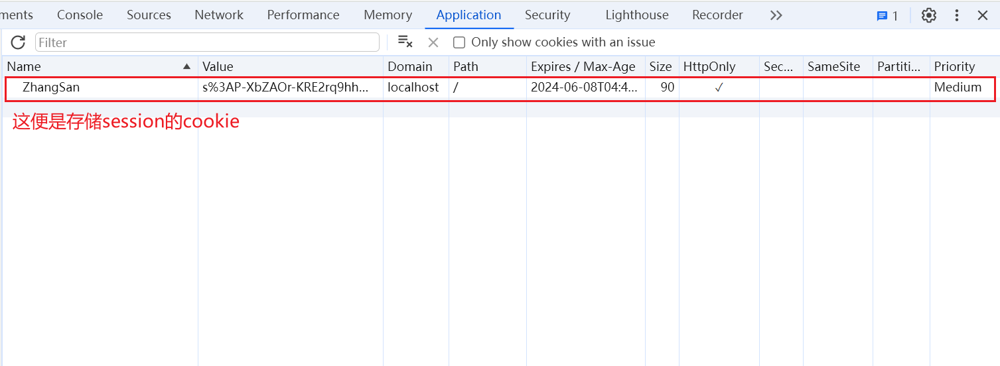

# 介绍

版本 1.5 之后，该模块使用时不再依赖`cookie-parser` 中间件，当前工作模式是直接读写`req/res` 中的 Cookie，

# 安装

```sh
npm install express-session
```

# 用法

```js
const express = require("express");
const session = require("express-session");
const app = express();

app.use(
  session({
    secret: "Your_Secret_Key",
    resave: false,
  })
);
app.get("/", (req, res) => {
  res.send("hello");
});
app.listen(3000, () => {
  console.log("Server is running at port 3000");
});
```

## 配置项



基础配置项

```js
// import redisStore from './redisStore.js'
// import { v4 as uuidv4 } from 'uuid';

app.use(
  session({
    // 秘钥，用于签名sessionID
    secret: "Your_Secret_Key",
    // 是否每次请求时都重新保存会话，
    resave: false,
    // 设置存储session的那个cookie的name属性
    name: myCookie,
    // 用于设置存储session的那个cookie的其他属性
    cookie: {
      // cookie配置项
      // 这个cookie的有效时间
      maxAge: oneDay,
      //
      httpOnly: true,
      //
      secure: false,
      //
    },
    genid: function () {
      // 用于生成新sessionID的函数
      return uuidv4();
    },
    store: new redisStore(redisConfig),
  })
);
```

# API

## genid

- 作用
  提供一个生成字符串的函数，该函数的返回值将作为 sessionID
- 默认值
  使用 三方模块 `uid-safe` 来生成 `sessionID`

- 注意
  生成保证 sessionID 的唯一性来避免 sessionID 冲突

## name

- 作用
  设置存储 session 的那个 cookie 的 name 属性
- 默认值
  `connect.sid`

## cookie

设置存储 `session` 的那个 `cookie` 的其他属性

- 默认值

```js
{
    path: '/',
    httpOnly: true,
    secure: false,
    maxAge: null
}
```

- 其他可选值
  **cookie.domain**

## req.session

要存储或访问会话数据，只需使用请求对象 `req` ,会话`session`通常被序列化为 JSON 进行存储，所以嵌套对象非常有用，下面举一个 展现用户访问 session 次数 的例子

```js
app.use(
  session({
    secret: "【秘钥】",
    cookie: {
      maxAge: 60 * 1000,
    },
  })
);

app.get("/", (req, res, next) => {
  if (req.session.views) {
    req.session.views++;
    res.setHeader("Content-Type", "text/html");
    res.write("<p>views: " + req.session.views + "</p>");
    res.write("<p>expires in: " + req.session.cookie.maxAge / 1000 + "s</p>");
    res.end();
  } else {
    req.session.views = 1;
    res.end("welcome to the session demo. refresh!");
  }
});
```

# 配置 session 存储方式
