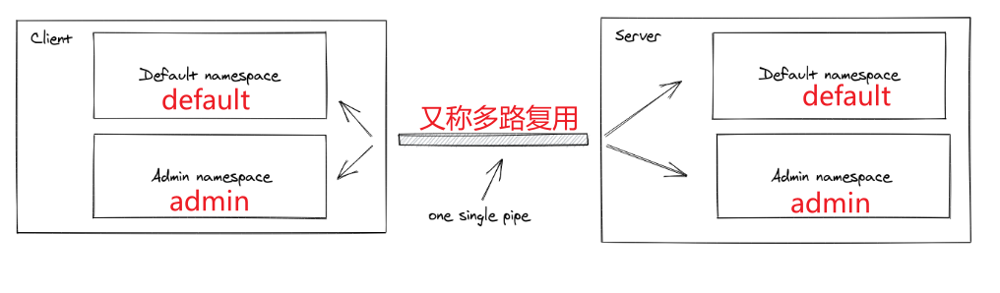

# 服务端

## 安装

```sh
npm install socket.io@version
```

## 初始化

### 独立运行

```js
import { createServer } from "http";
import { Server } from "socket.io";

const httpServer = createServer();
const io = new Server(httpServer, {
  /* options */
});

io.on("connection", (socket) => {
  // ...
});

httpServer.listen(3000);
```

### https 服务

```js
import { readFileSync } from "fs";
import { createServer } from "https";
import { Server } from "socket.io";

const httpServer = createServer({
  key: readFileSync("/path/to/my/key.pem"),
  cert: readFileSync("/path/to/my/cert.pem"),
});

const io = new Server(httpServer, {
  /* options */
});

io.on("connection", (socket) => {
  // ...
});

httpServer.listen(3000);
```

### 使用 express 框架

```js
import express from "express";
import { createServer } from "http";
import { Server } from "socket.io";

const app = express();
const httpServer = createServer(app);
const io = new Server(httpServer, {
  /* options */
});

io.on("connection", (socket) => {
  // ...
});

httpServer.listen(3000);
```

# API 介绍

# 中间件函数

# 命名空间 namespace

允许用户在单一的连接上，拆分得到多个应用程序服务。



# 房间 rooms

房间是一个 socket 可以自由进出的特有通道，它可以用来给特定的 用户广播事件

# 事件

## 发布事件

## 监听事件

## 广播事件
