# 基础教程

## python 官方网站

- 概述：python 官方文档

> 链接：[https://docs.python.org/zh-cn/3/library/index.html](https://docs.python.org/zh-cn/3/library/index.html)

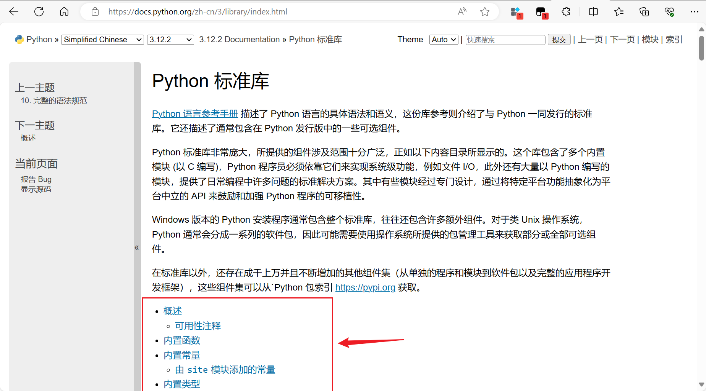

## 菜鸟教程-网站 1

> 链接：[https://www.runoob.com/](https://www.runoob.com/)

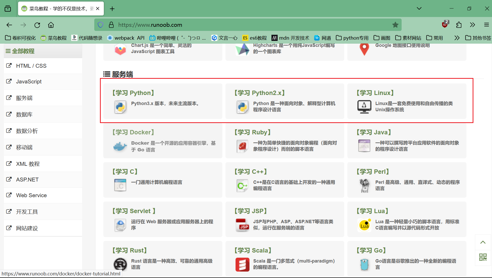

## 菜鸟教程-网站 2

> 概述：很经典的一个 IT 技术教程网站，超级经典，比上一个经典
> 链接：[https://www.cainiaojc.com/python/](https://www.cainiaojc.com/python/)

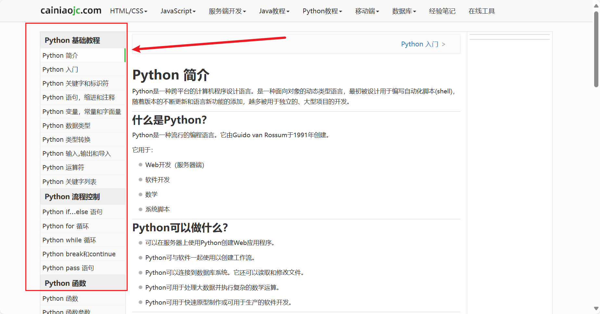

## 廖雪峰的官方网站

- 概述：大佬的个人网站，对于编程语言有自己的理解，可作为学习过程的参考

> 链接：[https://www.liaoxuefeng.com/wiki/1016959663602400/1017063413904832](https://www.liaoxuefeng.com/wiki/1016959663602400/1017063413904832)

## python 中文学习大本营

- 概述：里面有一些基础教程，也有很多 flask 教程，flask 常用后端服务，这个你有时间再看

> 链接：[http://www.pythondoc.com/](http://www.pythondoc.com/)

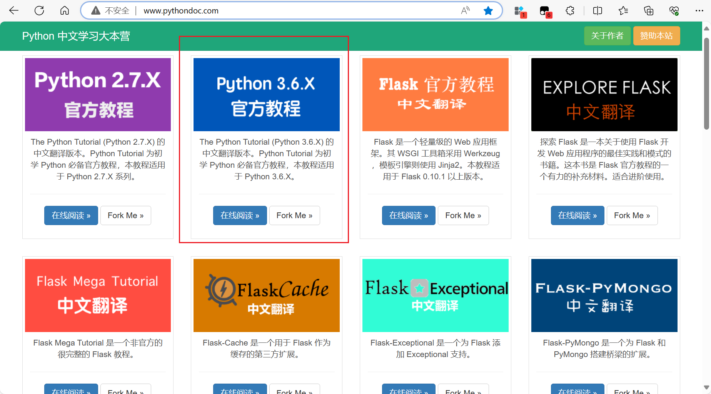

## w3cSchool 教程

- 概述：万维网联盟（World Wide Web Consortium，简称 W3C）,一个很权威的机构，这个网站里面的教程整体更加简洁

> 链接：[https://www.w3school.com.cn/python/python_reference.asp](https://www.w3school.com.cn/python/python_reference.asp)

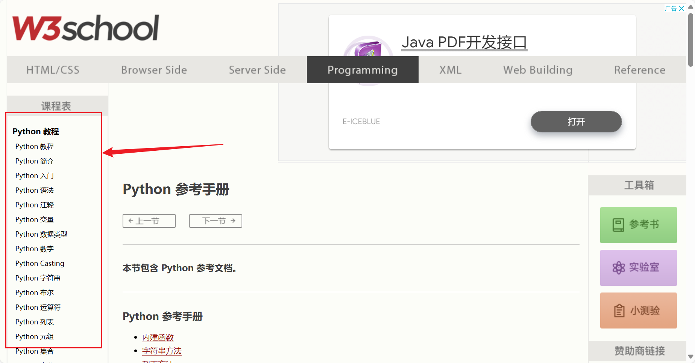

## 极客教程

- 概述：很好的一个教程网站

> 链接：[https://geek-docs.com/](https://geek-docs.com/)

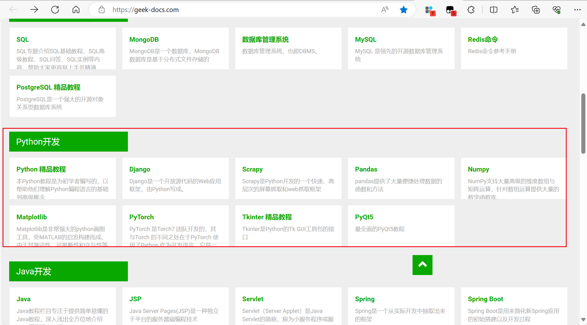

# 实战案例-基础版

- 概述：之所以称基础版是因为很多案例都是在几十行内完成的，且引入的第三方库少，不同代码文件之间耦合度小甚至没有耦合，适合在 IDIE 编辑器中通过文本形式或命令行形式运行。

## python-small-examples

- 概述：github 的高 star 项目，超级推荐
- 网址：[https://github.com/jackzhenguo/python-small-examples](https://github.com/jackzhenguo/python-small-examples)

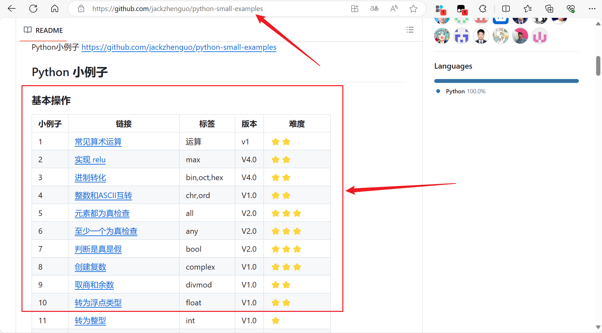

## python-code-examples

- 概述：主要是一些 py 库(如 re、os 等)的使用案例
- 网址：[https://www.programcreek.com/python/](https://www.programcreek.com/python/)

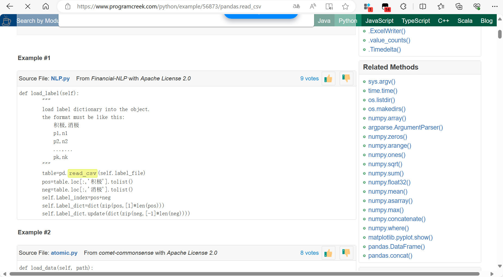

# 实战案例-进阶版

- 概述：这些项目中的代码文件耦合度较高，而且对编程者的 python 库掌握程度要求较高，谨慎学习

## python geekcomputers

- 概述：整体项目目录结构比较混乱，可以参考开发者代码是怎么写的

- 网址：[https://github.com/geekcomputers/Python](https://github.com/geekcomputers/Python)

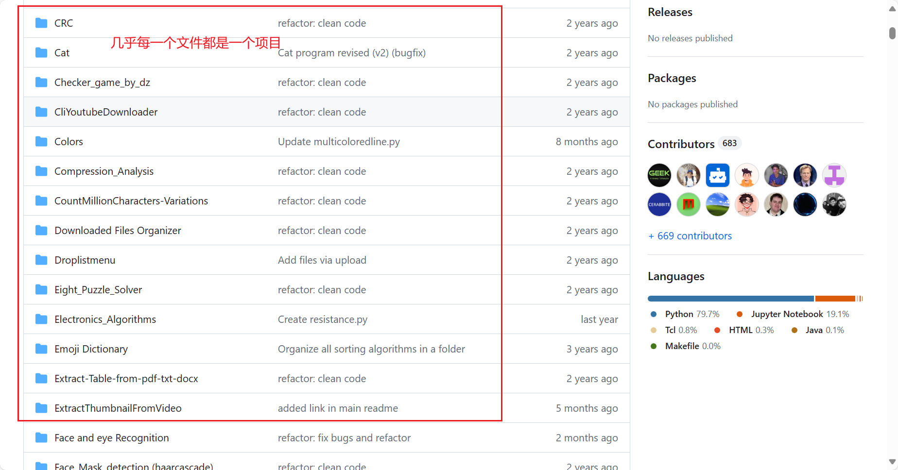

## awexome-spider

- 概述：python 爬虫项目，github 高 star 项目，学爬虫强烈推荐使用该项目进行练手
- 注意：爬虫有风险，爬虫的原理基本上就是模拟用户向对方浏览器发请求，对方浏览器返回你请求的数据，玩爬虫一定要控制好量，不熟悉的代码不要直接在自己的电脑上运行，谨防多线程爬虫、分布式爬虫等爬虫项目，但也不必诚惶诚恐，一般的爬虫项目对服务器造成的压力连人家日常流量的零头都没有，爬虫还是很好玩的，建议多去尝试

- 网址：[https://github.com/facert/awesome-spider](https://github.com/facert/awesome-spider)

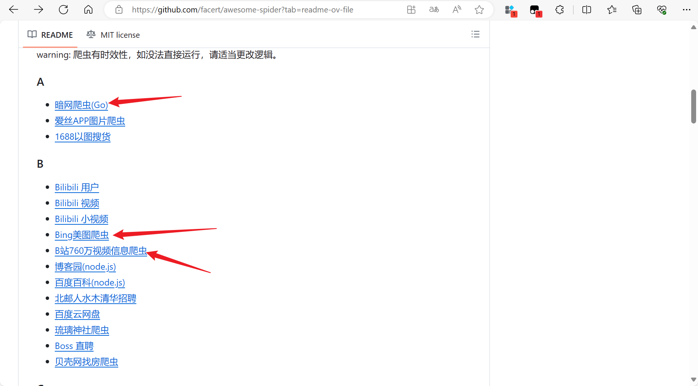

## nyspider

- 概述：github 上的另一个高 star 爬虫项目

- 网址:[https://github.com/queensun/Nyspider](https://github.com/queensun/Nyspider)

# 其他

## 算法刷题网

- 概述：介绍该模块的目的是：请尝试使用 python 作为编程语言进行算法刷题，在这个过程中，对 python 的基本 API(如列表 list、字典 dict、集合 Set 等) 的使用会有更深的理解。你们学校的那些刷题网站当成学校的作业任务就好，完成了是不要再回头管了也就是不要废太多的时间在其上面。leecode 和洛谷有良好的生态：IT 从业者的经验分享（更多的 IT 行业资讯）、多种多样的解题思路（py 是一门很“投机取巧”的编程语言，开发者基于 C 等对其做了高度的封装，所以当你去看别人的解题方法时会发现很多叼毛能用 3 行以内的代码完成题目，所以一定要去看看别人的代码是怎么写的，看基础教程太枯燥，看小案例又不能拓展思路，所以推荐这个部分）

> 作为一名合格 IT 从业者，算法的能力是必不可少的，建议早点开始刷
> 大部分算法都涉及到数据结构，没学不要紧，入门数据结构并不难，所以不要有畏惧心理，刚开始刷算法可能没头绪，推荐观看 B 站 up 主【代码随想录】的视频解析：[点击跳转](https://space.bilibili.com/525438321)

### leecode

> 链接：[https://leetcode.cn/](https://leetcode.cn/)

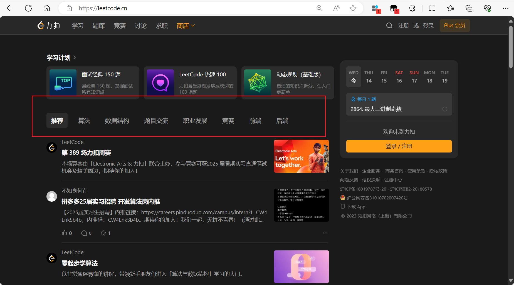

### 洛谷官方

> 链接：[https://www.luogu.com.cn/](https://www.luogu.com.cn/)

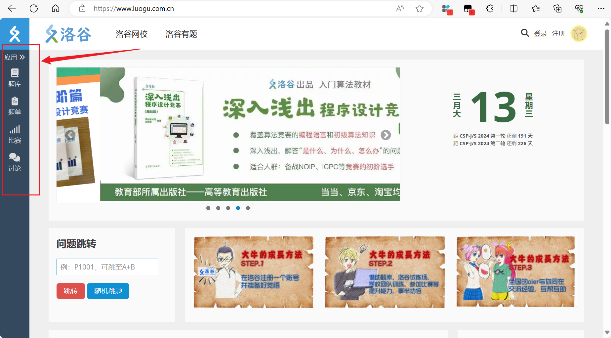

## 技术博客社区

- 概述：介绍该模块的目的是：用于解决学习中的遇到的问题，并尽早开始写自己的博客完成知识输出

### csdn

- 概述：csdn 和掘金目前几乎可以称得上是国内头部的 IT 技术论坛了，但是两者商业模式似乎不太一样。csdn 在百度投放了大量广告费用，这导致当你使用浏览器进行搜索一个问题时，看到的大部分结果都是 csdn 的，这有好处也有坏处，好处就是你能在 csdn 上找到大部分自己遇到的问题，坏处是该站点需要通过广告位招租、VIP 收费等形式完成资金商业循环，这也是为什么该网站常常被程序员诟病，所以我感觉该技术论坛的博主的身份可能比较杂，更适合新手、更适合解决一些零碎的问题
  > 网址：[https://www.csdn.net/](https://www.csdn.net/)

### 掘金

- 概述：与 csdn 不同，掘金界面更加简洁，也没有何种恶心的广告，很多程序员愿意在里面交流自己的从业经历、技术感悟等。总的来说，掘金中更适合有一定经验的 IT 从业者，而且里面的博客文章更多涉及工作中遇到的真实问题
  > 网址：[https://juejin.cn/](https://juejin.cn/)

### 博客园

- 概述：这个论坛我就不介绍了，总体来说用户量比较低，但是仍然有大佬愿意在里面分享技术博客，所以平时也可以多逛逛

> 网址：[https://www.cnblogs.com/](https://www.cnblogs.com/)

## 机器学习网站

机器学习，怎么说呢，当前的确很热门，但是实际的工作岗位上需要的人才往往是高学历的。原因也很简单，公司往往需要构建出自己的机器学习模型去解决自己遇到的具体的问题，这就需要从业者的机器学习理论基础非常扎实，要明白模型的原理以及优化思路，所有我看到网上有些人能调用一些 py 第三方库的 api 就说自己懂机器学习了觉得很搞笑。就比如用人工神经网络模型识别图片，该用几层模型呢？每层模型需要几个神经元？中间层的神经元需不要要 dropout？为什么这么做？神经网络模型的实现原理是什么？能不能自己动手实现一个？这些都是摆在你们眼前的问题。学习之路且长且艰，加油吧

### kaggle 官网

- 概述：leecode 专注于算法的技术平台，kaggle 是一个专注于机器学习的技术平台，两者都具有良好的生态。对于你们专业来说，kaggle 是十分重要的，里面包括了机器学习需要的数据集，其他数据分析大佬的高 score 的问题解决方案，甚至能把自己的机器学习模型部署到该网站上而不消耗自己的 CPU 资源，有兴趣一定要多逛逛

- 网址：[https://www.kaggle.com/](https://www.kaggle.com/)

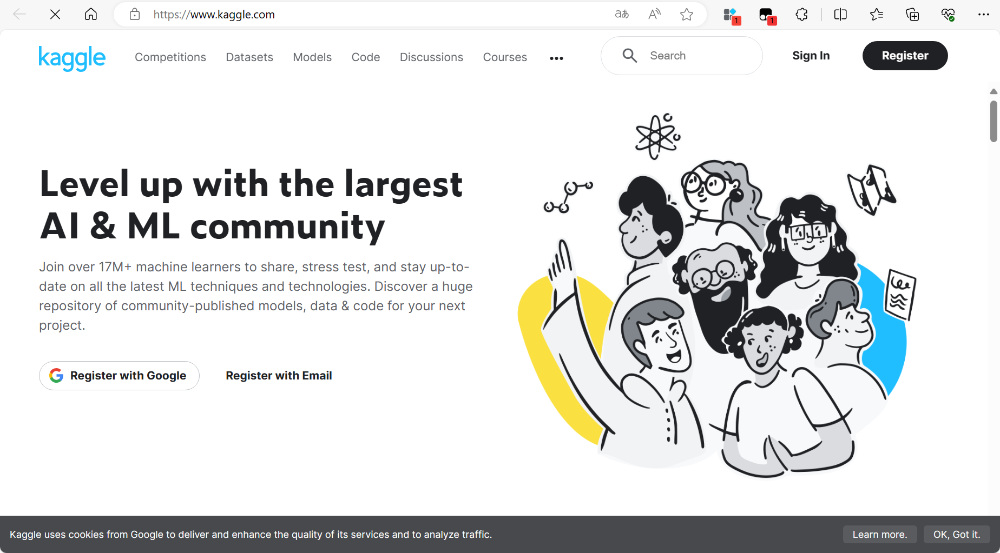

# 总结

好了，暂时写这么多，有遇到的了再整理上，学习 py 基础的时候难免会遇到一些关于计算机底层的知识（如内存缓冲区，流，进制等），可以暂时跳过，基础的学习要跟着你们的课程走，以过考试为目的，然后再来研究自己喜欢的东西。
其他的，游戏开发引擎 unity 和虚幻可以选一个学一下，很有意思的一件事，可以多去找找教程，找到适合自己的。
还有，早点开始在 csdn 或者掘金上发布自己的博客，要对自己的学习的知识进行一种知识输出，我的博客地址在这[【点击跳转】](https://blog.csdn.net/m0_54510474)，里面的文章可能有点青涩，你可以参考一下，当然，写不写有没有空还是要看你自己。
还有就是，今年 6 月份的计算机二级 python 你这个学期学完了可以尝试一下，拼多多上有盗版的二级刷题软件，有兴趣去了解一下。不过考这个证有计算机网络、数据结构、操作系统甚至计算机组成原理的选择题，这些课程本身不难，多去了解，早晚都要了解。另外该考试需要 100 块
好，目前就这么多，关于 python 的学习网站我写的可能不是很多，多去自己了解。
