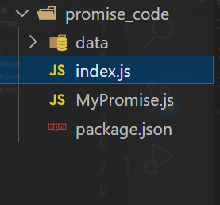

# 实现 Promise



- index.js

```js
let MyPromise = require("./MyPromise");

let promise = new MyPromise((resolve, reject) => {
  //   resolve("success");
  //   reject("error");
  throw new Error("Exception Error");
});
promise.then(
  (value) => {
    console.log("Fulfilled:" + value);
  },
  (reason) => {
    console.log("Rejected:" + reason);
  }
);
```

- package.json

```json
{
  "name": "promise_code",
  "version": "1.0.0",
  "description": "",
  "main": "index.js",
  "scripts": {
    "dev": "nodemon ./index.js -i ./data/"
  },
  "keywords": [],
  "author": "",
  "license": "ISC"
}
```

- MyPromise.js

```js
const PENDING = "PENDING",
  FULFILLED = "FULFILLED",
  REJECTED = "REJECTED";

class MyPromise {
  constructor(executor) {
    this.status = PENDING;
    this.value = undefined;
    this.reason = undefined;
    const resolve = (value) => {
      if (this.status === PENDING) {
        this.status = FULFILLED;
        this.value = value;
      }
    };
    const reject = (reason) => {
      if (this.status === PENDING) {
        this.status = REJECTED;
        this.reason = reason;
      }
    };
    try {
      executor(resolve, reject);
    } catch (err) {
      reject(err);
    }
  }
  then(onFULFILLED, onREJECTED) {
    if (this.status === FULFILLED) {
      onFULFILLED(this.value);
    }
    if (this.status == REJECTED) {
      onREJECTED(this.reason);
    }
  }
}

module.exports = MyPromise;
```

> 存在问题：不能处理 pending 状态

```js
//下面代码在实例化Promise对象时，写入异步函数，结果调用then时，不会被resolve或reject处理
let promise = new MyPromise((resolve, reject) => {
  setTimeout(() => {
    resolve("success");
  }, 2000);
});
promise.then(
  (value) => {
    //...
  },
  (reason) => {
    //...
  }
);
```
