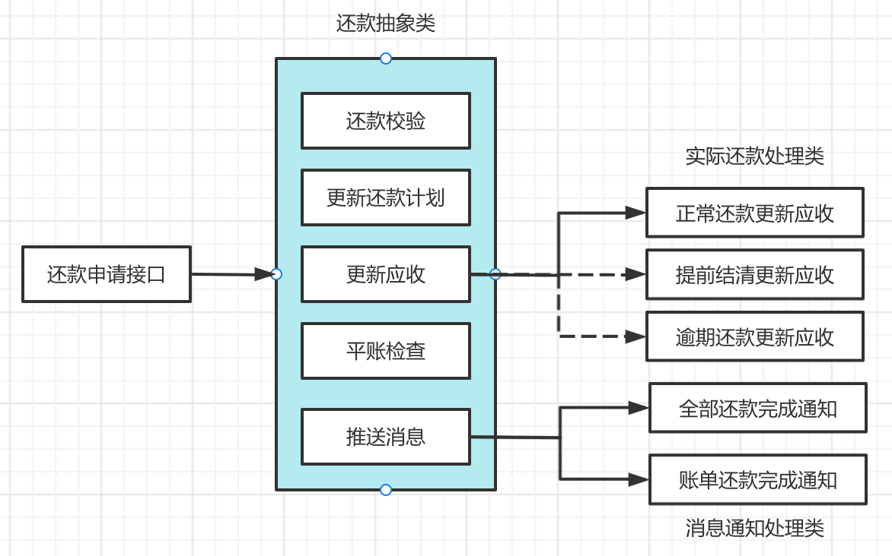

# 工厂模式

# 装饰器模式

特征：在不改变原始类的情况下扩展其功能

# 策略模式

## 适用场景

- 场景一：
  > 场景：在一个物流管理系统中，需要一个功能来处理不同类型的货物运输请求，如陆运、空运或海运。该系统应能够根据运输类型的不同选择不同的处理策略。
  > 解释：策略模式通过定义一系列算法（在这里是运输方式），封装每一个算法，并使它们可以相互替换，特别适合于有多种类似行为或策略的系统。

# 模板方法模式

- 核心逻辑：将**部分逻辑**以具体方法以及**具体构造子**的形式实现，然后声明一些**抽象方法**来**迫使子类实现剩余的逻辑**。

不同的子类可以以不同的方式实现这些抽象方法，从而对剩余的逻辑有不同的实现。先制定一个顶级逻辑框架，而将逻辑的细节留给具体的子类去实现

