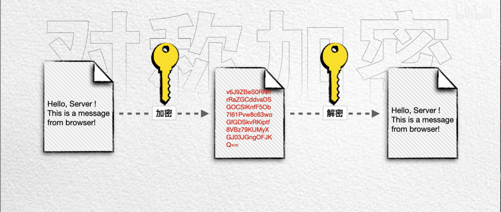
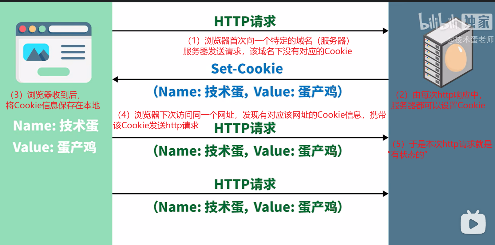
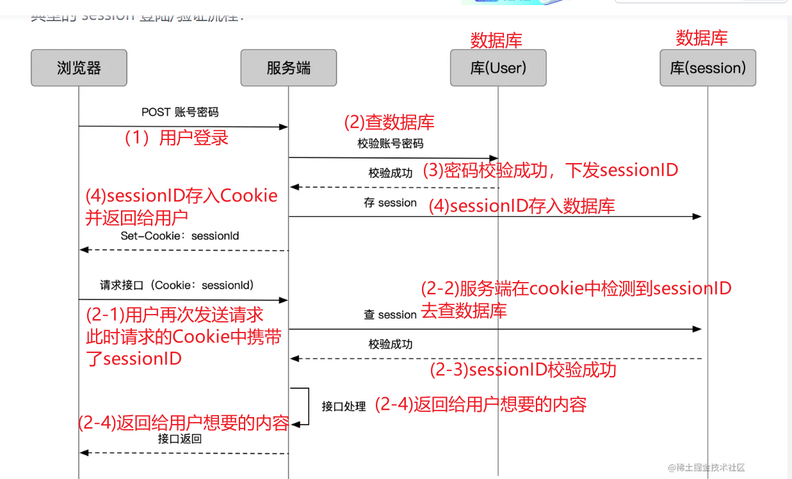
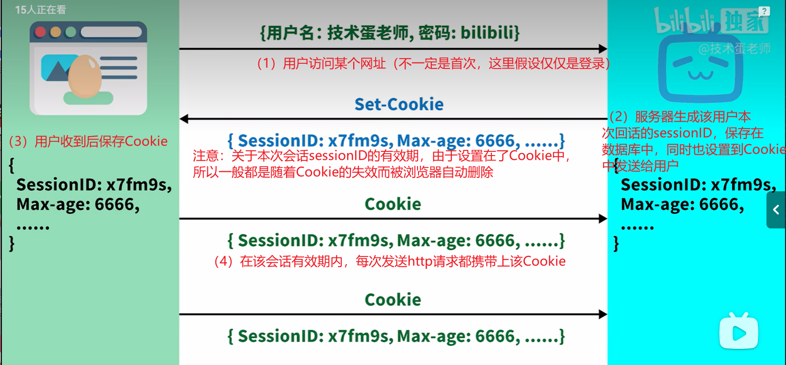

# http 请求头

## Content-Type

指示资源的 MIME 类型

> MediaType，即是 Internet Media Type，互联网媒体类型；也叫做 MIME 类型
> 在 Http 协议消息头中，使用 Content-Type 来表示具体请求中的媒体类型信息，确切的来说是**客户端**告知**服务端**，自己即将发送的请求消息携带的数据结构类型，好**让服务端**接收后以合适的方式处理。

### 请求头中常见 content-type

#### application/x-www-form-urlencoded

如何设置请求头的 content-type

1. **使用表单提交数据时**
   也就是 html 的表单标签

```html
<form action="目的URL" method="post" enctype="multipart/form-data">
  姓:
  <input type="text" name="fname" />
  <br />
  名:
  <input type="text" name="lname" />
  <br />
  <input type="submit" value="提交" />
</form>
```

> 设置 form 标签的`entype=application/x-www-form-urlencoded`之后，本次 http 请求的请求头中的 content-type 的值就是 application/x-www-form-urlencoded。

2. **使用 ajax 发送 post 请求**

```js
XMLHttpRequest对象.setRequestHeader(
  "Content-type",
  "application/x-www-form-urlencoded"
);
```

#### multipart/form-data

```html
<form action="/upload" enctype="multipart/form-data" method="post">
  <input type="file" name="fieldname" />
  <input type="submit" value="上传" />
</form>
```

> 设置 form 标签的`entype=multipart/form-data`之后,请求头中的 content-type 的值是： multipart/form-data;

#### application/json

前后端分离开发场景中使用最多，

一般该种格式使用 ajax 发送请求

```js
XMLHttpRequest对象.setRequestHeader("Content-type", "application/json");
```

### 响应头中常见 content-type

1）、text/html ： HTML 格式
2）、text/plain ：纯文本格式
3）、application/json：json 格式
4）、text/xml ： XML 格式
5）、image/gif ：gif 图片格式
6）、image/jpeg ：jpg 图片格式
7）、image/png：png 图片格式
8）、application/pdf：pdf 格式
9）、application/msword ： Word 文档格式
10）、application/octet-stream ： 二进制流数据（如常见的文件

## 常见状态码 Status Code

> 1xx:消息
> |状态码|含义|描述|
> |-|-|-|
> |101|Switch Protocol|升级协议，如从 http 升级到 ws

> 2xx:成功
> |状态码|含义|描述|
> |-|-|-|
> |200|ok|资源请求成功
> 201|creatded|资源创建成功，常用于 post 请求
> 204|No Content|响应不返回 body
> 206|Partial Content|数据分片传输

> 3xx:重定向
> |状态码|含义|描述|
> |-|-|-|
> 301 |Moved Permanently|永久重定向
> 302| Found|暂时重定向
> 304| Not Modified|z 资源被缓存

> 4xx:客户端错误

| 状态码 | 含义               | 描述                                 |
| ------ | ------------------ | ------------------------------------ |
| 400    | Bad Request        | 服务器无法理解的参数                 |
| 401    | Unauthorized       | 没有权限的用户请求需要带有权限的资源 |
| 403    | Forbidden          |
| 404    | Not Found          | 未找到资源                           |
| 405    | Method Not Allowed | http 请求方法错误                    |
| 413    | Payload Too Large  | 请求体过大                           |
| 429    | Too Many Request   | 请求过多被限流                       |

> 5xx:服务端错误
> |状态码|含义|描述|
> |-|-|-|
> 500| Internal Server Error|服务器内部错误，应用层未捕获错误导致整个服务挂掉
> 502 |Bad Gateway|应用层未返回响应，常见于 nginx
> 503 |Service Unavailable|服务器繁忙
> 504 |Gateway Timeout|网关超市，应用层一直未响应

## typora-root-url: ./..\pic


## 查看本机 ip 配置:elephant:

> ipconfig


获得更加详细的**网络配置信息**

> ipconfig/all


# https

- http 协议中数据以明文传输，不安全

## 对称加密：

- 通讯双方使用同样的秘钥，但存在问题，一方生成的秘钥另一方如何获得呢？
  

## 非对称加密

-
- 服务器先将自己的公钥发给浏览器，浏览器生成随机数据并使用公钥加密再发送给服务器，服务器收到数据后使用私钥解密最终得到数据，（即使攻击者拦截到了公钥，也不能解码数据）但存在问题

## ping 命令

### 使用步骤

> ping 127.0.0.1

用于检测自己的主机网络配置是否正常、本机的 TCP/IP 是否安装正常，发生在本机上

> ping 自己的内网 ip

如果不成功，可能网线或者 WiFi 连接出现问题

> ping 默认网关（路由器端口）

如果不成功，可能是路由器出现故障

> ping 目标 ip 地址

如果不成功可能是因为对方主机已经下线或者防火墙禁止了 ping 请求，或者是由于 ping 数据包在传输途中出现问题，但至少证明本机网络没有问题

> ping 域名


## 常见 http 请求头

Accept:浏览器能够处理的内容类型
Accept-Charset:浏览器能够显示的字符集
Accept-Encoding:浏览器能够处理的压缩编码
Accept-Language:浏览器当前设置的语言
Connection：浏览器与服务器之间连接的类型
Cookie：当前页面设置的 Cookie
Referer：发出请求的页面 URL
User-Agent：浏览器的用户代理字符串

## 常见 Http 响应头

Date：消息发送的时间
server：服务器名称
Connection：浏览器与服务器之间连接的类型
Cache-Control：控制 HTTP 缓存
content-type:文档属于什么 MIME 类型

> application/x-www-form-urlencoded:浏览器原生 form 表单，如果不设置 enctype 属性，最终将会以该种方式提交数据放在 body 里面，数据按照 key1=val1&key2=val2 的方式进行编码，key 和 val 都进行 url 编码
> multipart/form-data:一种常见的 post 提交方式，通常表单上传文件时使用该种方式
> application/json:服务器消息主体是序列化后的 JSON 字符串
> text/xml:该方式主要用于提交 XML 格式的数据

# cookie、session、token

**什么是 cookie**

http 请求是无状态的，每次请求都是完全独立，所以服务端无法确认当前请求访问者的身份。

看这样一个场景，一个用户登录微博之后，发布、关注、评论等行为产生的数据，都应该是跟该用户相关的，这就需要每次发送请求都携带一个与该用户相关的信息。这也是会话跟踪的一种。

如何实现？我们需要一个标记

上班进公司需要工牌，不能说每次跟门卫说自己的名字、年龄等信息。

如何保存这个工牌？

- 基本的，作为全局变量
- 高级点的，存储到 cookie、localStorage 中

有地方保存了，我们就能在发送请求的时候携带上这个工牌，这样门卫就能认识我们

## cookie

cookie 是前端存储的一种方式，能够实现每次 http 请求都带上特定的数据给服务器，



> 存在的问题：假设用户首次是登录操作，那么就需要向服务器发送用户名和密码，服务器应该将什么信息放在 Cookie 中呢？显然不能是 `用户名和密码`，因为 Cookie 在浏览器端是能够直接看到的。只存放用户名也是不行的，其中一个原因是用户名太随意了，而且不能保证唯一性。那应该保存什么才能保证唯一性呢？其中一种方案是 保存`sessionID`【见 session 部分】

### 属性

**name=value**
用户可以自定义键值对存储在 cookie 当中，其中键和值都应该是字符串

**domain**
cookie 不可跨域，每个 cookie 都会绑定一个单一的域名，这个 cookie 不允许在别的域名下使用

**path**
指定浏览器发出 http 请求时，哪些路径要附带这个 Cookie，

**maxAge**
指定从生成 Cookie 开始， Cookie 的有效期，比如 60 _ 60 _ 24 \* 365（即一年）

**expires**
指定 cookie 的过期时间，在设置的某个时间点后该 cookie 就会失效。

**secure**
浏览器只有在加密协议 HTTPS 下，才能将这个 Cookie 发送到服务器。另一方面，如果当前协议是 HTTP，浏览器会自动忽略服务器发来的 Secure 属性。

**httpOnly**
如果给某个 cookie 设置了 httpOnly 属性，则无法通过 JS 脚本 读取到该 cookie 的信息，但还是能通过 Application 中手动修改 cookie，所以只是在一定程度上可以防止 XSS 攻击，不是绝对的安全

### 使用 js-cookie 操作 cookie

- 设置 cookie

```js
const Cookies = require("js-cookie");

Cookies.set("name", "value", {
  expires: 7,
  path: "/",
  domain: "sub.example.com",
});
```

- 读取一个 cookie

```js
Cookies.get("name"); // => 'value'
Cookies.get("nothing"); // => undefined
// 读取所有可见的cookie
Cookies.get();
```

- 删除 cookie

```js
// 删除一个cookie
Cookies.remove("name");
// 删除一个指定path的cookie
Cookies.remove("name", { path: "" }); // removed!
```

## session

session 数据非全部存在`Cookie`当中，只有 sessionID 会被保存到 Cookie 中并发送给浏览器，Session 源数据只会存储在客户端




