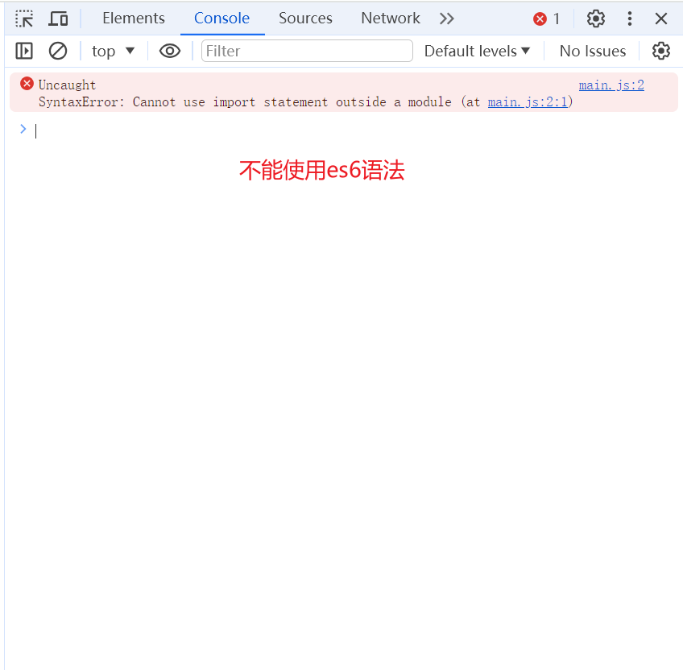
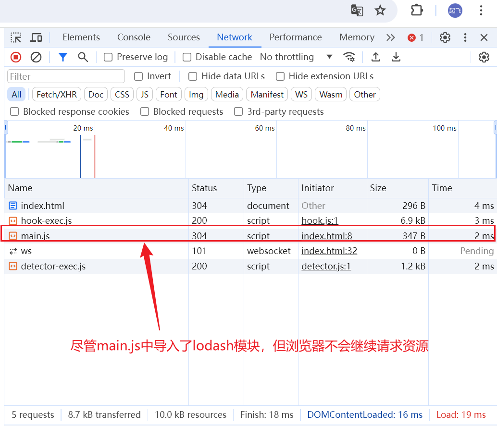

# 简介

一款开箱即用的开发服务器

# 安装

```sh
npm i -D vite
```

# 快速上手

## 一个小案例

- 项目目录

```
|- root
    |- index.html
    |- main.js
```

- index.html

```html
<script src="main.js" type="module"></script>
```

- main.js

```js
import _ from "lodash";
console.log(_);
```

浏览器的结果为


## vite 机理

默认情况下，es 语法导入资源时，要么是绝对路径、要么是相对路径。

对于`ESM`，当我们使用 es6 语法导入一个模块时，浏览器不会帮我们请求 node_modules 下的资源，因为这么做的话，模块的模块还是可能会加载别模块，太消耗性能了。

对于`CommonJS`,它运行在服务端，资源请求是通过直接读取本地文件的方式，而非网络请求


在处理过程中，如果看到有**非绝对路径或相对路径**的引用，尝试进行路径补全
