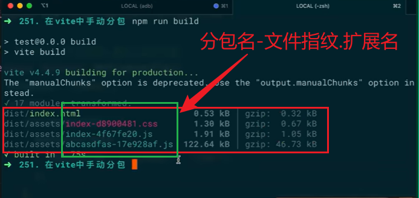

# 简介

一款开箱即用的开发服务器

# 安装

```sh
npm i -D vite
```

# 快速上手

## 一个小案例

- 项目目录

```
|- root
    |- index.html
    |- main.js
```

- index.html

```html
<script src="main.js" type="module"></script>
```

- main.js

```js
import _ from "lodash";
console.log(_);
```

浏览器的结果为


## vite 机理

默认情况下，es 语法导入资源时，要么是绝对路径、要么是相对路径。

对于`ESM`，当我们使用 es6 语法导入一个模块时，浏览器不会帮我们请求 node_modules 下的资源，因为这么做的话，模块的模块还是可能会加载别模块，太消耗性能了。

对于`CommonJS`,它运行在服务端，资源请求是通过直接读取本地文件的方式，而非网络请求


在处理过程中，如果看到有**非绝对路径或相对路径**的引用，尝试进行路径补全

# vite 打包优化

## 分包

- `vite` 基于 `rollup` ,因此理解分包原理就必须对 `rollup` 的常用配置有一定了解


> 上面代码中，所有三方包和项目相关的代码都打包到了同一个 JS 包中，体积太大了。考虑这样一种情况，项目上线后需要进行版本更新，如果都在一个 JS 包中，项目每次更新后，这个 JS 包的文件指纹都会改变，也就是说，如果用户使用了我们的系统，那么他们每次升系统时，都要重新下载这些 JS 包。如果我们将不变的三方包放到一个 JS 文件 A 中，而项目代码放在另外一个 JS 文件 B 中，那么在三方包不变的情况下，JS 文件 A 就不会发生改变、文件指纹也不会改变，用户升级系统时，就可直接使用浏览器缓存，而不需要重新下载。



- 分包的原理是将引入的三方包和自己写的代码分开打包成不同的 js 包

```js
// vite.config.js
export default defineConfig({
  plugins: [vue()],
  build: {
    rollupOptions: {
      // 手动配置分包
      // manualChunks:{
      //     // 分包名：该包包含的模块
      //     'abcasj':['lodash','vue']
      // }
      // 自动配置打包
      manualChunks(id) {
        if (id.includes("node_modules")) {
          return "vendor";
        }
      },
    },
  },
});
```

## gzip 压缩
