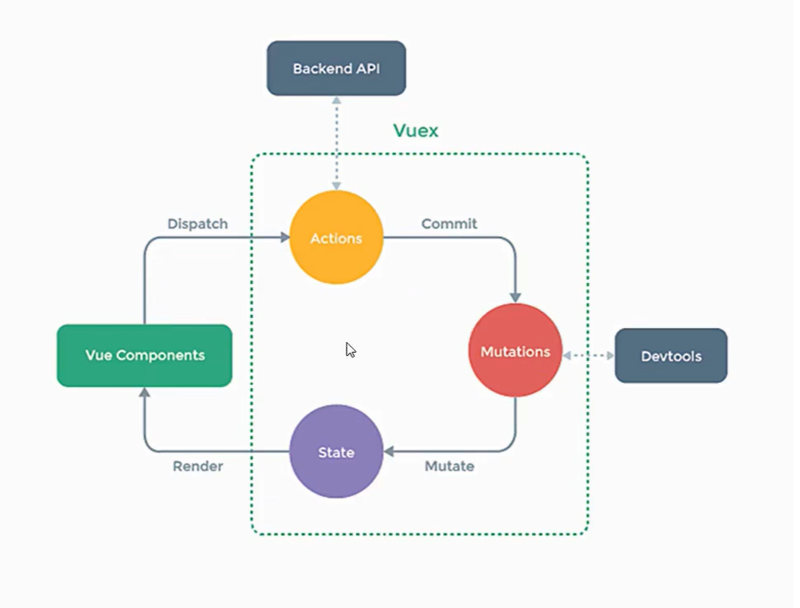
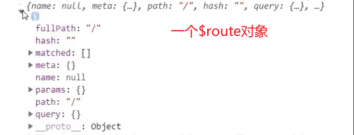
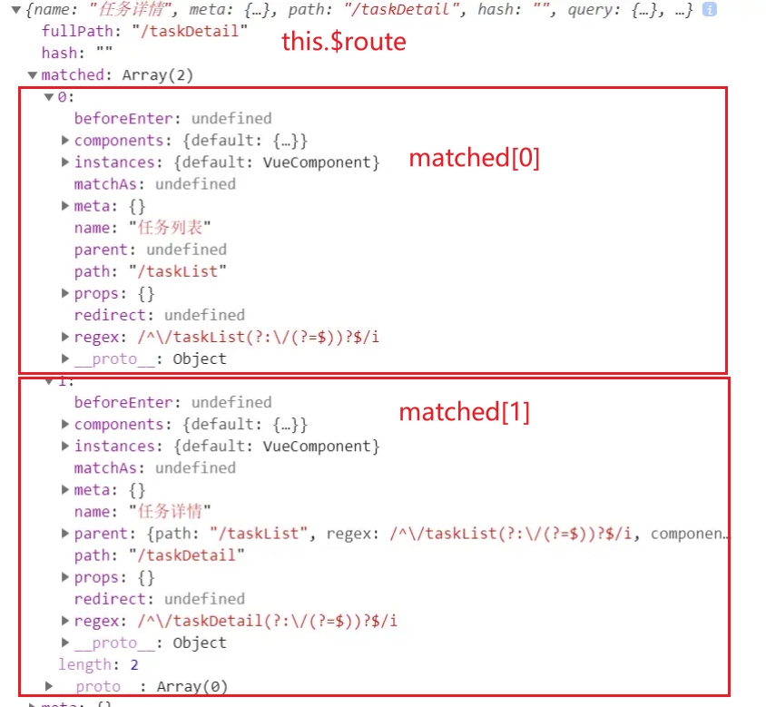
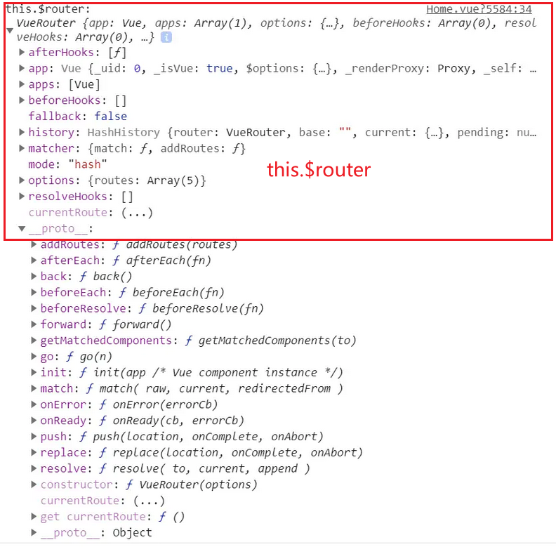
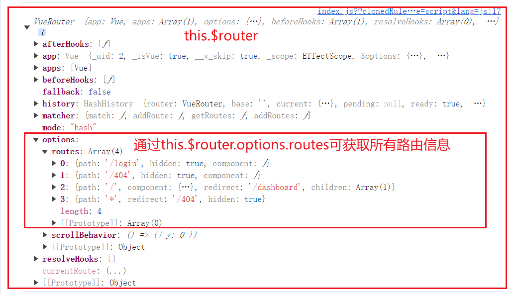

```vue
<template></template>
<script>
export default {
  name: "student",
};
</script>
<style></style>
```

# 配置项

## 绑定 class 样式

```css
.basic {
  height: 200px;
  width: 300px;
  background-color: antiquewhite;
}
.happy {
  background-color: orange;
}
.gloom {
  background-color: skyblue;
}
.sad {
  background-color: lightseagreen;
}

.style1 {
  border-radius: 10px;
}
.style2 {
  font-size: 25px;
}
.style3 {
  color: #000;
}
```

- 场景：鼠标点击后更换样式
- 写法一：字符串写法，要绑定的类名不确定，需要动态指定

```html
<div id="root">
  <div class="basic" :class="mood" @click="changeMood">{{name}}</div>
</div>
<script>
  const vm = new Vue({
    el: "#root",
    data: {
      name: "张三",
      mood: "gloom",
    },
    methods: {
      changeMood() {
        // this.mood="happy"
        const arr = ["style1", "style2", "style3"];
        const index = Math.floor(Math.random() * 3);
        this.mood = arr[index];
      },
    },
  });
</script>
```

- 场景：在所有样式中，可能全都用，也可能只用一部分
- 写法二：数组写法，适用于：要绑定的类名个数和名字都不确定
- 优点：可以通过操作数组`classArr`的方式(`shift,push等增删方式`)动态控制容器绑定的 class 样式

```html
<div id="root">
  <div class="basic" :class="classArr">{{name}}</div>
</div>
<script>
  const vm = new Vue({
    el: "#root",
    data: {
      name: "张三",
      classArr: ["style1", "style2", "style3"],
    },
  });
</script>
```

- 场景：在已知的两种样式中，使用的时候样式可能共存、可能互斥
- 写法三：对象写法，适用于：要绑定的类名个数和名字都确定

```html
<div id="root">
  <!-- 写法一： -->
  <div class="basic" :class="classObj">{{name}}</div>
  <!-- 写法二： -->
  <!-- <div class="basic" :class="{style1:false,style2:false}">{{name}}</div> -->
</div>
<script>
  const vm = new Vue({
    el: "#root",
    data: {
      name: "张三",
      classObj: {
        style1: true,
        style2: false,
      },
    },
  });
</script>
```

## 自定义事件

- 目录结构

```
|- 根目录
  |- components
    |- School.vue
    |- Student.vue
  |- App.vue
```

**场景：子组件给父组件传递数据**

- 写法一：父组件给子组件传递函数类型 props 实现
- 步骤：
  1. 父组件定义方法，并传递给子组件
  2. 子组件通过 props 配置项接收
  3. 子组件内调用父组件的方法

> App.vue

- 思路梳理：父组件中定义一个函数并且直接交给了子组件

```html
<!-- 此处v-on后面的变量名可以随便写，但是写什么，子组件School使用props接收的就是什么 -->
<School v-on:getSchoolName="getSchoolName" />

<script>
  export default {
    methods: {
      getSchoolName(name) {
        console.log(name);
      },
    },
  };
</script>
```

> School.vue

- 思路梳理：点击按钮后，执行`sendSchoolName`方法，该方法又会调用父组件传递过来的`getSchoolName`方法，最终完成业务场景

```html
<button @click="sendSchoolName">点击发送</button>

<script>
  export default {
    //...
    props: ["getSchoolName"],
    data() {
      return {
        name: "第一高中",
      };
    },
    methods: {
      sendSchoolName() {
        this.getSchoolName(this.name);
      },
    },
  };
</script>
```

- 写法二：父组件给子组件绑定自定义事件（使用`v-on`实现）
- 步骤：
  1. 父组件给组件绑定自定义事件，该事件触发后，执行父组件内的响应函数
  2. 子组件通过`this.$emit`触发该自定义事件同时向父组件传递数据

> App.vue

- 思路梳理：`toggleName`相当于是在 Student 的实例 vc 上绑定了一个事件，当该事件触发时，执行父组件的`demo`函数

```html
<Student @toggleName="demo" />
<!-- 仅触发一次 -->
<!-- <Student @toggleName.once="demo" /> -->
<script>
  export default {
    methods: {
      demo(name) {
        console.log(name);
      },
    },
  };
</script>
```

> Student.vue

- 思路梳理：`this.$emit`相当于触发 Student 的实例 vc 上绑定的`toggleName`事件
- 存在问题：如果有下面的业务需求：等待若干秒后再绑定事件，该种写法就不能实现

```html
<button @click="sendStudentName">点击发送</button>

<script>
  export default {
    //...
    data() {
      return {
        name: "张三",
      };
    },
    methods: {
      sendStudentName() {
        this.$emit("toggleName", this.name);
      },
    },
  };
</script>
```

- 写法三：父组件给子组件绑定一个自定义事件实现（使用 ref）

> App.vue

```html
<School ref="school" />

<script>
  export default {
    methods: {
      getSchoolName(name) {
        console.log(name);
      },
      //解构：接受多个参数
      // getSchoolName(name,...params) {
      //   console.log(name,params);
      // },
    },
    mounted() {
      //触发多次
      this.$refs.school.$on("toggleName", this.getSchoolName);
      //仅触发一次
      // this.$refs.school.$once("toggleName", this.getSchoolName);
    },
  };
</script>
```

> School.vue

```html
<button @click="sendSchoolName">点击发送</button>

<script>
  export default {
    //...
    data() {
      return {
        name: "第一高中",
      };
    },
    sendSchoolName() {
      this.$emit("toggleName", this.name, 1, 2, 3, 4);
    },
  };
</script>
```

## watch 配置项

用于监听变量名

```js
export default {
  name: "App",
  data() {
    return {
      isHot: true,
    };
  },
  watch: {
    isHot: {
      immediate: true,
      handler(newValue, oldValue) {
        console.log(`新的值：${newValue}，旧的值：${oldValue}`);
      },
    },
  },
};
```

**深度监听**

```js
<script>
export default{
  name:"App",
  data(){return {
    isHot:true,
    numbers:{
      a:1,
      b:2
    }
  }},
  watch:{
    isHot:{
      numbers:{
        deep:true,
        handler(oldVal,newVal){
          console.log(oldVal,newVal)
        }
      }
    }
  }
}
```

**简写形式**

```js
export default {
  name: "App",
  data() {
    return {};
  },
  watch: {
    isHot: (newValue, oldValue) => {
      console.log(`新的值：${newValue}，旧的值：${oldValue}`);
    },
  },
};
```

## ref 配置项

```vue
<h1 id="myId_1"></h1>
<h1 ref="myId_2"></h1>
<School ref="mySchool" />
<script>
export default {
  methods: {
    getEle_1() {
      //使用原生API获取DOM元素
      console.log(document.getElementById("myId_1"));
    },
    getEle_2() {
      //使用原生API获取DOM元素
      console.log(this.$refs.myId_2);
    },
    //获取组件实例对象
    getCom() {
      return this.$refs.mySchool;
    },
  },
};
</script>
```

## props

- 用与父组件向子组件传递数据
- 在子组件中进行配置

```
|- components
    |- student.vue
|- App.vue
```

- App.vue

```vue
<template>
<div>
    <Student name="张三" sex="男" v-bind:age="18">
</div>
</template>
<script>
import Student from './components/Student'
export default {
  name: "App",
  components:{Student},
};
</script>
<style></style>
```

- Student.vue

```vue
<template>
  <div>
    <h1>{{ msg }}</h1>
    <p>姓名：{{ name }}</p>
    <p>性别：{{ sex }}</p>
    <p>年龄：{{ myAge }}</p>
  </div>
</template>
<script>
export default {
  name: "Student",
  data() {
    return {
      msg: "我的一名学生",
      myAge: this.age,
    };
  },
  methods: {
    changeAge() {
      //不直接修改props传递过来的age变量
      this.myAge++;
    },
  },
  //接受方式一：简单接收
  /*props:['name','sex','age']*/
  //接受方式二：对接受的数据进行类型限制
  /*
  props:{
    name:String,
    age:Number,
    sex:String
  }
  */
  //接受方式三：使用对象进行接收
  props: {
    name: {
      type: String,
      required: true,
    },
    age: {
      type: Number,
      default: 19,
    },
    sex: {
      type: String,
      required: true,
    },
  },
};
</script>
<style></style>
```

- 避免修改通过 props 传递过来的数据
- 变量命名时避免与 props 传递过来的变量重名
- 避免使用一些特殊变量名（如 ref、key）作为 props
- 通过 props 传递的数据将会被挂载到组件实例对象 VC 身上，所以在组件内部可以直接使用 this 关键字访问到
- vue 会先将 props 中的数据准备好然后再渲染 data 配置项中的数据，所以可以在 data 中声明其他变量来对 props 中的数据进行一个浅拷贝

## mixin 混入

目的：多个组件有相同的业务逻辑，将该逻辑抽离出来放在`mixins.js`文件中

> 下面的例子中，两个子组件都有函数`showName`以实现点击标签呈现自己的名字的功能，于是尝试将该函数进行剥离

- 目录结构

```
|- components
    |- Student.vue
    |- School.vue
|- App.vue
|- main.js
|- mixins.js
```

- App.vue

```html
<template>
  <div>
    <Student />
  </div>
</template>
<script>
  import School from "./components/School";
  import Student from "./components/Student";
  export default {
    name: "App",
    components: {
      School,
      Student,
    },
  };
</script>
<style></style>
```

- Student.vue

```html
<template>
  <div>
    <h1 @click="showName">学生姓名：{{ name }}</h1>
    <p>性别：{{ sex }}</p>
  </div>
</template>
<script>
  export default {
    name: "Student",
    data() {
      return {
        name: "张三",
        sex: "男",
      };
    },
    methods: {
      showName() {
        alert("我的名字是：", this.name);
      },
    },
  };
</script>
```

- School.vue

```html
<template>
  <div>
    <h1 @click="showName">学校姓名：{{ name }}</h1>
    <p>{{address}}</p>
  </div>
</template>
<script>
  export default {
    name: "School",
    data() {
      return {
        name: "第一高中",
        address: "飞凤路与解放路交叉口",
      };
    },
    methods: {
      showName() {
        alert("我的名字是：", this.name);
      },
    },
  };
</script>
```

**开始剥离**

- mixins.js

```js
export const hunhe = {
  methods: {
    showName() {
      alert(this.name);
    },
  },
  mounted() {
    console.log("组件已经挂载");
  },
};
export const hunhe2 = {
  data() {
    return {
      x: 100,
      y: 200,
    };
  },
};
```

**引入混合**

> mixin 混合内可以配置所有的配置项，组件引入之后，会将所有配置项进行整合,数据或配置项发生冲突时，以组件中的为主

- Student.vue

```js
import { hunhe, hunhe2 } from "../mixins.js";

export default {
  mixins: [hunhe, hunhe2],
};
```

### 全局混合

- 在`main.js`文件中进行引入

```js
import { hunhe, hunhe2 } from "../mixins.js";

Vue.mixin(hunhe);
Vue.mixin(hunhe2);
```

## 过滤器

- 对显示的数据进行特定格式化后再显示，
- 语法：
  - 注册过滤器：全局注册|局部注册
  - 使用过滤器：1.在插值语法中使用 2.与 v-bind 结合使用
- 过滤器不改变原数据

```html
<head>
  <script src="https://cdn.bootcdn.net/ajax/libs/dayjs/1.11.9/dayjs.min.js"></script>
  <script src="https://cdn.bootcdn.net/ajax/libs/vue/2.4.0/vue.min.js"></script>
  <title>vue2</title>
</head>
<body>
  <!-- 第一个容器 -->
  <div id="root">
    <h2>显示格式化后的时间</h2>
    <h2>现在的时间是:{{this.time}}</h2>
    <h2>使用计算属性实现:{{fmtTime}}</h2>
    <h2>使用methods配置实现:{{getFmtTime()}}</h2>
    <h2>使用过滤器实现（不传参）:{{this.time|timeFormater}}</h2>

    <h2>使用过滤器实现（传参）:{{this.time|timeFormater_1('YYYY-MM-DD')}}</h2>
    <h2>多个过滤器:{{this.time|timeFormater_1('YYYY年MM月')| mySlice}}</h2>
  </div>
  <!-- 第二个容器  -->
  <div id="root2">
    <h1>{{msg|mySlice}}</h1>
  </div>
  <script>
    Vue.config.productionTip = false;
    //注册全局过滤器
    Vue.filter("mySlice", function (value) {
      return value.slice(0, 4);
    });
    //   生成第一个vue实例
    new Vue({
      el: "#root",
      data: {
        time: 1521561322839,
      },
      computed: {
        fmtTime() {
          return dayjs(this.time).format("YYYY年MM月DD日 HH:mm:ss");
        },
      },
      methods: {
        getFmtTime() {
          return dayjs(this.time).format("YYYY年MM月DD日 HH:mm:ss");
        },
      },
      //注册局部过滤器
      filters: {
        //value是过滤器器的默认参数
        timeFormater(value) {
          return dayjs(value).format("YYYY年MM月DD日 HH:mm:ss");
        },
        timeFormater_1(value, str = "YYYY年MM月DD日 HH:mm:ss") {
          return dayjs(value).format(str);
        },
        //   mySlice(value) {
        //     return value.slice(0, 4);
        //   },
      },
    });
    //   生成第二个vue实例
    new Vue({
      el: "#root2",
      data() {
        return {
          msg: "你好，有缘人",
        };
      },
    });
  </script>
</body>
```

- 在 Vue 实例中配置`filters`配置项以注册局部过滤器，使用`Vue.filter('',function()){}`注册全局过滤器
- 上面实例中生成了两个 Vue 实例，其中第一个 Vue 实例中注册了局部过滤器，仅仅供该 Vue 实例使用，然后注册了一个名为`mySlice`的全局过滤器，两个 Vue 实例均能使用

## 自定义指令

- 调用时机：

  - 指令与元素成功绑定时
  - 指令对应的版本被重新解析时

- 定义一个 v-big 指令

```html
<div id="root2">
  <h2>
    当前的值为：
    <span v-text="n"></span>
  </h2>
  <h2>
    放大10倍后的值：
    <span v-big="n"></span>
  </h2>
  <button @click="n++">点击改变当前值</button>
</div>
<script>
  Vue.config.productionTip = false;
  new Vue({
    el: "#root2",
    data() {
      return {
        n: 10,
      };
    },
    directives: {
      big(element, binding) {
        element.innerText = binding.value * 10;
      },
    },
  });
</script>
```

- 自定义指令默认传递的参数
  - element：该指令所绑定的 HTML 元素
  - binding：该指令所绑定的数据

## 配置跨域

1. 后端配置 cors

- 本质：在响应体中添加一些特殊的响应头
- 存在问题：配置响应头需谨慎，避免任何人都能向该服务器请求得到数据

2. jsonp

- 本质：script 标签的 src 属性在请求外部资源时，不受同源策略限制的特性
- 存在问题：1.前后端须同时进行相关配置，2.只能解决 get 请求跨域问题，不能解决 post 请求跨域

3. 代理服务器

- 配置方式：1. nginx 2. vue-cli：配置 vue.config.js 文件中的 devServer 配置项
- 本质：虚拟一台端口号和前台项目相同的服务器 B，B 与后端服务器通信时不受浏览器的同源策略限制（两者都是服务器），B 与前台项目也不受同源策略限制（通信时两者协议、域名、端口号均相同）


```vue
<!-- App.vue -->
<script>
import axios from "axios";
export default {
  name: "App",
  methods: {
    getData() {
      //此处后端服务运行在5000端口，但是由于配置了代理，所以要把请求发送给8080服务器
      axios
        .get("http://localhost:8080/api1/student")
        .then((res) => {
          conosle.log(res);
        })
        .catch((err) => {
          console.log(err);
        });
    },
  },
};
</script>
```

**配置方式一**
缺点：不能配置多个代理，不能灵活控制请求是否代理

```js
module.exports = {
  devServer: {
    proxy: "http://localhost:5000",
  },
};
```

**配置方式二**
缺点：请求资源需要加上前缀

```js
module.exports = {
  devServer: {
    proxy: {
      //匹配所有以"/api1"开头的请求路径
      "/api1": {
        target: "http://localhost:5000",
        pathRewrite: { "^/api1": "" },
      },
      "/api1": {
        target: "http://localhost:5000",
        pathRewrite: { "^/api1": "" },
      },
    },
  },
};
```

# vuex 基本使用



## 安装

```shell
npm i vuex@3 --save
```

## 使用步骤

- 步骤 1：创建`store/index.js`文件

```js
import Vue from "vue";
import Vuex from "vuex";
Vue.use(Vuex);

//响应组件中的动作
const actions = {};
// 操作state
const mutations = {};
// 存储数据
const state = {
  sum: 0,
};
const getters = {
  bigSum(state) {
    return state.sum + 1;
  },
};
export default new Vuex.Store({
  actions,
  mutations,
  state,
  getters,
});
```

- 步骤二：在`main.js`中引入

```js
import store from "./store/index.js";

new Vue({
  el: "#app",
  router,
  store,
  render: (h) => h(App),
});
```

- 步骤三：在组件中使用

```vue
<template>
  <div>{{ this.$store.state.sum }}</div>
</template>
```

## getters 配置项

- 作用：在其他组件中要使用 state 中存储的数据，通常在插值语法中使用，如果这时需要对 state 中的数据进行数值处理，就只能在插槽中书写对应的表达式，如果这种数值处理较为复杂，就会使得插槽中的表达式十分臃肿，

**配置步骤**

- 配置：直接在 store/index.js 文件中定义一个 getters 对象，添加到 Vuex.Store 对象中即可

```js
// ...  index.js文件其他内容
const getters = {
  bigSum(state) {
    return state.sum + 1;
  },
};
export default new Vuex.Store({
  actions,
  mutations,
  state,
  getters,
});
```

- 使用：在其他组件中，通过`this.$store.getters.bigSum`即可访问到

## mapState 与 mapGetters 的使用

- 引入背景：在组件中要使用 state 中存储的数据，通常在插值语法中使用，这就导致每次都需要写重复的内容`this.$store.state.变量名`,将要使用的变量提取到`computed`计算属性中

```js
//store/index.js
import Vue from "vue";
import Vuex from "vuex";
Vue.use(Vuex);

//响应组件中的动作
const actions = {};
// 操作state
const mutations = {};
// 存储数据
const state = {
  sum: 0,
  name: "张三",
  age: 19,
};
const getters = {};
export default new Vuex.Store({
  actions,
  mutations,
  state,
});
```

- App.vue

```html
<template>
  <div>
    <h1>总和：{{sum}}</h1>
    <h1>姓名是：{{xingming}}</h1>
    <h1>年龄是：{{nianling}}</h1>
  </div>
</template>
<script>
  export default {
    name: "App",
    data() {
      return {
        msg: 0,
      };
    },
    computed: {
      // 方式一：纯compute写法
      // sum() {
      //   return this.$store.state.sum;
      // },
      // nianling() {
      //   return this.$store.state.age;
      // },
      // xingming() {
      //   return this.$store.state.name;
      // },
      // 方式二：mapState对象写法，相当于重命名了state中的变量
      // ...mapState({sum:'sum',nianling:'age',xingming:'name'})

      //方式三：mapState数组写法:在组件中进行使用时，变量名需要和vuex中定义的相同
      ...mapState(["sum", "age", "name"]),
    },
  };
</script>
```

### 总结

**mapState**

```js
computed:{
  //对象写法
  ...mapState({sum:'sum',nianling:'age',xingming:'name'})
  //数组写法
  ...mapState(['sum','age','name'])
}
```

**mapGetters**

```js
computed:{
  //对象写法
  ...mapGetters({bigSum:'bigSum'})
  //数组写法
  ...mapGetters(['bigSum'])
}
```

## mapAction 与 mapMutation 的使用


根据 vuex 工作流程图，==要改变 store 中存储的数据==，其他组件需要在 methods 中`dispatch`将控制权交给 store 中的**actions**中定义的方法，后者再`commit`将控制权交给**mutation**中定义的方法，后者最终操作**state**中定义的数据

- store/index.js

```js
// ... store/index.js的其它代码
const actions={
  jia(context,value){
    context.commit('JIA',value)
  },
  jian(context,value){
    context.commit("JIAN",value)
  },
  jiaOdd(context,value){
    if(context.state.sum%2){
      context.commit("JIA",value)
    }
  },
  jiaWait(context,value){
    setTimeout(()=>{
      context.commit("JIA",value)
    },1000)
  },
}
const mutation={
  JIA(state,value){
    state.sum+=value;
  }
  JIAN(state,value){
    state.sum-=value
  }
}
const state={
  sum:9,
}
```

- 组件中使用`count.vue`(不使用 mapMutation 与 mapAction)

```vue
<template>
  <div>
    <h1>总和：{{ sum }}</h1>
    <button @click="increment">+</button>
    <button @click="decrement">-</button>
    <button @click="incrementOdd">为奇数就加</button>
    <button @click="incrementWait">等1秒再加</button>
  </div>
</template>
<script>
export default {
  name: "Count",
  data() {
    return {
      n: 1,
    };
  },
  methods: {
    increment() {
      this.$store.commit("JIA", this.n);
    },
    increment() {
      this.$store.commit("JIAN", this.n);
    },
    incrementOdd() {
      this.$store.dispatch("jiaOdd", this.n);
    },
    incrementWait() {
      this.$store.dispatch("jiaWait", this.n);
    },
  },
};
</script>
```

- 组件中使用`count.vue`(使用 mapMutation 与 mapAction)

```vue
<template>
  <div>
    <h1>总和：{{ sum }}</h1>
    <!-- mapMutation与mapActions的对象写法：可以重命名方法 -->
    <button @click="increment(n)">+</button>
    <button @click="decrement(n)">-</button>
    <button @click="incrementOdd(n)">为奇数就加</button>
    <button @click="incrementWait(n)">等1秒再加</button>

    <!-- mapMutation与mapActions的数组写法：只能使用state中定义的方法名 -->
    <!-- <button @click="JIA(n)">+</button> -->
    <!-- <button @click="JIAN(n)">-</button>
    <button @click="jiaOdd(n)">为奇数就加</button>
    <button @click="jiaWait(n)">等1秒再加</button> -->
  </div>
</template>
<script>
export default {
  name: "Count",
  data() {
    return {
      n: 1,
    };
  },
  methods:{
    //对象写法
    ...mapMutation({increment:"JIA",decrement:"JIAN"}),
    //数组写法：函数名需要和store/index.js中定义的相同
    ...mapMutation(['JIA','JIAN'])

    //对象写法
    ...mapActions({incrementOdd:"jiaOdd",incrementWait:"jiaWait"}),
    //数组写法:函数名需要和store/index.js中定义的相同
    ...mapActions(['jiaOdd','jiaWait'])
  }
};
</script>
```

> 注意： 使用函数时该带参数需要带参数

## vuex 模块化

- 引入背景:当多个组件需要共享 vuex 存储的数据时，如果都写在 store/index.js 文件中，会使得文件十分臃肿，`actions/mutations/state`等配置项中存放着多个组件的逻辑和数据，很混乱且维护麻烦

**单文件使用 map...**

```js
//... store/index.js其他代码
const personOptions = {
  namespaced: true,
  actions: {},
  mutations: {},
  state: {
    name: "张三",
    age: 10,
  },
  getters: {
    sayName(state) {
      return `我的名字是${state.name}`;
    },
  },
};
const countOptions = {
  namespaced: true,
  //dispatch
  actions: {
    jia(context, value) {
      context.commit("JIA", value);
    },
  },
  //commit
  mutations: {
    JIA(state, value) {
      state.sum += value;
    },
  },
  state: {
    sum: 0,
  },
  getters: {},
};
export default new Vuex.Store({
  modules: {
    countAbout: countOptions,
    personAbout: personOptions,
  },
});
```

- Person.vue

```js
<template>
  <h1>{{xingming}}</h1>
  <h1>{{sayName}}</h1>
</template>
<script>
  export default{
    name:"Count",
    data(){
      return{
      }
    },
    computed:{
      ..mapState('personAbout',{xingming:'name',nianling:'age'}),
      ...mapGetters('personAbout',['sayName'])
    }
  }
</script>
```

- Count.vue

```js
<template>
  <h1>总和：{{sum}}</h1>
  <button @click="jia(n)">+</button>
</template>
<script>
  export default{
    name:"Count",
    data(){
      return{
        n:1
      }
    },
    computed:{
      ...mapState('countAbout',['sum'])
    },
    methods:{
      ...mapMutation('countAbout',['jia'])
    }
  }
</script>
```

**单文件：不使用 map...**

- count.vue

```vue
<template>
  <h1>{{ xingming }}</h1>
  <h1>{{ sayName }}</h1>
  <h1>{{ sum }}</h1>
  <button @click="add(n)">+</button>
</template>
<script>
export default {
  name: "Count",
  data() {
    return {
      n: 1,
    };
  },
  computed: {
    sum() {
      return this.$store.countAbout.sum;
    },
    xingming() {
      return this.$store.personAbout.name;
    },
    sayName() {
      return this.$store.getters["perconAbout/sayName"];
    },
  },
  methods: {
    add() {
      this.$store.commit("countAbout/JIA", this.n);
    },
  },
};
</script>
```

**拆分为多个文件**

```
|- store
  |- index.js
  |- count.js
  |- person.js
```

- index.js

```js
import Vue from "vue";
import Vuex from "vuex";
import countOptions from "./count";
import personOptions from "./person";

Vue.use(vuex);

export default new Vuex.Store({
  modules: {
    countAbout: countOptions,
    personAbout: personOptions,
  },
});
```

- person.js

```js
export default {
  namespaced: true,
  actions: {},
  mutations: {},
  state: {
    name: "张三",
    age: 10,
  },
  getters: {
    sayName(state) {
      return `我的名字是${state.name}`;
    },
  },
};
```

- count.js

```js
export default {
  namespaced: true,
  actions: {
    jia(context, value) {
      context.commit("JIA", value);
    },
  },
  mutations: {
    JIA(state, value) {
      state.sum += value;
    },
  },
  state: {
    sum: 0,
  },
  getters: {},
};
```

# 路由 vueRouter



## 安装

```shell
npm i vue-router@3
```

## 使用步骤

- 步骤 1：安装，只有 vue-router3 才能在 vue2 中使用

```shell
npm i vue-router@3
```

- 步骤 2：建立文件 router/index.js

```js
import VueRouter from 'vue-router'
import About from './components/About'
import Home from './components/Home'
export default new VueRouter({
  routes:[
    {
      path:'/about',
      component：About
    },
    {
      path:'/home',
      component:Home
    }
  ]
})
```

- 步骤 3：在 main.js 中引入

```js
import VueRouter from "vue-router";
import router from "./router/index";

Vue.use(VueRouter);

new Vue({
  el: "#app",
  render: (h) => h(App),
  router,
});
```

- 步骤 4：在组件中使用

```html
<div class="sidebar">
  <router-link to="/home">Home</router-link>
  <router-link to="/about">About</router-link>
</div>
<div class="content">
  <router-view></router-view>
</div>
```

## 嵌套（多级）路由

- 路由规则的配置

```js
routes:[
  {
    path:'/about',
    component：About
  },
  {
    path:'/home',
    component:Home,
    children:[
      {
        path:'news',
        components:Message
      }
    ]
  }
]
```

> 注意：children 配置项中的 path 不用写'/'

- 跳转（要写完整路径）

```html
<router-link to="/home/news">News</router-link>
```

## query 参数

- 传递参数

```js
//写法一：to的字符串写法
<router-link :to="`/home/message/detail?id=${666}&title=${msg}`"></router-link>
//写法二：to的对象写法
<router-link
  :to="{
    path:'/home/message/detail',
    query:{
      id:666,
      title:'你好'
    }
  }"
>点击跳转
</router-link>
```

- 接收参数

```js
$route.query.id;
$route.query.title;
```

## 路由命名

作用：多级路由的 path 配置项往往很长，使用 name 配置项简化路由跳转

- 步骤 1：给路由配置 name

```js
routes: [
  {
    path: "/home",
    component: Home,
    children: [
      {
        name: "xinwen",
        path: "news",
        components: Message,
      },
    ],
  },
];
```

- 步骤 2：使用 name 配置项简化路由跳转

```js
// 写法一：完成的路径
<router-link to="/home/news"></router-link>
// 写法二：name配置项
<router-link :to="{name:"xinwen"}"></router-link>
// 写法二：name配置项+query传递参数
<router-link
  :to="{
    name:"xinwen",
    query:{
      id:666,
      title:'你好'
    }
  }"
>点击跳转
</router-link>
```

## params 参数

```
|- components
  |- Home.vue
  |- Message.vue
  |- Detail.vue
|- router
  |- index.js
```

- 配置路由，声明接受 params 参数

```js
routes: [
  {
    path: "/home",
    component: Home,
    children: [
      {
        path: "message",
        components: Message,
        children: [
          {
            name: "xiangqing",
            path: "detail/:id/:title",
            component: Detail,
          },
        ],
      },
    ],
  },
];
```

- 传递参数`Message.vue`

```js
// 写法一：to的字符串写法
<router-link :to="`/home/message/detail/666/你好`"></router-link>
// 写法二：name配置项+query传递参数
<router-link
  :to="{
    name:"xiangqing",// 此处不能使用path配置项
    params:{
      id:666,
      title:'你好'
    }
  }"
>点击跳转
</router-link>
```

> 注意：to 的对象写法中，路由携带 params 参数时，若使用 to 的对象写法，则不能使用`path:''`配置项来指明要跳转的位置，必须使用 name 配置

- 接受参数`Detail.vue`

```js
computed:{
  id(){
    return this.$route.params.id
  }
}
```

## props 配置项

- 目的：让组件在接受路由参数时，更加轻便不必要写一些重复性的东西

==写法一：props 的值为对象，该对象中的所有 key-value 都会一 props 的形式传递给 Detail 组件==

- 传递 props`router/index.js`

```js
{
  name: "xiangqing",
  path: "detail/:id/:title",
  component: Detail,
  props:{a:1,b:'hello'}
}
```

- 接受 props`Detail.vue`

```vue
<template>a:{{ a }},b:{{ b }}</template>
<script>
export default {
  name: "Detail",
  props: ["a", "b"],
};
</script>
```

==写法二：props 值为布尔值，若为 true，就会将该路由组件收到的所有 params 参数以 props 的形式传递给 Detail 组件==

> 存在问题：不能处理 query 参数

- 传递 params 参数`Component.vue`

```js
<router-link
  :to="{
    name:"xiangqing",// 此处不能使用path配置项
    params:{
      id:666,
      title:'你好'
    }
  }"
>点击跳转
</router-link>
```

- 传递 props`router/index.js`

```js
{
  name: "xiangqing",
  path: "detail/:id/:title",
  component: Detail,
  props:true
}
```

- 接受 props`Detail.vue`

```vue
<template>id:{{ id }},title:{{ title }}</template>
<script>
export default {
  name: "Detail",
  props: ["id", "title"],
  // 改进了下面的写法
  // computed:{
  //   id(){
  //     return this.$route.params.id
  //   },
  //    title(){
  //     return this.$route.params.tile
  //   },
  // }
};
</script>
```

写法三：props 的函数写法

- 传递 props`router/index.js`

```js
{
  name: "xiangqing",
  path: "detail/:id/:title",
  component: Detail,
  props($route){
    return {
      id:$route.query.id,
      title:$route.query.title
    }
  }
}
```

- 接受 props`Detail.vue`

```vue
<template>id:{{ id }},title:{{ title }}</template>
<script>
export default {
  name: "Detail",
  props: ["id", "title"],
  // 改进了下面的写法
  // computed:{
  //   id(){
  //     return this.$route.params.id
  //   },
  //    title(){
  //     return this.$route.params.tile
  //   },
  // }
};
</script>
```

## router-link 的 replace 属性

作用：用于控制条住哪时操作浏览器历史记录的模式

浏览器的历史记录有两种写入方式：分别是 push（默认，追加记录）和 replace（替换当前记录）

- 开启 replace 模式

```html
<router-link replace to=""></router-link>
```

## 编程式路由导航

作用：不借助 router-link 实现路由跳转

```js
this.$route.push({
  name: "xiangqing",
  params: {
    id: xxx,
    title: xxx,
  },
});
this.$route.replace({
  name: "xiangqing",
  params: {
    id: xxx,
    title: xxx,
  },
});
```

### 关于 this.$router和this.$route

> this.$route：当前激活的路由的信息对象。每个对象都是局部的，可以获取当前路由的 path, name, params, query 等属性。


其中`$route.matched`是一个数组，包含了当前路由的所有嵌套记录，即 routes 配置中的对象数组，包括 自己的信息和 children 数据。比如我的 routes 配置为：

```js
{
  path: '/taskList',
  component: TaskList,
  name: '任务列表',
  children: [
    {
      path: '/taskDetail',
      component: TaskDetail,
      name: '任务详情'
    }
  ]
}
```

那么`this.$route.matched`展开解结果就是



**应用情景**
某个项目的诸多页面，某些字段需要登录后才能使用，而有些不需要登录，这时就可以在 meta 字段配置一个变量，然后利用导航守卫就可以通过遍历 $route.matched 来检查路由记录中的 meta 字段。

#### this.$router

> this.$router：全局的 router 实例。通过 vue 根实例中注入 router 实例，然后再注入到每个子组件，从而让整个应用都有路由功能。其中包含了很多属性和对象（比如 history 对象），任何页面也都可以调用其 push(), replace(), go() 等方法。



**options 配置项**

> vue2 获取路由路径数组？
>
> - this.$router.options.routes 或者 this.$route.matched



## 缓存路由组件

作用：让不展示的路由组件保持挂载不被销毁

```js
//下面的News是组件名
<keep-alive include="News">
  <router-view></router-view>
</keep-alive>
```

## 路由守卫

作用：对路由进行鉴权

### 全局前置守卫

```js
const route={
  {
    path: "/home",
    component: Home,
    children: [
      {
        path: "News",
        components: News
      },
      {
        path: "message",
        components: Message,
        children: [
          {
            name: "xiangqing",
            path: "detail/:id/:title",
            component: Detail,
          },
        ],
      },
    ],
  }
 }
router.beforeEach((to,from,next)=>{
  if(to.path==='/home/news'||to.path==='/home/message'){
    if('判断条件'){
      next();
    }else{
      conosle.log('没有去啊你先拿执行条跳转')
    }
  }else{
    next()
  }
})
export default router;
```

> beforeEach()函数的三个参数中 to 和 from 均为完整的$route 对象，next 作为一个函数，决定是否继续完成路由跳转
> 存在问题：`to.path==='/home/news'`这种方式判断路由的路径太过繁琐
> 改进：配置路由的`meta`配置项（路由元信息）

```js
{
  path: "News",
  components: News,
  meta:{isAuth:true;}
}
router.beforeEach((to,from,next)=>{
  if(to.isAuth){
    if('判断条件'){
      next();
    }else{
      conosle.log('没有权限执行跳转')
    }
  }else{
    next()
  }
})
```

### 后置路由守卫

```js
const route={
  {
    path: "/home",
    component: Home,
    meta:{title:'首页'},
    children: [
      {
        path: "News",
        components: News,
        meta:{title:'新闻'}
      },
      {
        path: "message",
        components: Message,
        meta:{title:'消息'}
        children: [
          {
            name: "xiangqing",
            path: "detail/:id/:title",
            component: Detail,
            meta:{title:'新闻'}
          },
        ],
      },
    ],
  }
 }
// 完成跳转后执行
router.afterEach((to,from)=>{
  document.title=to.meta.title;
})
```

### 独享守卫

- 独享守卫仅仅针对某一个路由生效
- 独享守卫仅有前置守卫

```js
{
  path: "News",
  components: News,
  meta:{title:'新闻'},
  beforeEnter(to,from,next){
    //....
  }
}
```
