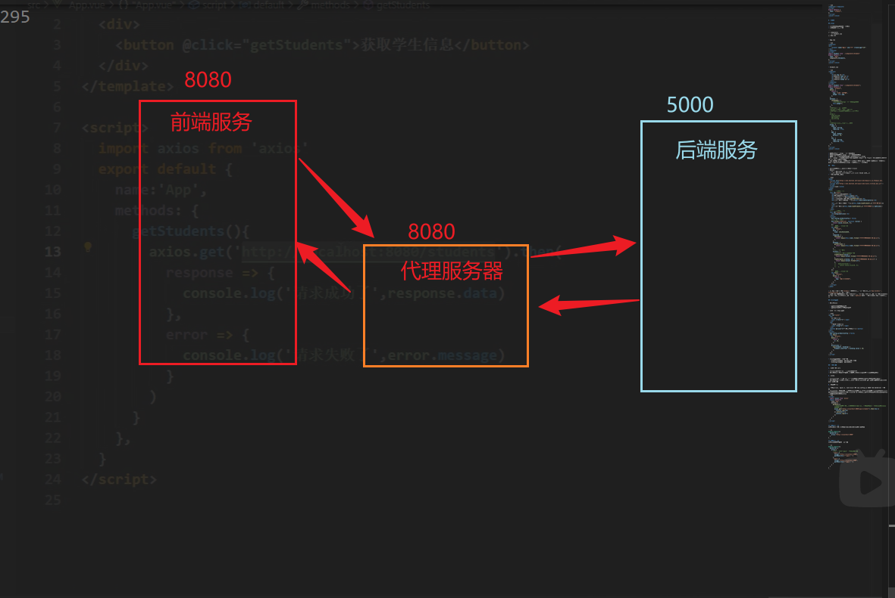

```vue
<template></template>
<script>
export default {
  name: "student",
};
</script>
<style></style>
```

# 配置项

## props

- 用与父组件向子组件传递数据
- 在子组件中进行配置

```
|- components
    |- student.vue
|- App.vue
```

- App.vue

```vue
<template>
<div>
    <Student name="张三" sex="男" v-bind:age="18">
</div>
</template>
<script>
import Student from './components/Student'
export default {
  name: "App",
  components;{Student},
};
</script>
<style></style>
```

- Student.vue

```vue
<template>
  <div>
    <h1>{{ msg }}</h1>
    <p>姓名：{{ name }}</p>
    <p>性别：{{ sex }}</p>
    <p>年龄：{{ myAge }}</p>
  </div>
</template>
<script>
import Student from "./components/Student";
export default {
  name: "Student",
  data() {
    return {
      msg: "我的一名学生",
      myAge: this.age,
    };
  },
  methods: {
    changeAge() {
      //不直接修改props传递过来的age变量
      this.myAge++;
    },
  },
  //接受方式一：简单接收
  /*props:['name','sex','age']*/
  //接受方式二：对接受的数据进行类型限制
  /*
  props:{
    name:String,
    age:Number,
    sex:String
  }
  */
  //接受方式三：使用对象进行接收
  props: {
    name: {
      type: String,
      required: true,
    },
    age: {
      type: Number,
      default: 19,
    },
    sex: {
      type: String,
      required: true,
    },
  },
};
</script>
<style></style>
```

- 避免修改通过 props 传递过来的数据
- 变量命名时避免与 props 传递过来的变量重名
- 避免使用一些特殊变量名（如 ref、key）作为 props
- 通过 props 传递的数据将会被挂载到组件实例对象 VC 身上，所以在组件内部可以直接使用 this 关键字访问到
- vue 会先将 props 中的数据准备好然后再渲染 data 配置项中的数据，所以可以在 data 中声明其他变量来对 props 中的数据进行一个浅拷贝

## 过滤器

- 对显示的数据进行特定格式化后再显示，
- 语法：
  - 注册过滤器：全局注册|局部注册
  - 使用过滤器：1.在插值语法中使用 2.与 v-bind 结合使用
- 过滤器不改变原数据

```html
<head>
  <script src="https://cdn.bootcdn.net/ajax/libs/dayjs/1.11.9/dayjs.min.js"></script>
  <script src="https://cdn.bootcdn.net/ajax/libs/vue/2.4.0/vue.min.js"></script>
  <title>vue2</title>
</head>
<body>
  <!-- 第一个容器 -->
  <div id="root">
    <h2>显示格式化后的时间</h2>
    <h2>现在的时间是:{{this.time}}</h2>
    <h2>使用计算属性实现:{{fmtTime}}</h2>
    <h2>使用methods配置实现:{{getFmtTime()}}</h2>
    <h2>使用过滤器实现（不传参）:{{this.time|timeFormater}}</h2>

    <h2>使用过滤器实现（传参）:{{this.time|timeFormater_1('YYYY-MM-DD')}}</h2>
    <h2>多个过滤器:{{this.time|timeFormater_1('YYYY年MM月')| mySlice}}</h2>
  </div>
  <!-- 第二个容器  -->
  <div id="root2">
    <h1>{{msg|mySlice}}</h1>
  </div>
  <script>
    Vue.config.productionTip = false;
    //注册全局过滤器
    Vue.filter("mySlice", function (value) {
      return value.slice(0, 4);
    });
    //   生成第一个vue实例
    new Vue({
      el: "#root",
      data: {
        time: 1521561322839,
      },
      computed: {
        fmtTime() {
          return dayjs(this.time).format("YYYY年MM月DD日 HH:mm:ss");
        },
      },
      methods: {
        getFmtTime() {
          return dayjs(this.time).format("YYYY年MM月DD日 HH:mm:ss");
        },
      },
      //注册局部过滤器
      filters: {
        //value是过滤器器的默认参数
        timeFormater(value) {
          return dayjs(value).format("YYYY年MM月DD日 HH:mm:ss");
        },
        timeFormater_1(value, str = "YYYY年MM月DD日 HH:mm:ss") {
          return dayjs(value).format(str);
        },
        //   mySlice(value) {
        //     return value.slice(0, 4);
        //   },
      },
    });
    //   生成第二个vue实例
    new Vue({
      el: "#root2",
      data() {
        return {
          msg: "你好，有缘人",
        };
      },
    });
  </script>
</body>
```

- 在 Vue 实例中配置`filters`配置项以注册局部过滤器，使用`Vue.filter('',function()){}`注册全局过滤器
- 上面实例中生成了两个 Vue 实例，其中第一个 Vue 实例中注册了局部过滤器，仅仅供该 Vue 实例使用，然后注册了一个名为`mySlice`的全局过滤器，两个 Vue 实例均能使用

## 自定义指令

- 调用时机：

  - 指令与元素成功绑定时
  - 指令对应的版本被重新解析时

- 定义一个 v-big 指令

```html
<div id="root2">
  <h2>
    当前的值为：
    <span v-text="n"></span>
  </h2>
  <h2>
    放大10倍后的值：
    <span v-big="n"></span>
  </h2>
  <button @click="n++">点击改变当前值</button>
</div>
<script>
  Vue.config.productionTip = false;
  new Vue({
    el: "#root2",
    data() {
      return {
        n: 10,
      };
    },
    directives: {
      big(element, binding) {
        element.innerText = binding.value * 10;
      },
    },
  });
</script>
```

- 自定义指令默认传递的参数
  - element：该指令所绑定的 HTML 元素
  - binding：该指令所绑定的数据

## 配置跨域

1. 后端配置 cors

- 本质：在响应体中添加一些特殊的响应头
- 存在问题：配置响应头需谨慎，避免任何人都能向该服务器请求得到数据

2. jsonp

- 本质：script 标签的 src 属性在请求外部资源时，不受同源策略限制的特性
- 存在问题：1.前后端须同时进行相关配置，2.只能解决 get 请求跨域问题，不能解决 post 请求跨域

3. 代理服务器

- 配置方式：1. nginx 2. vue-cli：配置 vue.config.js 文件中的 devServer 配置项
- 本质：虚拟一台端口号和前台项目相同的服务器 B，B 与后端服务器通信时不受浏览器的同源策略限制（两者都是服务器），B 与前台项目也不受同源策略限制（通信时两者协议、域名、端口号均相同）



```vue
<!-- App.vue -->
<script>
import axios from "axios";
export default {
  name: "App",
  methods: {
    getData() {
      //此处后端服务运行在5000端口，但是由于配置了代理，所以要把请求发送给8080服务器
      axios
        .get("http://localhost:8080/api1/student")
        .then((res) => {
          conosle.log(res);
        })
        .catch((err) => {
          console.log(err);
        });
    },
  },
};
</script>
```

**配置方式一**
缺点：不能配置多个代理，不能灵活控制请求是否代理

```js
module.exports = {
  devServer: {
    proxy: "http://localhost:5000",
  },
};
```

**配置方式二**
缺点：请求资源需要加上前缀

```js
module.exports = {
  devServer: {
    proxy: {
      //匹配所有以"/api1"开头的请求路径
      "/api1": {
        target: "http://localhost:5000",
        pathRewrite: { "^/api1": "" },
      },
      "/api1": {
        target: "http://localhost:5000",
        pathRewrite: { "^/api1": "" },
      },
    },
  },
};
```

# vuex 基本使用

创建》》》引入》》》使用

- 步骤 1：创建`store/index.js`文件

```js
import Vue from "vue";
import Vuex from "vuex";
Vue.use(Vuex);

//响应组件中的动作
const actions = {};
// 操作state
const mutations = {};
// 存储数据
const state = {
  sum: 0,
};
const getters = {
  bigSum(state) {
    return state.sum + 1;
  },
};
export default new Vuex.Store({
  actions,
  mutations,
  state,
  getters,
});
```

- 步骤二：在`main.js`中引入

```js
import store from "./store/index.js";

new Vue({
  el: "#app",
  router,
  store,
  render: (h) => h(App),
});
```

- 步骤三：在组件中使用

```vue
<template>
  <div>{{ this.$store.state.sum }}</div>
</template>
```

## getters 配置项

- 作用：在其他组件中要使用 state 中存储的数据，通常在插值语法中使用，如果这时需要对 state 中的数据进行数值处理，就只能在插槽中书写对应的表达式，如果这种数值处理较为复杂，就会使得插槽中的表达式十分臃肿，

**配置步骤**

- 配置：直接在 store/index.js 文件中定义一个 getters 对象，添加到 Vuex.Store 对象中即可

```js
// ...  index.js文件其他内容
const getters = {
  bigSum(state) {
    return state.sum + 1;
  },
};
export default new Vuex.Store({
  actions,
  mutations,
  state,
  getters,
});
```

- 使用：在其他组件中，通过`this.$store.getters.bigSum`即可访问到

## mapState 与 mapGetters 的使用

- 引入背景：在组件中要使用 state 中存储的数据，通常在插值语法中使用，这就导致每次都需要写重复的内容`this.$store.state.变量名`,将要使用的变量提取到`computed`计算属性中

```js
//store/index.js
import Vue from "vue";
import Vuex from "vuex";
Vue.use(Vuex);

//响应组件中的动作
const actions = {};
// 操作state
const mutations = {};
// 存储数据
const state = {
  sum: 0,
  name: "张三",
  age: 19,
};
const getters = {};
export default new Vuex.Store({
  actions,
  mutations,
  state,
});
```

```html
<template>
  <div>
    <h1>总和：{{sum}}</h1>
    <h1>姓名是：{{xingming}}</h1>
    <h1>年龄是：{{nianling}}</h1>
  </div>
</template>
<script>
  export default {
    name: "App",
    data() {
      return {
        msg: 0,
      };
    },
    computed: {
      // 方式一：纯compute写法
      // sum() {
      //   return this.$store.state.sum;
      // },
      // nianling() {
      //   return this.$store.state.age;
      // },
      // xingming() {
      //   return this.$store.state.name;
      // },
      // 方式二：mapState对象写法，相当于重命名了state中的变量
      // ...mapState({sum:'sum',nianling:'age',xingming:'name'})

      //方式三：mapState数组写法
      ...mapState(["sum", "age", "name"]),
    },
  };
</script>
```

### 总结

**mapState**

```js
computed:{
  //对象写法
  ...mapState({sum:'sum',nianling:'age',xingming:'name'})
  //数组写法
  ...mapState(['sum','age','name'])
}
```

**mapGetters**

```js
computed:{
  //对象写法
  ...mapGetters({bigSum:'bigSum'})
  //数组写法
  ...mapGetters(['bigSum'])
}
```
