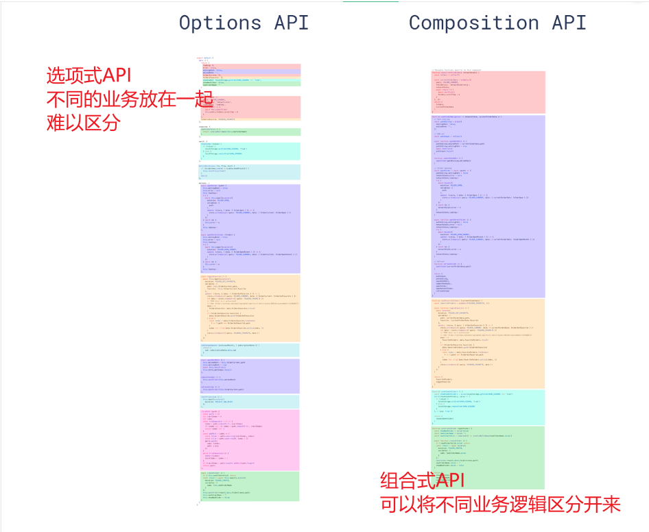
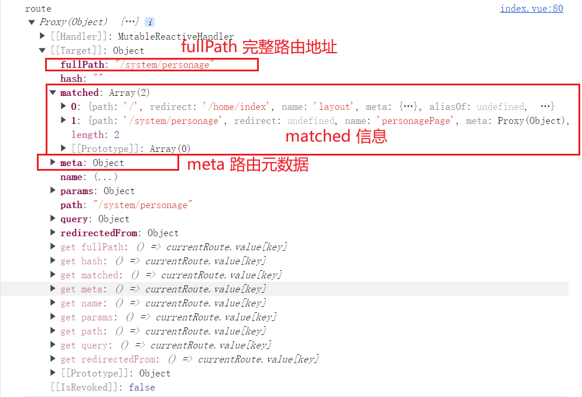
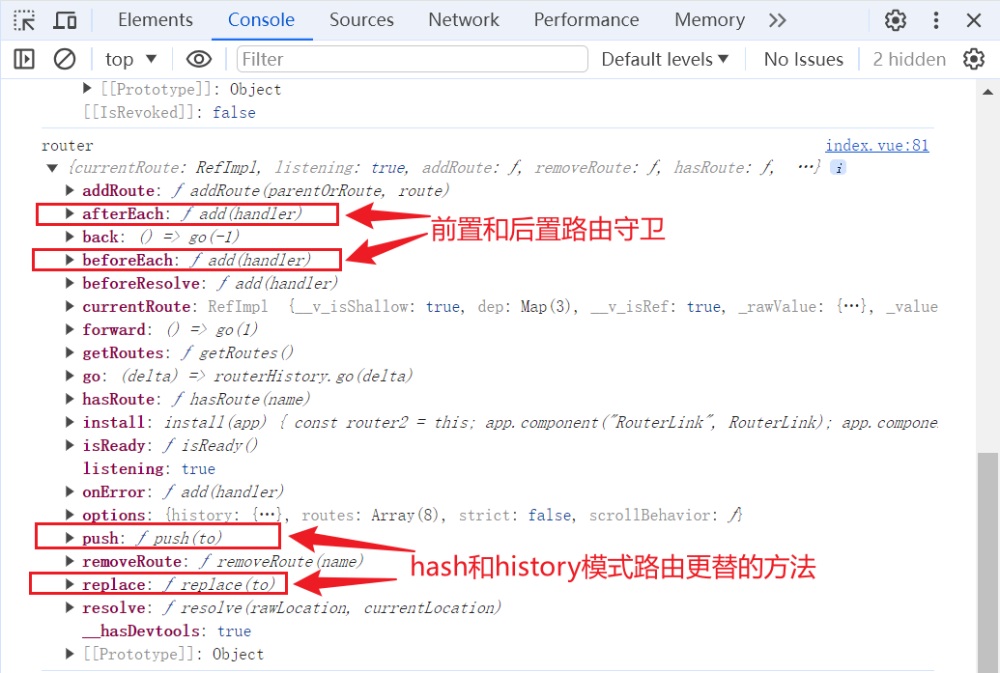

# 创建 vue3 工程

- nvm 切换 node 版本至 18.3 以上

```
nvm use 20.12.0
```

- 使用 npm 命令创建工程

```
npm create vue@latest
```

```
✔ Project name: … <your-project-name>
✔ Add TypeScript? … No / Yes
✔ Add JSX Support? … No / Yes
✔ Add Vue Router for Single Page Application development? … No / Yes
✔ Add Pinia for state management? … No / Yes
✔ Add Vitest for Unit testing? … No / Yes
✔ Add an End-to-End Testing Solution? … No / Cypress / Playwright
✔ Add ESLint for code quality? … No / Yes
✔ Add Prettier for code formatting? … No / Yes
✔ Add Vue DevTools 7 extension for debugging? (experimental) … No / Yes

Scaffolding project in ./<your-project-name>...
Done.
```

- 进入项目，安装 npm 包，运行项目

```
cd <your-project-name>
npm install
npm run dev
```

# options API 和 composition API 的对比

兼容问题，vue3 项目完全支持 vue2 语法

# Vue3 核心语法

## 初始 setup

概述
是 vue3 中的一个全新的配置项，可以将组件中所用到的数据、方法等都配置在其中

特点

- `setup`函数返回的对象中的内容，可直接在模板中使用。
- `setup`中访问`this`是`undefined`。
- `setup`函数会在`beforeCreate`之前调用，它是“领先”所有钩子执行的。

setup 返回值

- 若返回一个**对象**：则对象中的：属性、方法等，在模板中均可以直接使用**（重点关注）。**
- 若返回一个**函数**：则会将该函数的返回值直接替换 template 模板中的 html 代码渲染到页面中，代码如下：

```
setup(){
  return ()=> '你好啊！'
}
```

```html
<template>
  <div class="person">
    <h2>姓名：{{name}}</h2>
    <h2>年龄：{{age}}</h2>
    <button @click="changeName">修改名字</button>
    <button @click="changeAge">年龄+1</button>
  </div>
</template>

<script lang="ts">
  export default {
    name: "Person",
    setup() {
      // 数据，原来写在data中（注意：此时的name、age、tel数据都不是响应式数据）
      let name = "张三";
      let age = 18;

      // 方法，原来写在methods中
      function changeName() {
        name = "zhang-san"; //注意：此时这么修改name页面是不变化的
      }
      function changeAge() {
        age += 1; //注意：此时这么修改age页面是不变化的
      }
      // 返回一个对象，对象中的内容，模板中可以直接使用
      return { name, age, tel, changeName, changeAge };
    },
  };
</script>
```

### 面试题：setup、data、methods 三种配置项

setup 的生命周期最早，data 和 methods 可以通过 this 访问到 setup 中定义的变量和函数

- `Vue2` 的配置（`data`、`methos`......）中**可以访问到** `setup`中的属性、方法。
- 但在`setup`中**不能访问到**`Vue2`的配置（`data`、`methos`......）。
- 如果与`Vue2`冲突，则`setup`优先。

### setup 语法糖

问题：上面代码中，编写变量和函数时还需要写一个 setup 配置项并 return 出去，比较麻烦
解决：通过语法糖，将 setup 配置项独立出去，生成一个新的 script 标签

```html
<script lang="ts">
  export default {
    name: "Person",
  };
</script>

<script setup lang="ts">
  let name = "张三";
  let age = 18;
  let tel = "13888888888";

  function changName() {
    name = "李四";
  }
  function changAge() {
    age += 1;
  }
  function showTel() {
    alert(tel);
  }
</script>
```

问题：上述代码，还需要编写一个不写`setup`的`script`标签，去指定组件名字，比较麻烦
解决：使用插件解决

- 安装插件：`npm i vite-plugin-vue-setup-extend -D`
- 修改`vite.config.js`配置文件

```js
import { defineConfig } from "vite";
import VueSetupExtend from "vite-plugin-vue-setup-extend";

export default defineConfig({
  plugins: [VueSetupExtend()],
});
```

- 合并两个 script 标签

```html
<script setup lang="ts" name="Person">
  // ....
</script>
```

## 基本数据类型的响应式数据 ref

- **作用：**定义响应式变量。
- **语法：**`let xxx = ref(初始值)`。
- **返回值：**一个`RefImpl`的实例对象，简称`ref对象`或`ref`，`ref`对象的`value`**属性是响应式的**。
- **注意点：**
  - `JS`中操作数据需要：`xxx.value`，但模板中不需要`.value`，直接使用即可。
  - 对于`let name = ref('张三')`来说，`name`不是响应式的，`name.value`是响应式的。

```html
<template>
  <div class="person">
    <h2>姓名：{{name}}</h2>
    <h2>年龄：{{age}}</h2>
    <button @click="changeName">修改名字</button>
    <button @click="changeAge">年龄+1</button>
  </div>
</template>

<script setup lang="ts" name="Person">
  import { ref } from "vue";
  // name和age是一个RefImpl的实例对象，简称ref对象，它们的value属性是响应式的。
  let name = ref("张三");
  let age = ref(18);

  function changeName() {
    // JS中操作ref对象时候需要.value
    name.value = "李四";
    console.log(name.value);
    // 注意：name不是响应式的，name.value是响应式的，所以如下代码并不会引起页面的更新。
    // name = ref('zhang-san')
  }
  function changeAge() {
    // JS中操作ref对象时候需要.value
    age.value += 1;
    console.log(age.value);
  }
</script>
```

## 对象类型的响应式数据 reactive

- **作用：**定义一个**响应式对象**（基本类型不要用它，要用`ref`，否则报错）
- **语法：**`let 响应式对象= reactive(源对象)`。
- **返回值：**一个`Proxy`的实例对象，简称：响应式对象。
- **注意点：**`reactive`定义的响应式数据是“深层次”的。

```html
<template>
  <div class="person">
    <h2>汽车信息：一台{{ car.brand }}汽车，价值{{ car.price }}万</h2>
    <h2>游戏列表：</h2>
    <ul>
      <li v-for="g in games" :key="g.id">{{ g.name }}</li>
    </ul>
    <h2>测试：{{obj.a.b.c.d}}</h2>
    <button @click="changeCarPrice">修改汽车价格</button>
    <button @click="changeFirstGame">修改第一游戏</button>
    <button @click="test">测试</button>
  </div>
</template>

<script lang="ts" setup name="Person">
  import { reactive } from "vue";

  // 数据
  let car = reactive({ brand: "奔驰", price: 100 });
  let games = reactive([
    { id: "ahsgdyfa01", name: "英雄联盟" },
    { id: "ahsgdyfa02", name: "王者荣耀" },
    { id: "ahsgdyfa03", name: "原神" },
  ]);
  let obj = reactive({
    a: {
      b: {
        c: {
          d: 666,
        },
      },
    },
  });

  function changeCarPrice() {
    car.price += 10;
  }
  function changeFirstGame() {
    games[0].name = "其他游戏";
  }
  function test() {
    obj.a.b.c.d = 999;
  }
</script>
```

## 对象类型的响应式数据 ref

ref 也可以定义对象类型的响应式数据
若`ref`接收的是对象类型，内部其实也是调用了`reactive`函数。

```html
<template>
  <div class="person">
    <h2>汽车信息：一台{{ car.brand }}汽车，价值{{ car.price }}万</h2>
    <h2>游戏列表：</h2>
    <ul>
      <li v-for="g in games" :key="g.id">{{ g.name }}</li>
    </ul>
    <h2>测试：{{obj.a.b.c.d}}</h2>
    <button @click="changeCarPrice">修改汽车价格</button>
    <button @click="changeFirstGame">修改第一游戏</button>
  </div>
</template>

<script lang="ts" setup name="Person">
import { ref } from 'vue'

// 数据
let car = ref({ brand: '奔驰', price: 100 })
let games = ref([
  { id: 'ahsgdyfa01', name: '英雄联盟' },
  { id: 'ahsgdyfa02', name: '王者荣耀' },
  { id: 'ahsgdyfa03', name: '原神' }
])

function changeCarPrice() {
  car.value.price += 10
}
function changeFirstGame() {
  games.value[0].name = '其他游戏'
}
```

## toRefs 和 toRef

- 作用：将一个响应式对象中的每一个属性，转换为`ref`对象。
- 备注：`toRefs`与`toRef`功能一致，但`toRefs`可以批量转换。

```html
<template>
  <div class="person">
    <h2>姓名：{{person.name}}</h2>
    <h2>年龄：{{person.age}}</h2>
    <h2>性别：{{person.gender}}</h2>
    <button @click="changeName">修改名字</button>
    <button @click="changeAge">修改年龄</button>
    <button @click="changeGender">修改性别</button>
  </div>
</template>

<script lang="ts" setup name="Person">
  import { ref, reactive, toRefs, toRef } from "vue";

  // 数据
  let person = reactive({ name: "张三", age: 18, gender: "男" });

  // 通过toRefs将person对象中的n个属性批量取出，且依然保持响应式的能力
  let { name, gender } = toRefs(person);

  // 通过toRef将person对象中的gender属性取出，且依然保持响应式的能力
  let age = toRef(person, "age");

  // 方法
  function changeName() {
    name.value += "~";
  }
  function changeAge() {
    age.value += 1;
  }
  function changeGender() {
    gender.value = "女";
  }
</script>
```


## computed

- 用法：与 vue2 不同，vue3 中的计算属性不再是 computed 配置项而是一个函数，通过 import 引入即可

```html
<template>
  <div class="person">
    姓：
    <input type="text" v-model="firstName" />
    <br />
    名：
    <input type="text" v-model="lastName" />
    <br />
    全名：
    <span>{{fullName}}</span>
    <br />
    <button @click="changeFullName">全名改为：li-si</button>
  </div>
</template>

<script setup lang="ts" name="App">
  import { ref, computed } from "vue";

  let firstName = ref("zhang");
  let lastName = ref("san");

  // 计算属性——只读取，不修改
  /* let fullName = computed(()=>{
    return firstName.value + '-' + lastName.value
  }) */

  // 计算属性——既读取又修改
  let fullName = computed({
    // 读取
    get() {
      return firstName.value + "-" + lastName.value;
    },
    // 修改
    set(val) {
      console.log("有人修改了fullName", val);
      firstName.value = val.split("-")[0];
      lastName.value = val.split("-")[1];
    },
  });
  //当修改fullName时会触发set()函数，从而完成修改
  function changeFullName() {
    fullName.value = "li-si";
  }
</script>
```

## watch 监视

- 作用：监视数据的变化（和`Vue2`中的`watch`作用一致）
- 特点：`Vue3`中的`watch`只能监视以下**四种数据**：

> 1. `ref`定义的数据。
> 2. `reactive`定义的数据。
> 3. 函数返回一个值（`getter`函数）。
> 4. 一个包含上述内容的数组。

**情况一（常用）**

```html
<template>
  <div class="person">
    <h1>情况一：监视【ref】定义的【基本类型】数据</h1>
    <h2>当前求和为：{{sum}}</h2>
    <button @click="changeSum">点我sum+1</button>
  </div>
</template>

<script lang="ts" setup name="Person">
  import { ref, watch } from "vue";
  // 数据
  let sum = ref(0);
  // 方法
  function changeSum() {
    sum.value += 1;
  }
  // 监视，情况一：监视【ref】定义的【基本类型】数据
  const stopWatch = watch(sum, (newValue, oldValue) => {
    console.log("sum变化了", newValue, oldValue);
    if (newValue >= 10) {
      stopWatch();
    }
  });
</script>
```

**情况二**

```html
<script lang="ts" setup name="Person">
  import { ref, watch } from "vue";
  // 数据
  let person = ref({
    name: "张三",
    age: 18,
  });
  // 方法
  function changeName() {
    person.value.name += "~";
  }
  function changeAge() {
    person.value.age += 1;
  }
  function changePerson() {
    person.value = { name: "李四", age: 90 };
  }
  /* 
    监视，情况一：监视【ref】定义的【对象类型】数据，监视的是对象的地址值，若想监视对象内部属性的变化，需要手动开启深度监视
    watch的第一个参数是：被监视的数据
    watch的第二个参数是：监视的回调
    watch的第三个参数是：配置对象（deep、immediate等等.....） 
  */
  watch(
    person,
    (newValue, oldValue) => {
      console.log("person变化了", newValue, oldValue);
    },
    { deep: true }
  );
</script>
```

**情况三**

reactive 定义的对象类型的数据

```html
<script lang="ts" setup name="Person">
  import { reactive, watch } from "vue";
  // 数据
  let person = reactive({
    name: "张三",
    age: 18,
  });

  // 方法
  function changeName() {
    person.name += "~";
  }
  function changeAge() {
    person.age += 1;
  }
  function changePerson() {
    Object.assign(person, { name: "李四", age: 80 });
  }

  // 监视，情况三：监视【reactive】定义的【对象类型】数据，且默认是开启深度监视的，且无法手动关闭深度监视
  watch(person, (newValue, oldValue) => {
    console.log("person变化了", newValue, oldValue);
  });
</script>
```

**情况四（常用）**

监视`ref`或`reactive`定义的【对象类型】数据中的**某个属性**，注意点如下：

1. 若该属性值**不是**【对象类型】，需要写成函数形式。
2. 若该属性值是**依然**是【对象类型】，可直接编，也可写成函数，建议写成函数。

结论：监视的要是对象里的属性，那么最好写函数式，注意点：若是对象监视的是地址值，需要关注对象内部，需要手动开启深度监视。

```js
let person = reactive({
  name: "张三",
  age: 18,
  car: {
    c1: "奔驰",
    c2: "宝马",
  },
});
// 监视，情况四：监视响应式对象中的某个属性，且该属性是基本类型的，要写成函数式
watch(
  () => person.name,
  (newValue, oldValue) => {
    console.log("person.name变化了", newValue, oldValue);
  }
);

// 监视，情况四：监视响应式对象中的某个属性，且该属性是对象类型的，可以直接写，也能写函数，更推荐写函数
//直接写：不能监视整体的变化，就是当被监视的对象完全变成另外一个对象时，无法触发监视回调
watch(
  person.car,
  {
    //...
  },
  {
    //...
  }
);
//函数写法
watch(
  () => person.car,
  (newValue, oldValue) => {
    console.log("person.car变化了", newValue, oldValue);
  },
  { deep: true }
);
```

**情况五（常用）**
同时监听多个数据，放在一个数组中

```js
watch(
  [() => person.name, person.car],
  (newValue, oldValue) => {
    //此时newValue和oldValue都是数组，[name_newVal,peroson_newVal]
    console.log("被监听的值发生变化：", newValue, oldValue);
  },
  { deep: true }
);
```

## 【watchEffect】

引入背景：

下面代码中，我们定义两个变量`temp`和`height`，通过 watch 监听，当 temp>=50 且 height>=20 执行相应操作

```js
let temp = ref(0);
let height = ref(0);

watch([temp, height], (value) => {
  const [newTemp, newHeight] = value;
  if (newTemp >= 50 && newHeight >= 20) {
    // 执行操作
  }
});
```

下面我们通过 watchEffect 进行简化

```js
const stopWtach = watchEffect(() => {
  if (temp.value >= 50 || height.value >= 20) {
    //执行操作
  }
  if (temp.value === 100 || height.value === 50) {
    //取消监听
    stopWtach();
  }
});
```

## ref 属性

用普通 DOM 标签上,可以获取 DOM 节点

```html
<script setup>
  import { ref } from "vue";

  const p = ref();
</script>

<template>
  <p ref="p">hello</p>
</template>
```

用子组件上，获取整个组件实力对象

- 父组件

```html
<!-- Father.vue -->
<template>
  <Son ref="ren" />
</template>

<script lang="ts" setup name="App">
  import Son from "./components/Son.vue";

  let ren = ref();

  function test() {
    //父组件只能访问子组件中向外暴露的变量
    console.log(ren.value.name);
  }
</script>
```

- 子组件

```html
<!-- Son.vue -->
<script lang="ts" setup name="Person">
  import { ref, defineExpose } from "vue";
  let name = ref("张三");
  let age = ref(18);
  // 使用defineExpose将组件中的数据交给外部
  defineExpose({ name, age });
</script>
```

## props

- 父组件

```html
<!-- Father.vue -->
<template>
  <Person :list="persons" />
</template>

<script lang="ts" setup name="App">
  import Person from "./components/Person.vue";
  import { reactive } from "vue";

  let persons = reactive([
    { id: "e98219e12", name: "张三", age: 18 },
    { id: "e98219e13", name: "李四", age: 19 },
    { id: "e98219e14", name: "王五", age: 20 },
  ]);
</script>
```

- 子组件

```html
<!-- Person.vue -->
<template>
  <div class="person">
    <ul>
      <li v-for="item in list" :key="item.id">{{item.name}}--{{item.age}}</li>
    </ul>
  </div>
</template>

<script lang="ts" setup name="Person">
  import { defineProps } from "vue";

  // 第一种写法：仅接收
  const props = defineProps(["list"]);
</script>
```

## 自定义 hooks

引入背景：vue3 的组合式 API 的特点就是将实现相同业务的代码放在一起，而不同业务的代码拆分成块，而 hooks 就体现了这一思想
作用：相当于 vue2 的 mixin，将涉及到某个功能的变量、函数等封装到一个单独的文件中

- 目录结构

```
|- 根目录
  |- hooks
    |- useSum.js
    |- useDog.js
  |- App.vue
```

- useSum.js

```js
import { ref, onMounted } from "vue";

export default function () {
  let sum = ref(0);

  const increment = () => {
    sum.value += 1;
  };
  const decrement = () => {
    sum.value -= 1;
  };
  onMounted(() => {
    increment();
  });

  return { sum, increment, decrement };
}
```

- useDog.js

```js
import { reactive, onMounted } from "vue";
import axios, { AxiosError } from "axios";

export default function () {
  let dogList = reactive([]);
  async function getDog() {
    try {
      // 发请求
      let { data } = await axios.get(
        "https://dog.ceo/api/breed/pembroke/images/random"
      );
      // 维护数据
      dogList.push(data.message);
    } catch (error) {
      // 处理错误
      const err = error;
      console.log(err.message);
    }
  }

  // 挂载钩子
  onMounted(() => {
    getDog();
  });

  //向外部暴露数据
  return { dogList, getDog };
}
```

- App.vue

```html
<template>
  <h2>当前求和为：{{sum}}</h2>
  <button @click="increment">点我+1</button>
  <button @click="decrement">点我-1</button>
  <hr />
  
  <span v-show="dogList.isLoading">加载中......</span>
  <br />
  <button @click="getDog">再来一只狗</button>
</template>

<script lang="ts">
  import { defineComponent } from "vue";

  export default defineComponent({
    name: "App",
  });
</script>

<script setup lang="ts">
  import useSum from "./hooks/useSum";
  import useDog from "./hooks/useDog";

  let { sum, increment, decrement } = useSum();
  let { dogList, getDog } = useDog();
</script>
```

观察上面的代码，如果不将相同业务逻辑拆分为 hooks 而是都写在 APP.vue 中，这只是两个逻辑，如果逻辑多了，就会非常乱。


# 路由 vueRouter

## 上手使用

1. 安装 vueRouter

```sh
npm install vue-router@4
```

2. 创建 vueRouter 实例

```js

```

## 简单的效果

- 目录结构

```
|- 根目录
  |- pages
    |- Home.vue
    |- News.vue
    |- About.vue
  |- routes
    |- index.js
  |- App.vue
  |- main.js
```

- routes/index.js

```js
import { createRouter, createWebHashHistory } from "vue-router";
import Home from "@/pages/Home.vue";
import News from "@/pages/News.vue";
import About from "@/pages/About.vue";

const router = createRouter({
  history: createWebHashHistory(),
  routes: [
    {
      path: "/home",
      component: Home,
    },
    {
      path: "/about",
      component: About,
    },
  ],
});
export default router;
```

- main.js

```js
import router from "./routes/index";

app.use(router);

app.mount("#app");
```

- App.js

```html
<template>
  <div class="app">
    <h2 class="title">Vue路由测试</h2>
    <!-- 导航区 -->
    <div class="navigate">
      <RouterLink to="/home" active-class="active">首页</RouterLink>
      <RouterLink to="/news" active-class="active">新闻</RouterLink>
      <RouterLink to="/about" active-class="active">关于</RouterLink>
    </div>
    <!-- 展示区 -->
    <div class="main-content">
      <RouterView></RouterView>
    </div>
  </div>
</template>

<script lang="ts" setup name="App">
  import { RouterLink, RouterView } from "vue-router";
</script>
```

**注意**

1. 视觉效果上“消失” 了的路由组件，默认是被**卸载**掉的，需要的时候再去**挂载**。

## routerlink 中 to 的两种写法

```html
<!-- 第一种：to的字符串写法 -->
<router-link active-class="active" to="/home">主页</router-link>

<!-- 第二种：to的对象写法 -->
<router-link active-class="active" :to="{path:'/home'}">Home</router-link>
```

## 命名路由

```js
routes: [
  {
    name: "zhuye",
    path: "/home",
    component: Home,
  },
  {
    name: "xinwen",
    path: "/news",
    component: News,
  },
  {
    name: "guanyu",
    path: "/about",
    component: About,
  },
];
```

跳转路由

```html
<!--简化前：需要写完整的路径（to的字符串写法） -->
<router-link to="/news/detail">跳转</router-link>

<!--简化后：直接通过名字跳转（to的对象写法配合name属性） -->
<router-link :to="{name:'guanyu'}">跳转</router-link>
```

## query 参数

- 传递参数

```html
<!-- 跳转并携带query参数（to的字符串写法） -->
<router-link to="/news/detail?a=1&b=2&content=欢迎你">跳转</router-link>

<!-- 跳转并携带query参数（to的对象写法） -->
<RouterLink
  :to="{
    //name:'xiang', //用name也可以跳转
    path:'/news/detail',
    query:{
      id:news.id,
      title:news.title,
      content:news.content
    }
  }"
>
  {{news.title}}
</RouterLink>
```

- 接受参数

```js
import { useRoute } from "vue-router";
const route = useRoute(); // 打印query参数
console.log(route.query);
```

### params 传参

- 传递参数

```html
<!-- 跳转并携带params参数（to的字符串写法） -->
<RouterLink :to="`/news/detail/001/新闻001/内容001`">{{news.title}}</RouterLink>

<!-- 跳转并携带params参数（to的对象写法） -->
<RouterLink
  :to="{
    name:'xiang', //此处只能使用name跳转
    params:{
      id:news.id,
      title:news.title,
      content:news.title
    }
  }"
>
  {{news.title}}
</RouterLink>
```

- 接受参数

```js
import { useRoute } from "vue-router";
const route = useRoute();
// 打印params参数
console.log(route.params);
```

**注意**

1. 需要传递 params 参数时，需要在定义 route 时占好位置

```js
//routes/index.js
{
  name:'Detail',
  path:"detail/:id/:title/:content",
  component:Detail
}
```

2. 传递`params`参数时，若使用`to`的对象写法，必须使用`name`配置项，不能用`path`。

## 关于 route 和 router





# 状态管理 pinia

## 使用步骤

- 项目目录

```
|- 根目录
  |- ...
  |- components
    |- Home.vue
  |- store
    |- modules
      |- home.ts
    |- index.ts
  |- App.vue
  |- main.ts
```

1. 安装 pinia

```sh
npm install pinia
```

2. 创建一个 pinia 实例

```js
// index.ts
import { createPinia } from "pinia";

const pinia = createPinia();

export default pinia;
```

3. 在`main.ts`中引入

```js
// main.ts
// ...其他代码
import store from "@/store";

app.use(store);
```

4. 在`pinia`中存储数据

```ts
// modules/home.ts
import { defineStore } from "pinia";

export const useCountStore = defineStore("count", {
  state() {
    return {
      sum: 9,
    };
  },
});
```

5. 在指定组件中使用`pinia`中存储的数据

```html
<!--components/Home.vue-->
<script lang="ts" name="Home">
  import { useCountStore } from "@/store";

  const countStore = useCountStore();

  console.log(countStore.sum);
</script>
```

## 修改数据的三种方式

```html
<template>
  <p class="container">"当前值为："{{countStore.cum}}</p>
</template>
<!--components/Home.vue-->
<script lang="ts" name="Home">
  import { useCountStore } from "@/store";

  const countStore = useCountStore();

  let n = ref(1);

  function add() {
    // 方式一：直接修改
    countStore.sum += n;
    // 方式二：$patch
    countStore.$patch({
      sum: 999,
      name: "张三",
      age: 10,
    });
    //方式三：在actions中定义一个方法并在此处调用
    countStore.increment(n);
  }
</script>
```

```ts
// modules/home.ts
import { defineStore } from "pinia";

export const useCountStore = defineStore("count", {
  // 方式三：在actions中定义一个方法
  actions: {
    increment(value) {
      this.sum += value;
    },
  },
  state() {
    return {
      sum: 9,
    };
  },
});
```

## storeToRefs

- 存在问题：在上面例子中如果需要使用 countStore 中定义的值，需要带上前缀`{{countStore.sum}}`，但是如果仅使用解构的方法来提取数据又不能做到响应式

```html
<script lang="ts" name="Home">
  import { useCountStore, storeToRefs } from "@/store";

  const countStore = useCountStore();
  // 如何在解构的同时实现响应式
  // 方式一：toRef
  // 存在问题：countStore对象中的所有对象 都被设置成响应式了
  const { sum } = toRef(countStore);
  // 方式二：从pinia中引入storeToRefs
  // 优势：只会关注store中的数据
  const { sum } = storeToRefs(countStore);

  let n = ref(1);

  function add() {
    // ...
  }
</script>
```

## getters 配置项

```ts
import { defineStore } from "pinia";

// 定义并暴露一个store
export const useCountStore = defineStore("count", {
  actions: {
    // ...
  },
  state() {
    return {
      sum: 1,
      school: "atguigu",
    };
  },
  getters: {
    bigSum: (state): number => state.sum * 10,
    upperSchool(): string {
      return this.school.toUpperCase();
    },
  },
});
```

## $subscribe 监听 store 中的数据变化

```html
<script lang="ts" name="Home">
  import { useCountStore } from "@/store";

  const countStore = useCountStore();

  countStore.$subscribe((mutate, state) => {
    //...
  });
  let n = ref(1);

  function add() {
    // ....
  }
</script>
```

# 组件通信

- 项目目录结构

```
|- 根目录
  |- components
    |- Child.vue
    |- Child1.vue
  |- routes
    |- index.ts
  |- App.vue
  |- main.ts
```

## props：父子互传

**父子通信。父组件向子组件中传递数据（变量、函数等）：子组件使用父组件中的数据、方法。父组件使用子组件的数据**

- 子组件

```html
<!-- Child.vue -->
<template>
  <div class="person">
    <h2>自己的玩具：{{toy}}</h2>
    <h2>来自父亲的汽车：{{car}}</h2>
    <button @click="fasong(toy)">点击赠送玩具</button>
  </div>
</template>
<script lang="ts" name="Child">
  import { ref } from "vue";

  let toy = ref("玩具");

  let props = defineProps(["car", "sendToy"]);
  // 点击按钮触发函数，在其执行父组件中传递过来的函数，此时可以为父组件中的变量赋值以达到父组件使用子组中的数据的目的
  function fasong(toy) {
    props.sendToy(toy);
  }
</script>
```

- 父组件

```html
<!-- App.vue -->
<template>
  <div class="person">
    <h2>自己的汽车：{{car}}</h2>
    <h2>儿子的玩具：{{toy}}</h2>
    <!-- 此处sendToy的意思是，给子组件传递一个函数数据，子组件需要使用prop进行接收 -->
    <Child :car="car" :sendToy="getToy" />
  </div>
</template>
<script lang="ts" name="App">
  import Child from "@/components/Child.vue";
  import { ref } from "vue";

  let car = ref("奔驰");
  let toy = ref("");

  function getToy(value: string) {
    console.log("父组件中的方法被调用了");
    toy = value;
  }
</script>
```

## 自定义事件

### vue 官方：defineEmits

- 子组件

```html
<!-- Child.vue -->
<template>
  <div class="person">
    <h2>自己的玩具：{{toy}}</h2>
    <h2>来自父亲的汽车：{{car}}</h2>
    <button @click="emit('haha',toy)">点击赠送玩具</button>
    <!-- 其他写法：多单词变量 -->
    <!-- <button @click="emit('send-toy',toy)">点击赠送玩具</button> -->
  </div>
</template>
<script lang="ts" name="Child">
  import { ref } from "vue";

  let toy = ref("玩具");

  const emit = defineEmits(["haha"]);
</script>
```

- 父组件

```html
<!-- App.vue -->
<template>
  <div class="person">
    <h2>自己的汽车：{{car}}</h2>
    <h2>儿子的玩具：{{toy}}</h2>
    <Child @haha="xyz" />
    <!-- 其他写法：多单词变量 -->
    <!-- <Child @send-toy="xyz" /> -->
  </div>
</template>
<script lang="ts" name="App">
  import Child from "@/components/Child.vue";
  import { ref } from "vue";

  let toy = ref("");

  function xyz(value: number) {
    console.log("父组件中的方法被调用了");
    toy = value;
  }
</script>
```

### 三方库：mitt

1. 安装

```sh
npm install --save mitt
```

2. 基本使用

```js
import mitt from "mitt";

// 实例化一个对象，该对象可以绑定事件、触发事件
const emitter = mitt();
// 绑定事件
emitter.on("test1", () => {
  console.log("test1被调用了");
});
// 触发事件
setInterval(() => {
  emitter.emit("test1");
}, 1000);

// 解绑事件
setTimeout(() => {
  // emitter.off('test1')
  emitter.all.clear();
}, 2000);
```

3. 应用在 vue 组件中

- 首先在项目的`utils/emitter.ts`中定义并向外暴露

```ts
import mitt from "mitt";

// 实例化一个对象，该对象可以绑定事件、触发事件
const emitter = mitt();

export default emitter;
```

- 接下来要实现的是,把`child1.vue`中的变量传递到它的兄弟组件`child.vue`,思路就是：在发送方组件内部定义一个自定义事件，点击按钮后触发该事件，如果事件触发成功，接收方就会收到通知，然后触发相应的函数

```html
<!-- Child.vue -->
<template>
  <h2>来自兄弟的玩具：{{toy}}</h2>
</template>
<script lang="ts" name="Child">
  import { ref, onUnmounted } from "vue";
  import emitter from "@/utils/emitter";

  let toy = ref("");
  // 绑定一个事件
  emitter.on("send-toy", (value) => {
    console.log("send-toy", value);
    toy.value = value;
  });
  const emit = defineEmits(["haha"]);

  //组件卸载时，解绑事件
  onUnmounted(() => {
    emitter.off("send-toy");
  });
</script>
```

```html
<!-- Child1.vue -->
<template>
  <h2 v-if="toy">来自兄弟的玩具：{{toy}}</h2>
  <!-- 点击触发事件 -->
  <button @click="emitter.emit('send-toy',toy)">点击赠送玩具</button>
</template>
<script lang="ts" name="Child">
  import { ref } from "vue";
  import emitter from "@/utils/emitter";

  let toy = ref("child1的玩具");
</script>
```

## v-model

UI 组件库底层大量使用`v-model`进行通信
