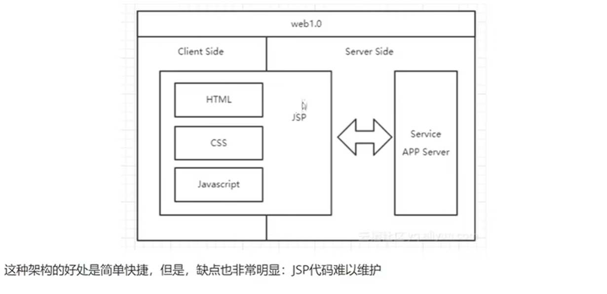
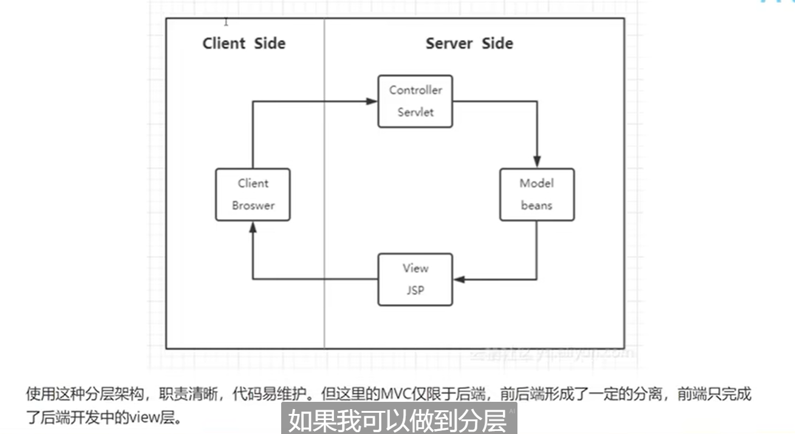
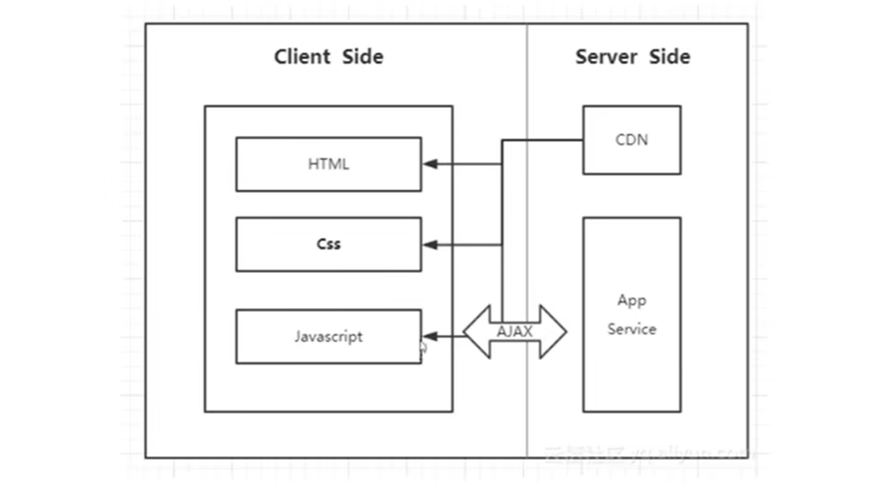
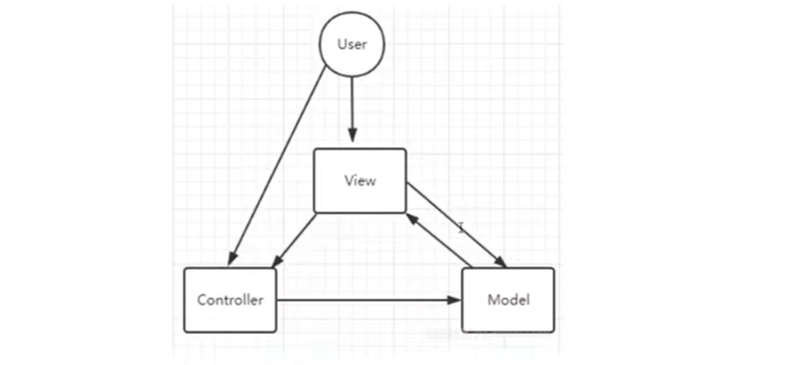
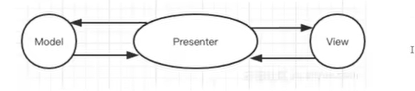
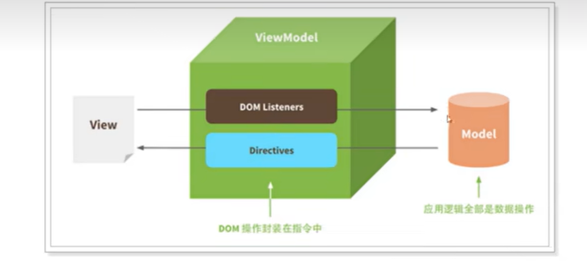

# 三种架构模式

早期没有前端概念的时候，页面的渲染、数据的获取，对用户事件的响应所有的应用逻辑都混合在一起。



- 存在问题：数据与视图之间的逻辑关系比较混乱，难以识别和开发维护

因此需要一种统一的**管理方式**，这种管理方式能够显示管理`数据Model`，并让其呈现在页面上的不同位置

## MVC 架构

### 后端 MVC 架构

此时的 MVC 只限于服务端，几乎所有数据都要在服务端做渲染，前端只负责 View 层



- 时期特点： **切图仔时代**
- 存在问题：

  > - 前端页面开发效率不高，前端的主要工作是将 ui 设计的页面还原出来，

  > - 前后端职责不清晰

### 后端 MVC 进一步发展

- 契机：Gmail 出现、ajax 技术的风靡，前后端职责更清晰了：前端可以通过 ajax 技术与后端进行交互，整体架构发生了变化



- 优点：ajax 使得页面实现部分刷新，减少了服务器负载和流量消耗
- 时期特点：著名的前端类库开始涌现，比如`jQuery`
- 存在问题：缺乏可行的开发模式，页面内容杂糅在一起，项目大了难以维护

### 初期前端 MVC

- 存在问题：各个部分之间的割裂太多严重，不够灵活

### 前端 MVC 进阶

实际项目中，更多的出现这种框架，backbond.js 就是这种架构模式



- 存在问题：
  > - 数据流混乱。

> - Controller 层功能太过单薄，View 层比较臃肿

### 总结

MVC 的架构迭代过程中，有一些矛盾的地方：本身不够灵活，改变的灵活，但是有出现了数据流混乱的问题

MVC 架构方式的出现，能够很好的满足页面对于`管理方式`的需求

## MVP 模式

与 MVC 模式接近，引入 Presenter 层（中间人），防止 View 与 Model 层之间直接接触。



- 背景：由于 AngularJS 很早的将 MVVM 架构思想引入了前端，实际上 MVP 架构在前端开发中并不常见。

- 存在问题：虽然分离了 View 和 Model 层，但是随着项目体积的增大，presenter 层的体积也会增大，变得难以维护

## MVVM 模型

> **vue 官网：Vue 的设计受到了 MVVM 模型的启发**

- 全称：Model - View - ViewModel



特点

- 自动响应数据变化，并更新视图
- 监听用户与 View 层的交互，并完成数据更新
- 使用户专注于业务逻辑，避免对于 DOM 的操作

## 总结

- 这三者都是框架模式,它们设计的目标都是为了解决 Model 和 View 的耦合问题。

- MVC 模式出现较早主要应用在后端,如 Spring MVC、ASP.NET MVC 等,在前端领域的早期也有应用,如
  Backbone.js。它的优点是分层清晰,缺点是数据流混乱,灵活性带来的维护性问题
  。
- MVP 模式在是 MVC 的进化形式,Presenter 作为中间层负责 MV 通信,解决了两者耦合问题,但 P 层过于臃肿会
  导致维护问题。

- MVVM 模式在前端领域有广泛应用,它不仅解决 MV 耦合问题,还同时解决了维护两者映射关系的大量繁杂代
  码和 DOM 操作代码,在提高开发效率、可读性同时还保持了优越的性能表现。

# vue2 与 vue3 的区别有哪些？

## 组合式 API

组合式 API **Composition API**替代选项式 API **Options API**

- 代码组织问题。**options API**当组件变得复杂时，不同功能的代码可能会散落在各个部分，难以维护和重用
- 代码复用：vue2 中代码复用方案主要是 mixins，但它们都有一些缺点，比如命名冲突和代码可读性差
- 更好地 TS 支持和函数式编程趋势

## 其他细节上的改变

> - 弱化 this
> - 生命周期函数的改变
> - 根实例的 创建语法 `new App`=>`createApp`
> - mixin 被 hooks 替代
> - `teleport` 组件
> - `template`可以不包括在一个根元素中

## 原理方面

### 响应式原理

`Proxy`代替`object.defineProperty`

- defineProperty 存在的问题

  > - 一次只能监听一个属性
  > - 属性值为对象时需要递归监听
  > - 不能自动监听对象的新增属性
  > - 通过 push、unshift 等方法新增元素，无法监听到

  > - 并非完全代替：reactive 定义的响应式数据通过`proxy`包裹，`ref`则使用了`defineProperty`给一个空对象定义`value`属性做响应式

## 其他方面

### diff 算法

### v-model

- vue2

在 vue2 中，`v-model`常用于在表单元素和组件之间实现双向数据绑定，其工作原理是：为表单元素添加一个事件监听器，并将表单元素的`value`属性与 Vue 的实例属性进行关联，并通过监听`input`事件，捕获该事件并更新绑定数据

**绑定一个表单元素**

```html
<input v-model="a" />

<!-- 相当于 -->

<input :value="a" @input="(e)=>{a=e.target.value}" />
```

**v-model 用在子组件上**

- 原理与绑定表单元素时相同

```vue
<son v-model="a"></son>

<!-- 相当于 -->

<son
  :value="a"
  @input="
    (e) => {
      a = e;
    }
  "
></son>
```

- vue3

#
