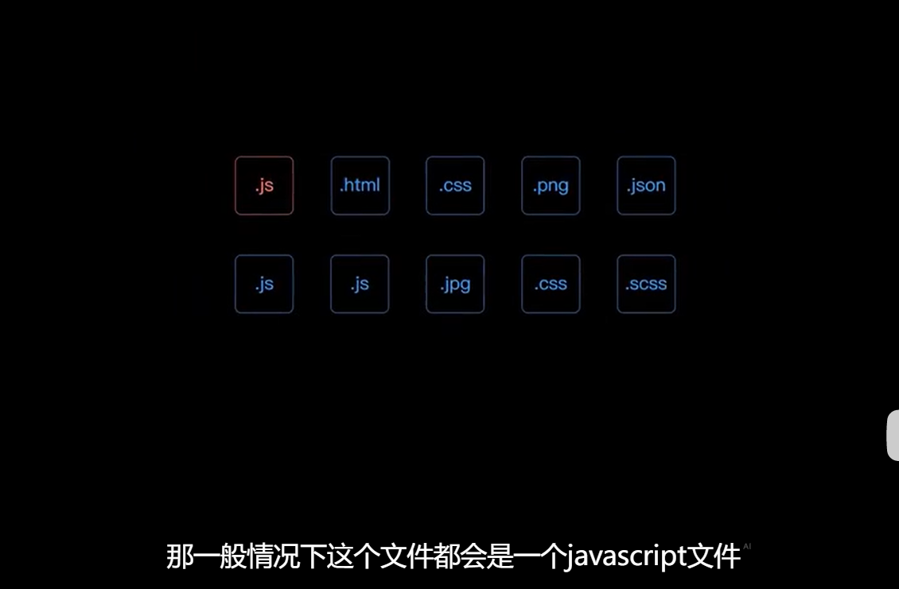

# webpack 核心工作原理

一个项目中通常会使用到多个资源文件

webpack 会根据配置文件，找到项目的入口文件（一般是一个`js`文件），然后根据入口文件中中 `import/require`等语句解析并找到文件依赖的资源模块，并据此解析项目用到的各个模块之间的依赖关系，形成依赖树

最后递归该依赖树，找到每个节点对应的资源文件，并根据配置文件中的`rules`属性，找到该模块对应的加载器（loader），然后将资源文件交给 Loader 完成加载，加载后的结果放在最终的打包后的文件中

# loader

## 工作原理

loader 相当于一个管道，从源文件到最终的打包文件之间可以一次使用多个 loader 进行处理，但是最后一个 loader 的输出结果必须是一段 js 代码，

##

# plugin
