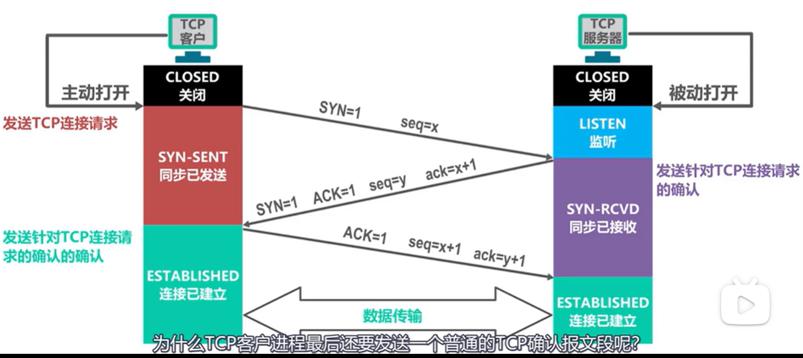
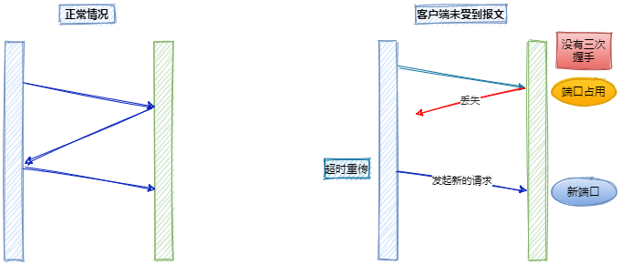
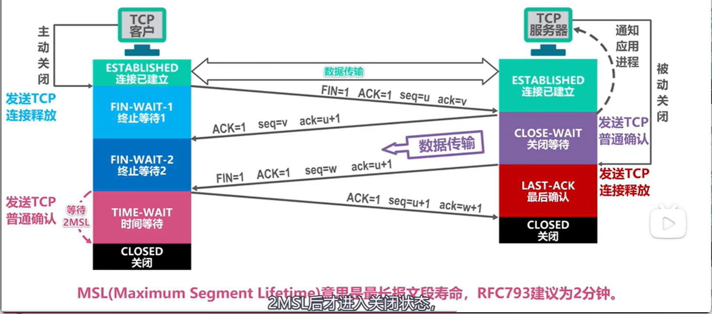
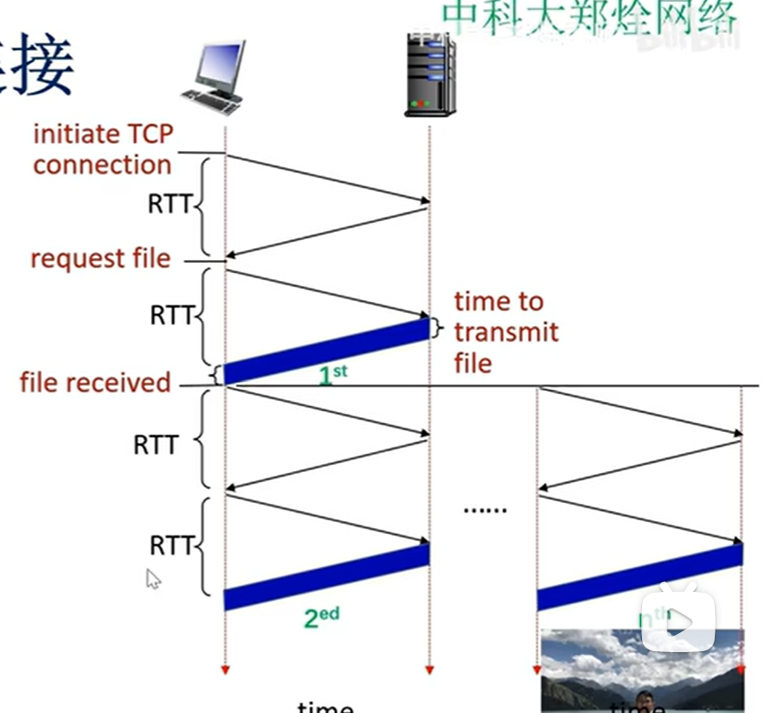
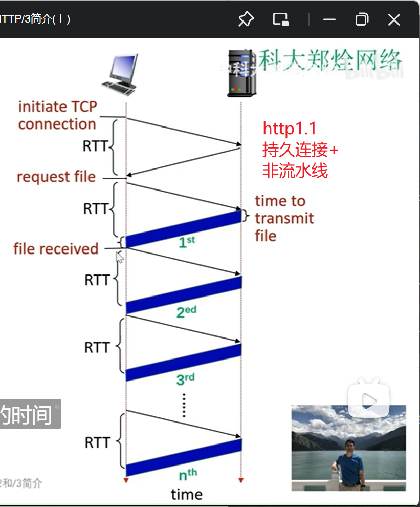
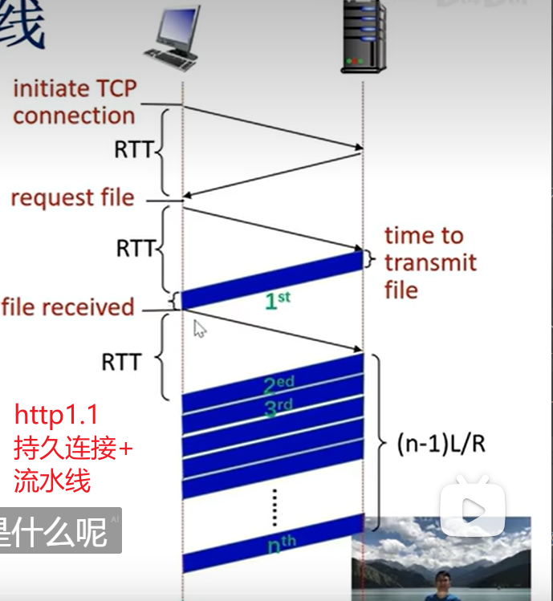
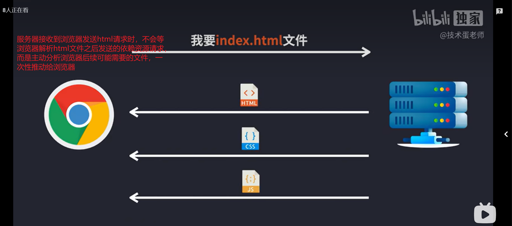
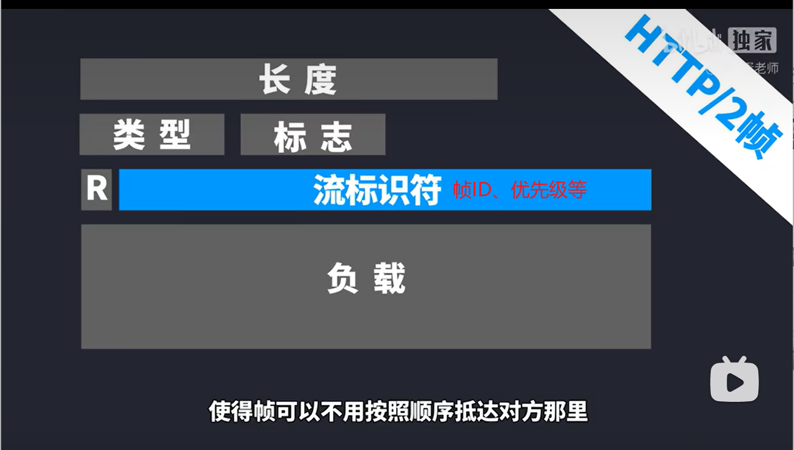
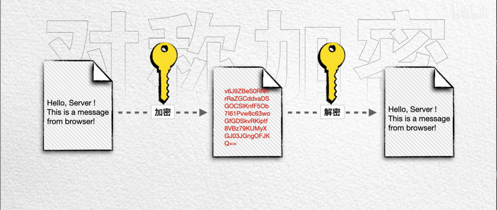
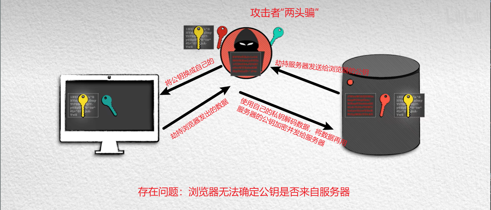

# http

## 缓存机制

### 强缓存

- 首次请求，服务器为资源的响应头设置'cache-control'中的`max-age`字段
- 浏览器接收到后，根据`cache-control`设置缓存资源的有效期
- 在有效期内，浏览器在访问该资源时都不会发送请求，而是直接从`memory cache`中读取

### 协商缓存

- 首次请求资源，服务器将响应头设置 Last-Modified 和 Etag 字段，
- 再次请求资源时，请求头会带上 If-Modified-Since，来告知服务器浏览器本地缓存资源的最后修改时间
- 服务器，对比 If-Modified-Since 和指定文件的 Last-Modified,如果一致，就不返回资源，此时状态码为`304`,浏览器受收到后，继续使用原有资源。如果不一致，说明浏览器中缓存的资源不是最新的，服务器返回最新的资源

# TCP

## 三次挥手建立连接

- 客户端发送 SYN 包，请求建立连接
- 服务端发送 ACK 包响应。
- 客户端发送 ACK 包响应



### 为什么是三次？

> 为什么客户端进程最终要再次发送一个 ACK 确认报文？

- 情况一：如果服务端的 ACK 在传输过程中发生了丢包，过段时间客户端就会发起超时重传，服务器端就会重新开启一个端口进行连接，导致很多无效的连接端口，造成资源浪费



- 情况二：已经失效的客户端发出的请求信息，由于某种原因传输到了服务器端，服务器端以为是客户端发出的有效请求，接收后产生错误


## 四次握手关闭连接

- 客户端发送 FIN 包，表示自己不会再发送数据了。
- 服务端接收后，先回答一个 ACK 应答报文。此时服务器可能还有数据要发送。
- 服务端发送 FIN 包。表示自己不会再发送数据了。
- 客户端接收后，回答一个 ACK 应答报文。



# websocket

- 概述：基于 TCP 协议的双向通信协议

## 原理

- 利用 http 建立连接
- 建立 TCP 连接，用于交换协议的加密和压缩参数
- 双向通信
- 断开连接，想要断开的一方发送一个特殊的帧

## 请求头

### Content-Type

指示资源的 MIME 类型

> MediaType，即是 Internet Media Type，互联网媒体类型；也叫做 MIME 类型
> 在 Http 协议消息头中，使用 Content-Type 来表示具体请求中的媒体类型信息，确切的来说是**客户端**告知**服务端**，自己即将发送的请求消息携带的数据结构类型，好**让服务端**接收后以合适的方式处理。

### 请求头中常见 content-type

#### application/x-www-form-urlencoded

如何设置请求头的 content-type

1. **使用表单提交数据时**
   也就是 html 的表单标签

```html
<form action="目的URL" method="post" enctype="multipart/form-data">
  姓:
  <input type="text" name="fname" />
  <br />
  名:
  <input type="text" name="lname" />
  <br />
  <input type="submit" value="提交" />
</form>
```

> 设置 form 标签的`entype=application/x-www-form-urlencoded`之后，本次 http 请求的请求头中的 content-type 的值就是 application/x-www-form-urlencoded。

2. **使用 ajax 发送 post 请求**

```js
XMLHttpRequest对象.setRequestHeader(
  "Content-type",
  "application/x-www-form-urlencoded"
);
```

#### multipart/form-data

```html
<form action="/upload" enctype="multipart/form-data" method="post">
  <input type="file" name="fieldname" />
  <input type="submit" value="上传" />
</form>
```

> 设置 form 标签的`entype=multipart/form-data`之后,请求头中的 content-type 的值是： multipart/form-data;

#### application/json

前后端分离开发场景中使用最多，

一般该种格式使用 ajax 发送请求

```js
XMLHttpRequest对象.setRequestHeader("Content-type", "application/json");
```

### 响应头中常见 content-type

1）、text/html ： HTML 格式
2）、text/plain ：纯文本格式
3）、application/json：json 格式
4）、text/xml ： XML 格式
5）、image/gif ：gif 图片格式
6）、image/jpeg ：jpg 图片格式
7）、image/png：png 图片格式
8）、application/pdf：pdf 格式
9）、application/msword ： Word 文档格式
10）、application/octet-stream ： 二进制流数据（如常见的文件

# 状态码 Status Code

101
200/204/206
301/308 302/307 304
400/401/403/404/405/413/429
500/502/503/504

## 1xx:消息

### 101：Switch Protocol

升级协议，如从 http 升级到 ws

## 2xx:成功

### 200 ：ok

资源请求成功

### 204： No Content

响应不返回 body

### 206 ：Partial Content

数据分片传输

## 3xx:重定向

版本问题

301/302：在 http1.0 就定义好了
其余状态码：在 http1.1 新增

### 301：永久重定向

请求的 URL 已经被移除使用，响应的 Location 首部应包含资源 所在的新的 URL

### 302:临时重定向

- 由 `Location` 首部给出 URL

- 浏览器以 post 方式请求 域名：a.com，资源被重定向到 b.com，此时浏览器再次发送请求时，将会以 get 方式，

### 304：资源无变化

通常是因为浏览器 的协商缓存机制

### 307:临时重定向

- 区别于 302：不允许将 post 请求改为 get 请求

### 308 永久重定向

- 区别于 301：不允许将 post 请求改为 get 请求

## 4xx:客户端错误

### 400:Bad Request

请求报文中存在语法错误，服务器无法理解

### 401：Unauthorized

表示无权限

### 403：Forbidden

请求资源的访问被服务器拒绝了。

### 404：Not Found

服务器无法找到请求的资源

### 405:Method Not Allowed

客户端请求的方法虽然能被服务器识别，但是服务器禁止使用该方法

### 413:Payload Too Large

请求体过大

### 429 : Too Many Request

请求过多被限流

## 5xx:服务端错误

### 500：Internal Server Error

服务器内部错误，应用层未捕获错误导致整个服务挂掉

### 502 ：Bad Gateway

应用层未返回响应，常见 nginx

### 503 Service Unavailable

服务器繁忙

### 504 Gateway Timeout

网关超时，应用层一直未响应

## 查看本机 ip 配置:elephant:

> ipconfig


获得更加详细的**网络配置信息**

> ipconfig/all


# http

## http1.x

### http1.0 非持久连接

> 非持久连接：每次资源请求之后，立即关闭本次 TCP 连接

#### 非并行


- 单个报文的获取时间：`2RTT+L/R`
- n 个报文的获取时间：`n*(2RTT+L/R)`

- 缺点：通信效率低下，尤其是 RTT 的时间约等于 L/R 时，效率只能达到 50%

#### 1.0 的优化方案:并行

并行连接：建立 TCP 连接后，客户端发现有多个资源需要请求，就同时建立多个并发的 TCP 连接



- 缺点：并行的 TCP 连接必定要耗费服务器的资源、影响服务器的性能，服务器通常会限制客户端并发连接的个数

### http1.1 持久连接

> 持久连接:资源传输完毕之后，在一段时间内不会关闭 TCP 连接，省去了每次请求都要建立 TCP 的时间

#### 非流水线方式

> 非流水线：当需要请求多个资源时，需要一个一个地请求，收到上一个请求的结果之后，才能发送下一个请求



- n 个报文的获取时间：`2RTT+L/R+(n-1)RTT+(n-1)L/R`

#### 流水线方式

> 流水线：当需要请求多个资源时，一次性全部发送，而不必等待其他请求的结果



- n 个报文的获取时间：首次建立 TCP 连接+多个请求=`2RTT+L/R+RTT+(n-1)L/R`

- 存在问题：

  > - 服务器按照顺序响应请求（FCFS）。一系列资源请求中可能有体积大小不同的对象，一个体积很大的资源可能需要多个报文才能传输完毕，这样以来就阻塞了后续资源的传输。

  > - 队头阻塞。由于服务器要按照顺序进行响应，一旦传输过程中，某个位于中间的资源发生了丢包，那么需要对该资源进行重发，那么后续的资源就会收到影响。

### 其他问题

- 传输层 TCP 协议的开销
  > - 三次握手的时间开销
  > - TCP 的拥塞控制算法：慢启动
- 应用层 HTTP 协议的开销
  > - 请求和响应的首部大部分都是重复的。
  > - http1.1 明文传输，首部未进行压缩，显得很臃肿

## http2

> 队头阻塞问题的表现
>
> - 在**http1.1 的资源流水线请求**中，规定在**同一连接上只能同时处理一个资源请求**，后续的资源请求必须等待前面的资源请求完成才能发送。如果某个资源请求因为网络延迟、服务器处理缓慢或其他原因被阻塞，那么后续的资源请求也会被阻塞，即使它们本身可能已经准备好发送。
> - 在**TCP 报文传输**，传输过程中，如果发生在一个 TCP 分节丢失，导致其后续分节不按序到达接收端的时候。由于**TCP 协议按序接收**的特征，**后续分节将被接收端一直保持**直到丢失的第一个分节被发送端重传并到达接收端为止。该后续分节的延迟递送确保接收应用进程能够按照发送端的发送顺序接收数据

### 服务器推送

2015 年退出 http2 的时候，还有另一项技术：服务器推送。


- 存在问题
  > - 浏览器端缓存压力过大
  > - 易造成 DDos 非对称攻击

### 优化了哪些方面

#### 首部压缩

引入 HPACK 压缩算法

要求浏览器和服务器都保存一张静态可读的表

#### http2 帧

被请求的资源对象，在服务器端会被划分为一个个二进制的帧，帧结构如下所示


同优先级的资源的帧可以交错传输，大的资源对象不会对后请求的资源对象有**队头阻塞**的影响

#### 多路复用机制

队头阻塞

原本一个大的资源对象，经过多次切片后每次都占满 http 报文的负载，但是这个负载也只包含了这一个大对象，后续的资源请求，

### 还存在哪些问题？

#### 未完全解决队头堵塞问题

http2.0 提出的多路复用，只是在一定程度上缓解了队头堵塞问题在应用层 http1.1 协议中的表现，但是 http2 在传输层仍然基于 TCP 协议，而 TCP 仍然存在队头阻塞问题。

## http3

> 问题：上面提到 http2.0 没有解决 TCP 协议的队头阻塞问题，因为 TCP 协议是在操作系统层面实现的，既然不能在传输层解决队头阻塞的问题，只能继续在应用层的 http 协议层面解决问题。

# https

- http 协议中数据以明文传输，不安全

## 对称加密：

- 通讯双方使用同样的秘钥，但存在问题，一方生成的秘钥另一方如何获得呢？

  

## 非对称加密

- 服务器先将自己的公钥发给浏览器，浏览器生成随机数据并使用公钥加密再发送给服务器，服务器收到数据后使用私钥解密最终得到数据，（即使攻击者拦截到了公钥，也不能解码数据）但存在问题



# ping 命令

## 使用步骤

> ping 127.0.0.1

用于检测自己的主机网络配置是否正常、本机的 TCP/IP 是否安装正常，发生在本机上

> ping 自己的内网 ip

如果不成功，可能网线或者 WiFi 连接出现问题

> ping 默认网关（路由器端口）

如果不成功，可能是路由器出现故障

> ping 目标 ip 地址

如果不成功可能是因为对方主机已经下线或者防火墙禁止了 ping 请求，或者是由于 ping 数据包在传输途中出现问题，但至少证明本机网络没有问题

> ping 域名


# 常见 http 请求头

Accept:浏览器能够处理的内容类型
Accept-Charset:浏览器能够显示的字符集
Accept-Encoding:浏览器能够处理的压缩编码
Accept-Language:浏览器当前设置的语言
Connection：浏览器与服务器之间连接的类型
Cookie：当前页面设置的 Cookie
Referer：发出请求的页面 URL
User-Agent：浏览器的用户代理字符串

# 常见 Http 响应头

Date：消息发送的时间
server：服务器名称
Connection：浏览器与服务器之间连接的类型
Cache-Control：控制 HTTP 缓存
content-type:文档属于什么 MIME 类型

> application/x-www-form-urlencoded:浏览器原生 form 表单，如果不设置 enctype 属性，最终将会以该种方式提交数据放在 body 里面，数据按照 key1=val1&key2=val2 的方式进行编码，key 和 val 都进行 url 编码
> multipart/form-data:一种常见的 post 提交方式，通常表单上传文件时使用该种方式
> application/json:服务器消息主体是序列化后的 JSON 字符串
> text/xml:该方式主要用于提交 XML 格式的数据

# cookie、session、token

**什么是 cookie**

http 请求是无状态的，每次请求都是完全独立，所以服务端无法确认当前请求访问者的身份。

看这样一个场景，一个用户登录微博之后，发布、关注、评论等行为产生的数据，都应该是跟该用户相关的，这就需要每次发送请求都携带一个与该用户相关的信息。这也是会话跟踪的一种。

如何实现？我们需要一个标记

上班进公司需要工牌，不能说每次跟门卫说自己的名字、年龄等信息。

如何保存这个工牌？

- 基本的，作为全局变量
- 高级点的，存储到 cookie、localStorage 中

有地方保存了，我们就能在发送请求的时候携带上这个工牌，这样门卫就能认识我们

## cookie

cookie 是前端存储的一种方式，能够实现每次 http 请求都带上特定的数据给服务器，


> 存在的问题：假设用户首次是登录操作，那么就需要向服务器发送用户名和密码，服务器应该将什么信息放在 Cookie 中呢？显然不能是 `用户名和密码`，因为 Cookie 在浏览器端是能够直接看到的。只存放用户名也是不行的，其中一个原因是用户名太随意了，而且不能保证唯一性。那应该保存什么才能保证唯一性呢？其中一种方案是 保存`sessionID`【见 session 部分】

### 属性

**name=value**
用户可以自定义键值对存储在 cookie 当中，其中键和值都应该是字符串

**domain**
cookie 不可跨域，每个 cookie 都会绑定一个单一的域名，这个 cookie 不允许在别的域名下使用

**path**
指定浏览器发出 http 请求时，哪些路径要附带这个 Cookie，

**maxAge**
指定从生成 Cookie 开始， Cookie 的有效期，比如 60 _ 60 _ 24 \* 365（即一年）

**expires**
指定 cookie 的过期时间，在设置的某个时间点后该 cookie 就会失效。

**secure**
浏览器只有在加密协议 HTTPS 下，才能将这个 Cookie 发送到服务器。另一方面，如果当前协议是 HTTP，浏览器会自动忽略服务器发来的 Secure 属性。

**httpOnly**
如果给某个 cookie 设置了 httpOnly 属性，则无法通过 JS 脚本 读取到该 cookie 的信息，但还是能通过 Application 中手动修改 cookie，所以只是在一定程度上可以防止 XSS 攻击，不是绝对的安全

### 使用 js-cookie 操作 cookie

- 设置 cookie

```js
const Cookies = require("js-cookie");

Cookies.set("name", "value", {
  expires: 7,
  path: "/",
  domain: "sub.example.com",
});
```

- 读取一个 cookie

```js
Cookies.get("name"); // => 'value'
Cookies.get("nothing"); // => undefined
// 读取所有可见的cookie
Cookies.get();
```

- 删除 cookie

```js
// 删除一个cookie
Cookies.remove("name");
// 删除一个指定path的cookie
Cookies.remove("name", { path: "" }); // removed!
```

## session

session 数据非全部存在`Cookie`当中，只有 sessionID 会被保存到 Cookie 中并发送给浏览器，Session 源数据只会存储在客户端


# 跨域解决方案

## CORS

- 方案一：使用 express 等框架，安装 cors 三方模块

```js
import cors from "cors";

app.use(cors());
```

- 方案二：自定义中间件，设置响应标头

```js
app.use("*", (req, res, next) => {
  res.setHeader("Access-Control-Allow-Origin", "*");
  res.setHeader("Access-Control-Allow-Headers", "*");
  res.setHeader("Access-Control-Allow-Methods", "*");
  next();
});
```

## jsonp

- 原理：`<script>`标签美欧跨域限制，网页可以得到从其他来源动态产生的 JSON 数据

- 缺点：仅仅支持 get 方法，且容易收到 xss 攻击

### 实现一个 jsonp

- [【掘金-浪里行舟】](https://juejin.cn/post/6844903767226351623)

假设下面我们要实现这样一个功能：前端定义一个函数`sayName`，接受一个参数`name`，功能是`console.log()`这个`name`，而这个参数需要请求后端才能知道

- 定义一个函数用于发送请求，将`后端url地址、函数名(sayName)、要获取的数据(name)`等作为数据传递进去
- 创建 script 标签。将跨域的 API 接口赋值给 script 标签的 src 属性，并传递`函数名(sayName)、要获取的数据(name)`等参数
- 服务端接收到请求之后，将传递过来`函数名(sayName)、要获取的数据(name)`进行拼接：`sayName("小明")`
- 服务器将数据返回给客户端，客户端调用`sayName()`即可

```js
// index.html
function jsonp({ url, params, callback }) {
  return new Promise((resolve, reject) => {
    let script = document.createElement("script");
    window[callback] = function (data) {
      resolve(data);
      document.body.removeChild(script);
    };
    params = { ...params, callback }; // wd=b&callback=show
    let arrs = [];
    for (let key in params) {
      arrs.push(`${key}=${params[key]}`);
    }
    script.src = `${url}?${arrs.join("&")}`;
    document.body.appendChild(script);
  });
}
jsonp({
  url: "http://localhost:3000/say",
  params: { wd: "Iloveyou" },
  callback: "show",
}).then((data) => {
  console.log(data);
});
```

## proxy 代理

- 实操：比如`webpack`设置 devServer

- 原理：本地服务与运行在远程服务器上的后端服务交互时由于浏览器同源策略的原因，会出现跨域请求的问题。添加 proxy 代理之后，相当于在浏览器和服务端之间架设了一台代理服务器。
  本地发送请求时，会先将请求发给代理服务器，后者将本次请求进行转发给后端服务，后端服务响应给代理服务器，后者最终转交给本地

服务器之间的交互没有同源策略的限制。
而代理服务器与本地服务同源，不存在跨域行为。
